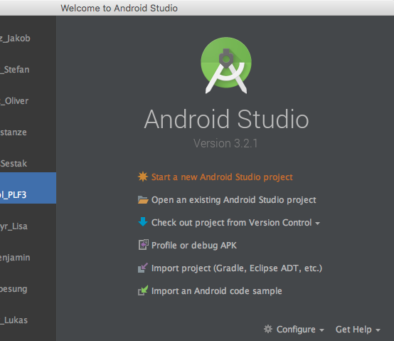
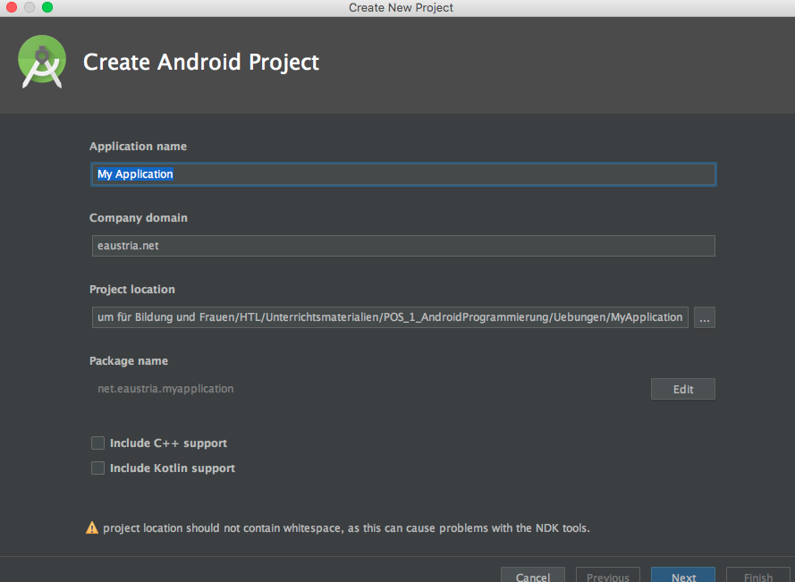
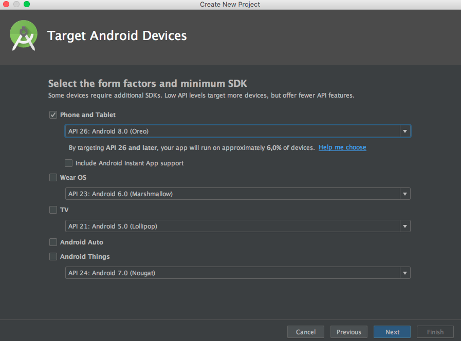
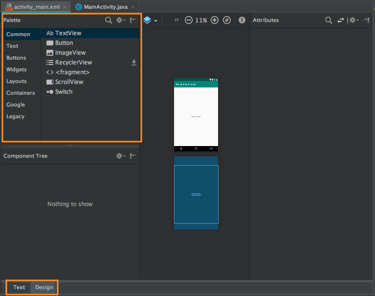
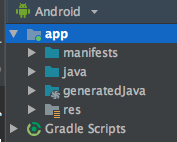
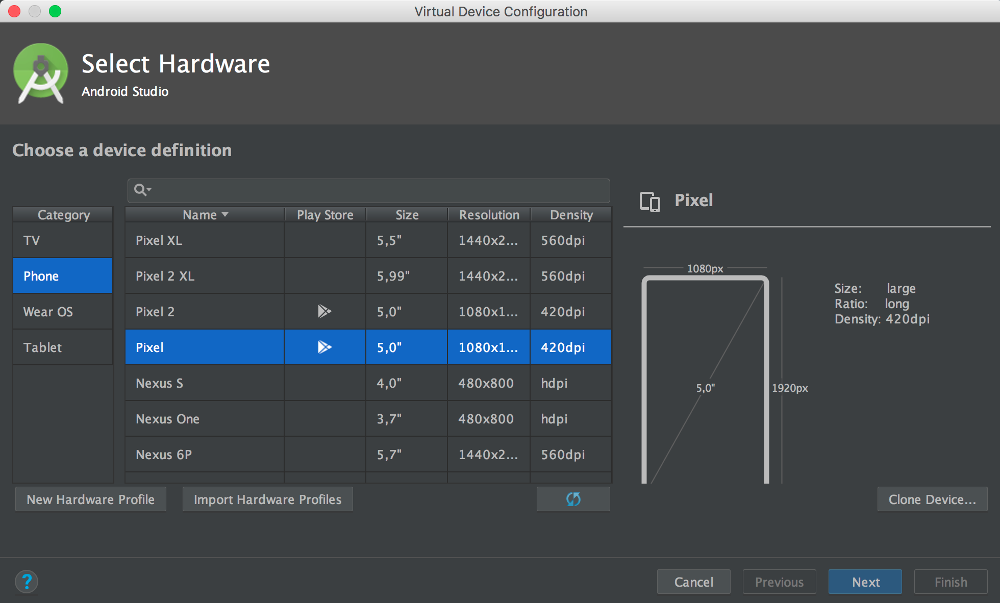

# Using Android Studio

This script discusses several feature and usage of Android Studio.

## Starting a new Android Project
After starting Android Studio a welcomescreen is shown to the user. On this screen you can reopen former projects on the left side or start a new project on the right side.

If you have already created a project on another PC and you want to open it in school, please use `import project`.  
If you create a new project you want to use the wizzard to create the project stub.

Define your application name (this will be the name of your app if you deploy to google play store).

Use a domain name for `company domain`. This doesn't have to be a real domain but will effect your package structure later on.

The field `Project location` is the directory into which android studio will put all the project files.

Click next to get to the selection of the form factors of your app. Select `Phone and Tablet` on all our training and assignment examples. We will use API level 26 (_Android 8.0 Oreo_) on all our projects to be able to use the most recent features.

Next choose the activity format the wizzard should prepare. We will start choosing an empty activity.

On the next window we could change the names of some of the files which the wizzard will auto-generate for us. For the sake of simplicity we will keep the defaults.

Now the build process will start and after a while you should see your android studio ide looking something like this:

## Android Editor Window

Let's have a closer look on the editor window. This is a code editor for your java files but a dual-editor for your layout files. If you open a layout file (e.g. activity_main) you will see two tabs (_Text_ / _Design_) on the lower edge. There you can switch between text and WYSIWG editing of your layout files. When choosing the _Design_ Tab you see your palette of UI elements on the left and a preview of the layout on the right side.

## Project Files Organisation

When working on Android projects we will have to deal with these categories of files:

 - Gradle files
 - Source Code files
 - Resource files

1. __Gradle files__: Gradle files are the scripts that define how to compile and build your apps. We won't discuss these in much detail right now but I'll show you where they are for the time being.
1. __Source Code Files__: These are the Java source code files that define the logic of your application. The third major group of files we'll show you are the Resource Files.
1. __Resource Files__: These are files that your app makes use of while it is running. Such as the user interface layout files that define what different screens of your app look like. Any images that are included within your app, including the app's icon itself. And XML files containing values used by your app. One example XML file resource is called `strings.xml`. This file is where you put all the words displayed by your app. That way you can easily translate every word into a different language, and easily swap in and out which language should be used based on the users language settings.

   
If we choose the `Android` Project view we will see two main categories. `app` and `Gradle Scripts`.

The __app__ portion is were your project files exist. There are three main categories of files in the Android Studio project. Manifest which are special XML files that describe how the Android platform should interact with your project.

1. __manifests__:  The manifest folder will only contain a single file for all projects you work on for this course. That file is called `AndroidManifest.xml`. This file defines how the Android platform, on each user's device, will interact with our app.
1. __java__: The java folder contains the java packages for your source code and your unit- and instrumented-tests. More on the difference between unit and instrumented tests later on.
1. __generatedJava__: Autogenerated code. Do not modify the files in this folder.  
1. __res__: The Resources folder, abbreviated _res_. The Resources folder contains things such as images, user interface layout files, and other files that hold special value for us. Within the `res` folder we will find the `/values/strings.xml`file. This file contains all the language specific files of your android project like a _ressouce bundle_ in javaFX applications.

## Creating and Editing Files in Android Projects

Android Studio has two main sets of files that you will edit. __Java source code files__ that contain the logic of your app. And __resource files__, such as the user interface layout files.

To create a new java activity file just right click on the package you want your class file to reside and choose `New`-->`Java Class`.

To create a new layout file is just as easy as creating a java class file. Just right click on the layout folder within our res portion in the project explorer.

## Creating and Running a Virtual device
Virtual Machines or VMs allow you to run code on your development machine as though it were inside a physical Android device. One of the reasons this is useful is for testing run time behavior of your app when you don't have a physical device to test your code on.

The first step in managing, creating or starting a virtual device running Android is to open the Android Virtual Device Manager:
  
After opening the Android Virtual Device Manager you see a list of all your VMs. If you haven't created any, this list is empty. You can click `+Create Virtual Device` to create new VMs. To start an existing VM, just click on the green arrow on the right hand side of the Device.

We want to create a new device so we click on '+Create Virtual Device'. Another dialog opens and we can specifiy several aspects of our VM. We choose _category Phone_ and use the _Pixel_ emulator. Then just click next to proceed.

Next we have to choose the API Level and the ABI. These are the two central columns. The __API level__ is the API level of the image or Android operating system version that you want to run on your virtual device. The __ABI, or Application Binary Interface__, is the specification of what kind of CPU architecture your virtual device will emulate. The important thing to know from this is that the Arm EABI Version 7 is the most universal. But it will run slower on our machines because it isn't of the same instruction set as our desktops or laptops. Therefore, running an X86 or an X8664 image would be faster. However, your device, meaning your laptop or desktop, needs to have a CPU that allows for virtualization, and needs to have the feature turned on. For the sake of performance we will use x86 ABI for our emulators.

The last window will display additional features that you can change. But for now, we will not changing anything and just clicking finish.

Now the recently created emulator devices appears in the list and we start it by clicking the green arrow.

As soon as the emulator has finished the boot process we can run our app on the emulator by clicking the _run app_ Button (green triangle) in Android Studio.

A dialog pops up which lets us choose the device we will run our app on.

After starting the emulator you will see many log messages in the `Logcat` window of Android Studio. This is where you can see all the logs from the emulator. We will discuss this window in a later lesson in depth.

