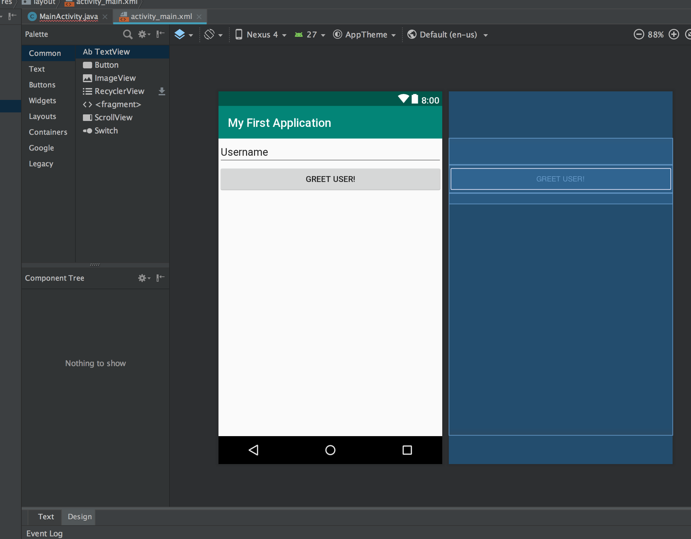
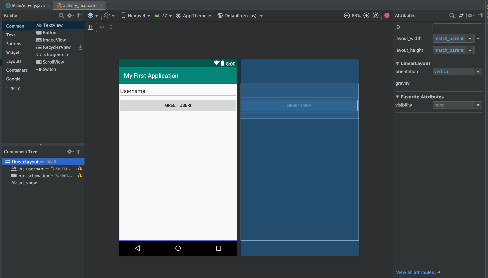
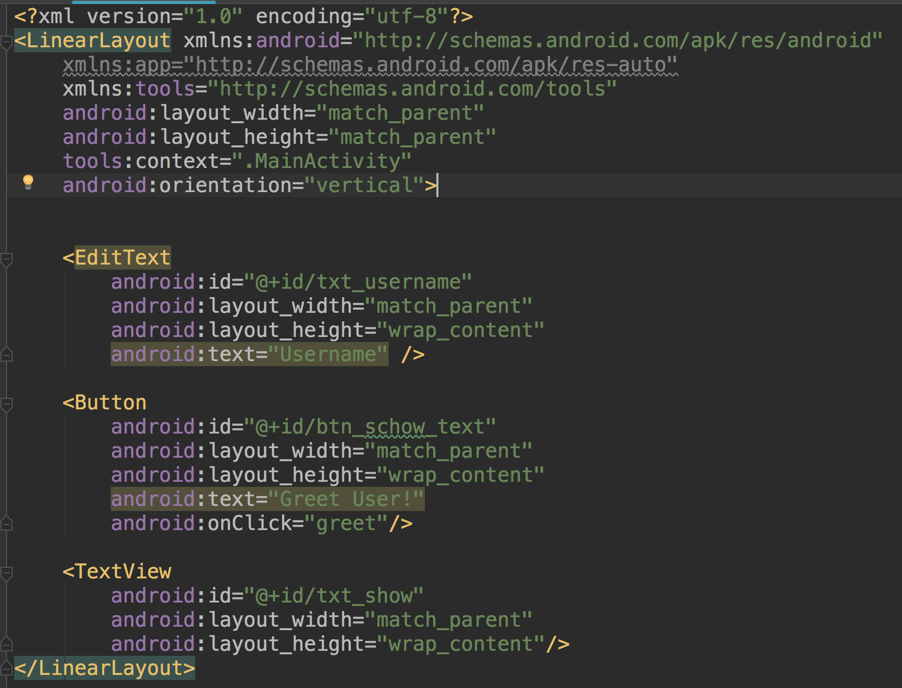
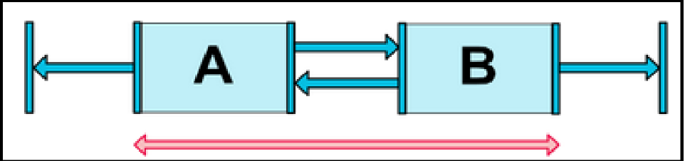
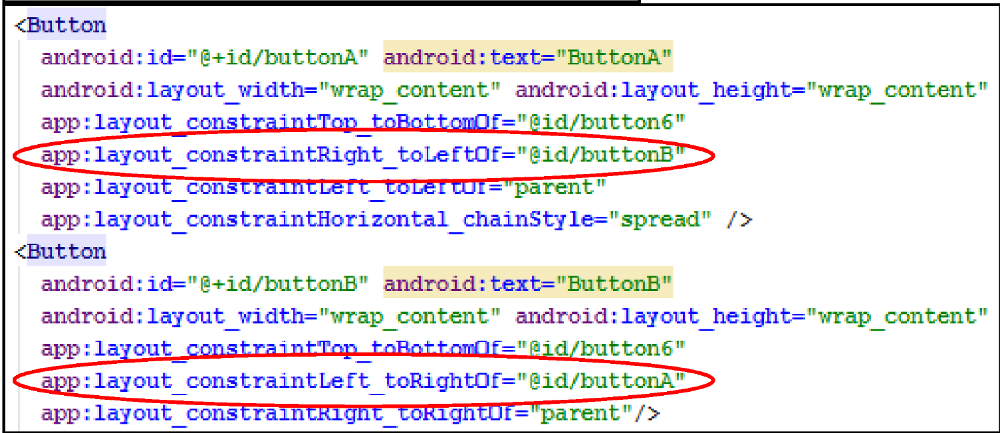
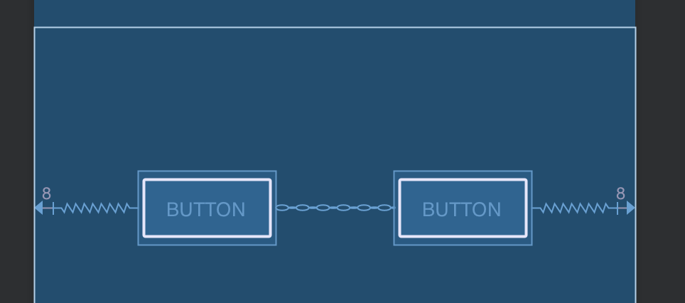

# Layouts

Das UserInterface einer App wird mithilfe von XML Definitionen im Layout File festgelegt.

Layouts dienen als Container für View Komponenten. Die wichtigsten Layouts findet ihr direkt auf der Android Doku Seite unter: https://developer.android.com/guide/topics/ui/declaring-layout.html#CommonLayouts.

## Der Layout Designer

Die XML Layout Files kann man visuell im Designer oder direkt im Texteditor bearbeiten.

Wir beginnen mit dem Designer:



In der Demo App wird ein LinearLayout verwendet. Dies ist das einfachste Layout. Es fügt die View Elemente entsprechend der Reihenfolge ein, in der wir sie in das Layout ziehen.

Verwenden wir das LinearLayout so müssen wir mit dem property ```orientation``` angeben, wie die View Elemente angeordnet werden sollen (horizontal oder vertikal). In diesem Fall haben wir ein vertikales Layout. Die View Elemente werden untereinander angeordnet.



## Textansicht der XML Files

Klicken wir auf den Reiter ```Text``` so öffnet sich die Textsicht auf das Layout File. Wir sehen hier, dass für jede View Komponente ein XML Tag mit mehr oder weniger vielen Attributen verwendet wird.



## Weitere CommonLayouts
### Table Layouts
Das Table Layout ermöglicht eine Anordnung der Views in Reihen und Spalten. Dieses Layout ähnelt dem ```<table>``` Tag aus HTML. Zeilen werden im Table Layout mittels ```TableRow``` definiert. Innerhalb der einzelnen Zeilen werden die View Komponenten für jede Zeile eingefügt.

Android Doku: https://developer.android.com/reference/android/widget/TableLayout.html

#### stretchColumns
Will man im TableLayout alle Zellen einer Zeile gleichmäßig verteilen, so verwendet man am besten das Attribut ```android:stretchColumns="*"```. Sollen alle Zeilen das Table Layout zur Gänze ausfüllen, so muss in jedem ```TableRow``` Tag das Attribut ```android:layout_weight="1"``` gesetzt sein.

### GridLayout

Das GridLayout ist stark mit dem TableLayout verwandt. Zu Beginn definiert man die Anzahl der Reihen und Spalten. Jedes neue View Element wird dann entsprechend dieser Vorgabe auf den nächsten freien Platz im Grid eingefügt. Einen expliziten ```TableRow``` Tag benötigt man daher nicht mehr.

### FrameLayout

Ein FrameLayout dient primär als Platzhalter im Layout, um spätere andere Views darin platzieren zu können. Die Position wird mit dem Attribut ```android:layout_gravity``` beinflusst.

Doku: https://developer.android.com/reference/android/widget/FrameLayout.html

### Constraint Layout
Bei einem Contraint Layout kann der Designer die Positionen der View Komponenten relativ zueinander definieren. Aus diesem Grund muss im ContraintLayout jeder View Komponente zwingend eine id zugewiesen werden.

```xml
<android.support.ContraintLayout
    xmlns:android="http://schemas.android.com/apk/res/android"
    xmlns:app="http://schemas.android.com/apk/res-auto"
    android:layout_width="match_parent"
    android:layout_height="match_parent">
```

Die allgemeine Form der Positionierungsattribute lautet:
``app:layout_constraint{myPos}_to{otherPos}Of="@id/{otherId}" ``

Mögliche Werte für die Platzhalter:
 - Left
 - Top
 - Bottom
 - Right
 - Baseline
 - Start
 - End

 Sollte sich die Positionierung auf das Elternlayout selbst beziehen, so wählt man als id __parent__: ```app:layout_contraintLeft_toRightOf="parent" ```

 Im Designer kann ich ein ContraintLayout mithilfe der Positionierungspfeile ausrichten:

Ein Zentrierung des Buttons erreicht man, durch Zuweisung von jeweils 8dpi Rand links und rechts.


#### Chains
Mithilfe von chains können mehrere View Komponenten miteinander gruppiert und gemeinsam ausgerichtet werden. Dazu müssen die Elemente aneinander ausgerichtet werden.




In der schematischen Ansicht des Designers wird diese gegenseitige Verbindung durch eine Kette symbolisiert dargestellt:



Doku zum ContraintLayout: https://developer.android.com/training/constraint-layout/

### Relative Layout
Funktioniert auch mit relativer Positionierung der Elemente. Allerdings wird aus Performance-Gründen die Verwendung vom ContraintLayout empfohlen (https://developer.android.com/guide/topics/ui/layout/relative)

### ScrollView

Passen nicht alle Elemente, die im Layout enthalten sind, auch tatsächlich auf den Bildschirm, so werden diese nicht mehr angezeigt. Um dies zu verhindern und entsprechende ScrollBars einzublenden, bietet sich die Verwendung einer ScrollView an:

```xml
<ScrollView
        android:layout_width="match_parent"
        android:layout_height="match_parent">
        <Button
            android:id="@+id/button"
            android:layout_width="wrap_content"
            android:layout_height="wrap_content"
            android:layout_marginStart="8dp"
            android:layout_marginEnd="8dp"
            android:text="Button"
            app:layout_constraintEnd_toStartOf="@+id/button2"
            app:layout_constraintStart_toStartOf="parent"
            tools:layout_editor_absoluteY="92dp" />

        <Button
            android:id="@+id/button2"
            android:layout_width="wrap_content"
            android:layout_height="wrap_content"
            android:layout_marginStart="8dp"
            android:layout_marginEnd="8dp"
            android:text="Button"
            app:layout_constraintEnd_toEndOf="parent"
            app:layout_constraintStart_toEndOf="@+id/button"
            tools:layout_editor_absoluteY="92dp" />
</ScrollView>
```
Eine ScrollView dient als Container. Alle Elemente, die innerhalb des öffnenden und schließenden ScrollView Tags stehen, werden in diesen Container eingefügt. Natürlich können in eine ScrollView auch weitere Layouts verschachtelt werden.

## Wichtige generelle Eigenschaften von Layouts

| Eigenschaft | Beschreibung |
| ------ | ----- |
| layout_height, layout_width | Mögliche Werte: ```match_parent``` -> Layout nimmt gesamten Platz des Elternelements ein oder ```wrap_content``` -> Layout ist genauso groß, dass der Inhalt Platz hat |
| id | Eindeutige Kennung einer View (Zuweisung im XMl mittels ```@+id/bezeichner ``` das '+' bedeutet, dass diese id automatisch angelegt wird. Zugriff aus dem Java Code mittels ```R.id.bezeichner```)|
| text | Angezeigter Text bei Buttons, EditText, TextView, etc. |
| layout_gravity | vergleich mit ```align``` Tag in HTML |
| gravity | Ausrichtung des angezeigten Text, sofern die View das text property unterstützt |
| padding | innerer Rand der View |
| margin | äußerer Rand der View |

## layout_weight

Das property ```layout_weight``` ermöglicht die gleichmäßige Verteilung des Platzes innerhalb eines Layouts, der jeder View zugewiesen wird.

```xml
<LinearLayout android:orientation="vertical"
      android:layout_width="match_parent"
      android:layout_height="match_parent">
      <Button
          android:id="@+id/button"
          android:layout_width="match_parent"
          android:layout_height="0dp"
          android:layout_weight="2"
          android:text="Button1"
          />

      <Button
          android:id="@+id/button2"
          android:layout_width="match_parent"
          android:layout_height="0dp"
          android:layout_weight="1"
          android:text="Button2"
          />
      <Button
          android:id="@+id/button3"
          android:layout_width="match_parent"
          android:layout_height="0dp"
          android:layout_weight="1"
          android:text="Button3"
          />
 </LinearLayout>
 ```

 Die Angaben bei layout_weight verhalten sich proportional zueinander. In diesem Beispiel erhält Button1 doppelt soviel Platz wie Button2 und Button3. Wichtig ist dabei, das entsprechende ```layout_height``` bzw. ```layout_width``` propery muss auf "0dp" gesetzt sein.
