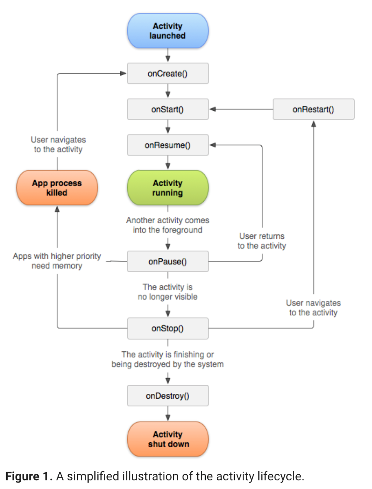

# Der Activity Lifecycle in Android

Quelle: https://developer.android.com/guide/components/activities/activity-lifecycle

Eine Activity folgt immer einem bestimmten Ablaufdiagramm. Die Activity ist immer in einem bestimmten Zustand und kann von diesem durch Ereignisse in einen anderen Zustand überführt werden.

Diese Zustandsänderungen sind in der Basisclass ```Activity``` implementiert, weshalb wir jede individuelle Activity von einer Basisactivity Klasse ableiten müssen.

Um auf Ereignisse im Leben einer Activity reagieren zu können, überschreiben wir einfach die geerbten hook-methoden.

Zu Beginn des Lifecycles einer Activity wird die Methode ```onCreate()``` aufgerufen.



## onCreate()

In die ```onCreate()``` packen wir Code, der nur einmalig beim Initialisieren der Activity aufgerufen werden soll. Diese Methode wir im Lifecycle nur einmal aufgerufen. In dieser Methode wird das Layout geladen, möglicherweise Databindings zwischen Datenquellen und Listen hergestellt, Klassenvariablen initialisiert, etc.

Die Methode ```onCreate()``` erhält den Parameter ```savedInstanceState```. Dieser beinhaltet ein Objekt vom Typ ```Bundle``` in welchem der vorherige Zustand der Activity gespeichert ist. Falls die Activity neu erstellt wurde, ist der Wert null.

Methoden aus Komponenten, die auf Lifecycle Methoden reagieren (mit ```@OnLifecycleEvent``` gekennzeichnet sind) erhalten einen ```ON_CREATE``` event und können beliebigen Code ausführen, der für das Erreichen von on_create erforderlich ist.

Nachdem die Methode ```onCreate()``` aufgerufen wurde, geht die Activity in den Status __Started__ und es wird wiederum die entsprechende hook-Methode aufgerufen.

### Codebeispiel

```java
TextView mTextView;

// some transient state for the activity instance
String mGameState;

@Override
public void onCreate(Bundle savedInstanceState) {
    // call the super class onCreate to complete the creation of activity like
    // the view hierarchy
    super.onCreate(savedInstanceState);

    // recovering the instance state
    if (savedInstanceState != null) {
        mGameState = savedInstanceState.getString(GAME_STATE_KEY);
    }

    // set the user interface layout for this activity
    // the layout file is defined in the project res/layout/main_activity.xml file
    setContentView(R.layout.main_activity);

    // initialize member TextView so we can manipulate it later
    mTextView = (TextView) findViewById(R.id.text_view);
}

// This callback is called only when there is a saved instance that is previously saved by using
// onSaveInstanceState(). We restore some state in onCreate(), while we can optionally restore
// other state here, possibly usable after onStart() has completed.
// The savedInstanceState Bundle is same as the one used in onCreate().
@Override
public void onRestoreInstanceState(Bundle savedInstanceState) {
    mTextView.setText(savedInstanceState.getString(TEXT_VIEW_KEY));
}

// invoked when the activity may be temporarily destroyed, save the instance state here
@Override
public void onSaveInstanceState(Bundle outState) {
    outState.putString(GAME_STATE_KEY, mGameState);
    outState.putString(TEXT_VIEW_KEY, mTextView.getText());

    // call superclass to save any view hierarchy
    super.onSaveInstanceState(outState);
}
```

## onStart()

Durch einen Aufruf der Methode ```onStarted()``` wird die Activity für den Benutzer sichtbar. Für _lifecycle-aware_ Komponenten wird nun der Event ```ON_START``` ausgelöst. Nachdem Abarbeiten von ```onStart``` wird die Methode ```onResume()``` aufgerufen.

## onResume()

Nun kommt die Activity in den Vordergrund und kann mit dem Anwender interagieren. Die App verbleibt in diesem Status solange, bis ein Ereignis den Fokus von der App entfernt. Ein solches Ereignis könnte zB ein eingehender Telefonanruf sein. Weitere mögliche Ereignisse, die zum Verlust des Fokus führen:
 - der User wechselt in eine andere App
 - der Screenlock wird aktiviert
 Tritt ein solches Ereignis ein, so wechselt die Activity in den Status _Paused_ und ruft die Methode ```onPause()``` auf.

 Kehrt der Fokus später zur Activity zurück, so wird die Methode ```onResume()``` erneut aufgerufen.

## Lifecycle aware components

Folgendes Beispiel reagiert auf den __ON_RESUME__ Event und initialisiert die Kamera. Dieser Code könnte auch direkt in der Methode ```onStart()``` bzw. ```onStop()``` erfolgen. Letzteres wird allerdings nicht empfohlen, da wir mit der lifecycle aware component eine Komponente schaffen, die über Activity-Grenzen hinweg verwendet werden kann, was Codeverdopplung vorbeugt.

```java
public class CameraComponent implements LifecycleObserver {

    ...

    @OnLifecycleEvent(Lifecycle.Event.ON_RESUME)
    public void initializeCamera() {
        if (camera == null) {
            getCamera();
        }
    }

    ...
}
```
Tutorial zu lifecycle-aware components: https://developer.android.com/topic/libraries/architecture/lifecycle.html

## onPause()

Diese Methode wird aufgerufen, wenn die Activity nicht mehr im Vordergrund ist. Folgende Gründe können dafür ausschlaggebend sein, dass die Activity den Fokus verliert:
 - Ereignisse (wie in _onResume()_ beschrieben) unterbrechen die Ausführung der Activity
 - Ab Android 7.0 (API Level 24) oder höher, können Apps im Multi-Window-Mode laufen. Da nur eine der apps zu einem Zeitpunkt den Fokus besitzen kann, laufen die anderen im Hintergrund
 - Eine neue (teil-)transparente Activity wie etwa ein Dialogfenster wird geöffnet.
In der ```onPause()``` Methode sollten alle gebundenen Ressource wieder freigegeben werden, um Energie zu sparen (zB GPS Sensor).

Die Abarbeitung der ```onPause()``` Methode erfolgt sehr rasch, was dazu führen kann, dass nicht ausreichend Zeit zur Abarbeitung sämtlicher Anweisungen bleibt. Aus diesem Grund sollten in dieser Methode keine Operationen ausgeführt werden, die dem Speichern von Daten dienen bzw. länger dauern können (Netzwerkverbindungen). Für letztere Operationen wird die Verwendung der Methode ```onStop()``` empfohlen.

## onStop()

Diese Methode wird aufgerufen, sobald die Activity für den User nicht mehr sichtbar ist.

## onDestroy()

... wird aufgerufen, falls die Activity nach einem Aufruf von ```onStop()``` nicht mehr wiederherstellt, sondern beendet wird.

# Den State einer Activity Speichern
Der User erwartet, dass sich der Zustand einer Activity durch Änderungen der Konfiguration nicht ändert (zB ändern der Ausrichtung von Portrait auf Landscape et vice versa). Das heißt, dass zB Ausgaben, wie der aktuelle Punktestand eines Spiels, zwischengespeichert werden müssen, dass das Layout bei Änderungen der Konfiguration durch Android zerstört wird. Für diese Speicherungen bietet sich die Methode ```onSaveInstanceState()``` an.

```java
static final String STATE_SCORE = "playerScore";
static final String STATE_LEVEL = "playerLevel";
// ...


@Override
public void onSaveInstanceState(Bundle savedInstanceState) {
    // Save the user's current game state
    savedInstanceState.putInt(STATE_SCORE, mCurrentScore);
    savedInstanceState.putInt(STATE_LEVEL, mCurrentLevel);

    // Always call the superclass so it can save the view hierarchy state
    super.onSaveInstanceState(savedInstanceState);
}
```
Wird die Activity wiederhergestellt, so erhalten sowohl die Methode ```onRestoreInstanceState()``` wie auch die Methode ```onCreate()``` ein Objekt vom Typ ```Bundle```, welches die zuvor gespeicherten Werte beinhaltet.

```java
@Override
protected void onCreate(Bundle savedInstanceState) {
    super.onCreate(savedInstanceState); // Always call the superclass first

    // Check whether we're recreating a previously destroyed instance
    if (savedInstanceState != null) {
        // Restore value of members from saved state
        mCurrentScore = savedInstanceState.getInt(STATE_SCORE);
        mCurrentLevel = savedInstanceState.getInt(STATE_LEVEL);
    } else {
        // Probably initialize members with default values for a new instance
    }
    // ...
}
```

Die Methode ```onRestoreInstanceState()``` wird nach ```onStart()``` aufgerufen, allerdings nur, falls das Bundle-Objekt auch tatsächlich Werte beinhaltet. Daher muss in diesem Fall nicht auf ```null``` geprüft werden.

```java
public void onRestoreInstanceState(Bundle savedInstanceState) {
    // Always call the superclass so it can restore the view hierarchy
    super.onRestoreInstanceState(savedInstanceState);

    // Restore state members from saved instance
    mCurrentScore = savedInstanceState.getInt(STATE_SCORE);
    mCurrentLevel = savedInstanceState.getInt(STATE_LEVEL);
}
```
