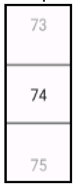
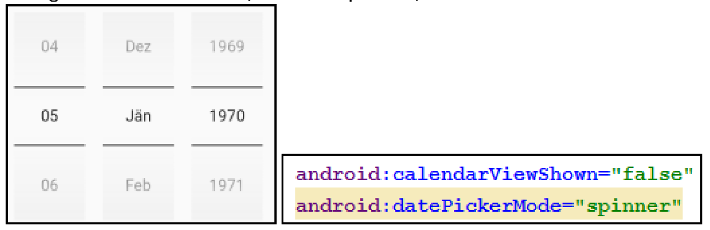
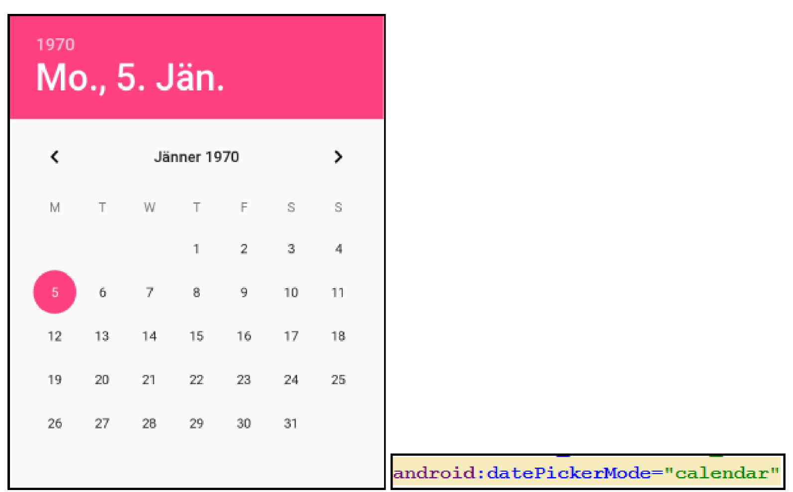
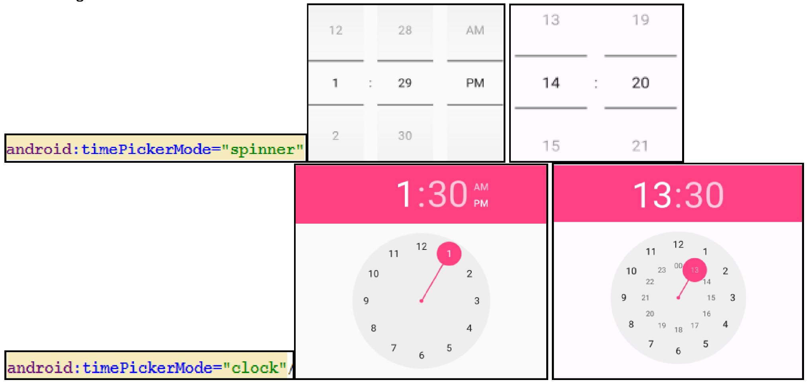

# Views

Android verfügt über eine ganze Palette an vordefinierten View-Komponenten.

Dokumentation zum Einsatz der verschiedenen Komponenten findet man direkt in der Android Developer Dokumentation: https://developer.android.com/reference/android/widget/Button.html. Wobei das letzte Pfadsegment der URL eine beliebige View sein (also statt _Button.html_ kann zB auch _TimePicker.html_ eingesetzt werden.)

In diesem Foliensatz wollen wir folgende Komponenten etwas genauer betrachten:

 - RadioButton / RadioGroup
 - RatingBar
 - Switch
 - NumberPicker
 - SeekBar
 - DatePicker
 - TimePicker

## RadioButton / RadioGroup

Ein RadioButton stellt innerhalb einer RadioGroup eine Wahlmöglichkeit dar. Mithilfe eines RadioButtons kann der User eine Auswahl aus einer vorgegebenen Wahlmenge treffen. Allerdings kann nur genau eine Möglichkeit gewählt werden.

Das Attribut __android:checked__ gibt an, ob der RadioButton beim Start des Layouts ausgewählt ist oder nicht.

Die meisten der Eigenschaften eines RadioButtons werden vom _CompoundButton_ geerbt und müssen daher auch dort in der Doku nachgeschlagen werden.

## RatingBar

Eine RatingBar stellt dem User die Möglichkeit zur Bewertung zur Verfügung.


Die wichtigsten Eigenschaften der RatingBar:
 - __numStars__: Anzahl der verfügbaren Sterne (7)
 - __rating__: Anzahl der _gefüllten_ / _gewählten_ Sterne (4)

Über Änderungen der Werte wird man durch einen Listener informiert:

```java
ratA.setOnRatingBarChangedListener(
    ( RatingBar ratingBar, float rating, boolean fromUser ) -> {
        String s = "RatingBar --> rating = " + rating + "/" + ratingBar.getNumStars();
        Log.d(TAG, "RatingBar: " + s)
    }
    );
```

## Switch

Ein Switch in Android ähnelt der Checkbox sehr stark. Der Switch kann _an_ bzw. _aus_ sein.


Dementsprechend haben wir auch wieder die Eigenschaft _isChecked_ zur Verfügung.

```java
swiA.setInCheckedChangeListener(( buttonView, isChecked ) --> {
    String s = buttonView.getText() + " --> " + isChecked;
    Log.d(TAG, "Switch: " + s);
});
```

## NumberPicker

Der NumberPicker ist sozusagen ein "spezialisierter" Spinner für Zahlen.



Die wichtigsten Eigenschaften vom NumberPicker lauten:

 - **maxValue**: maximaler Wert, der gewählt werden kann
 - **minValue**: minimaler Wert, der gewählt werden kann
 - **value**: aktueller Wert
 - **Event _OnValueChange_ **: wird bei einer Änderung des gewählten Werts aufgerufen.

_Beim NumberPicker muss stets die Eigenschaft **maxValue** gesetzt sein, sonst wird nur eine '0' angezeigt. Diesen Wert kann man aber nur programmatisch über den Java Code setzen und nicht im XML File definieren!_

```java
private void initNumberPicker() {
    numValue.setMinValue(0);
    numValue.setMaxValue(seekA.getMax());
    numValue.setOnValueChangedListener(this::numValueChanged);
}

protected void numValueChanged(NumberPicker picker, int oldVal, int newVal) {
    String s = "Value changed from " + oldVal + " to " + newVal;
    Log.d(TAG, "NumberPicker: " + s);
}
```

## SeekBar

Die SeekBar ermöglicht einen Fortschritt anzuzeigen und zu verändern. Anwendungsfall ist zB die Wiedergabe eines Musikstücks oder eines Videos. Die SeekBar zeigt die aktuelle Position an und gibt dem User die Möglichkeit, vor- bzw. zurückzuscrollen im Song / Video.


Eigenschaften und Events:

 - **max**: maximaler Wert
 - **progress**: aktueller Wert
 - **Event OnSeekBarChange**: wird bei Änderung des Wertes aufgerufen.

## DatePicker

Der DatePicker kann in Form eines Spinners oder als Kalendar dargestellt werden.



Mit entsprechende getter-Methoden erhält man Zugriff auf den ausgewählten Tag, Monat und Jahr.

**__Die Indizierung der Monate beginnt bei 0 - Jänner hat also den Wert 0, Februar den Wert 1 .... Dezember den Wert 11__**.

__Ab API Level 26 ist eine Registrierung auf den ÄnderungsEvent mit der Methode **setOnDateChangedListener()** möglich.__

## TimePicker

Ähnlich wie beim DatePicker lässt sich auf der TimePicker auf zwei verschiedene Varianten darstellen:


Mithilfe der Methode **setIs24HourView(true)** lässt sich die Umstellung auf 24/12 Stunden-Anzeige bewerkstelligen.

Zugriff auf die gewählten Werte erhält man durch: **getCurrentHour** / **getCurrentMinute** und ab API Level 23: **getHour** / **getMinute**.

Registrierung vom Listener für ÄnderungsEvent:

```Java
tpA.setOnTimeChangedListener((TimePicker timePicker, int hour, int minute ) -> Log.d(TAG, "onTimeChanged: " + hour + ":" + minute));
```
