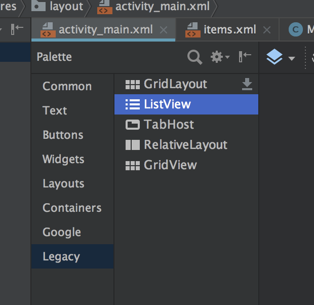
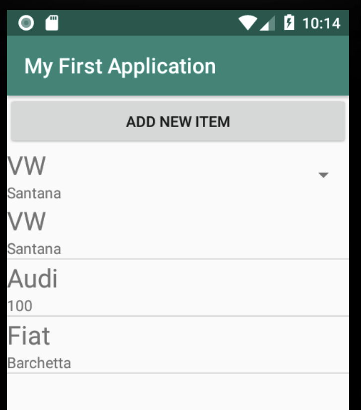

# ListView
Die Listview diente seit API 1 in Android der Darstellung einer großen Zahl an Einträgen aus einer Datenquelle in einer Liste.

Inzwischen gibt es mit der RecyclerView eine Alternative zur ListView, die deutlich besser konfigurierbar ist. Da für die Verwendung jedoch Fragments benötigt werden, werden wir die RecyclerView erst zu einem späteren Zeitpunkt besprechen.

Die ListView findet sich im Desiger im Bereich "legacy". Einfach die View Komponente auf das Layout ziehen. Als Alternative kann natürlich auch der Texteditor verwendet werden:

```java
<ListView
       android:id="@+id/myList"
       android:layout_width="match_parent"
       android:layout_height="match_parent" />
```



Allerdings sind dadurch noch keine Elemente an die ListView gebunden. Die ListView benötigt eine Datenquelle, aus der die Element angezeigt werden. Diese Datenquelle wird mithilfe eines __Adapters__ an die ListView gebunden.

### ArrayAdapter mit fixen Werten
Die einfachste Variante ist ein Adapter mit fixen Werten. Die Element werden zB in einer ArrayList gespeichert.

#### Layout im Emulator


#### Codebeispiel
```java
public class MainActivity extends AppCompatActivity {
    // ArrayList, in der die Elemente abgelegt sind, die die ListView anzeigt
    private List<String> items = new ArrayList<>();
    // Reference auf die ListView
    private ListView mListView;
    private ArrayAdapter<String> mAdapter;

    @Override
    protected void onCreate(Bundle savedInstanceState) {
        super.onCreate(savedInstanceState);
        setContentView(R.layout.activity_main);
        mListView = findViewById(R.id.myList);
        fillItemsList(items);
        bindAdapterToListView(mListView);
    }

    //
    private void bindAdapterToListView(ListView lv) {
        mAdapter = new ArrayAdapter<>(
                // Referenz auf einen Context in Android
                this,
                // ein einfaches fertiges einzeiliges Layout. Hier könnte mann
                // auch ein eigenes Layout mitübergeben - später dazu mehr
                android.R.layout.simple_list_item_1,
                // Die Datenquelle
                items
        );
        // Nachdem der Adapter angelegt wurde, muss er mit der ListView verbunden
        // werden.
        lv.setAdapter(mAdapter);
    }

    // Die Elemente für die ListView werden einfach in die ArrayList gespeichert
    private void fillItemsList(List list) {
        list.add("First Item");
        list.add("Second Item");
        list.add("Third Item");
    }
}
```
### Auf Änderungen in der Datenquelle reagieren
Werden nach Zuweisen des Adapters zur ListView zusätzliche Elemente hinzugefügt, so muss der Adapter über diese Änderung informiert werden.

```java
public void addItemToList(View view) {
        items.add("New Element");
        mAdapter.notifyDataSetChanged();
}
```

### Werte direkt aus einer Ressource übernehmen
Wird die ListView nur als Auswahl benötigt, bei der die Werte nicht verändert werden, bietet es sich an, eine XML Ressource zu verwenden.

Dazu muss zuerst eine Ressource erstellt werden:

Diese Ressource Datei findet man unter ```res->values->name.xml```
Innerhalb dieser Ressourcedatei definiert man ein string-array:
```xml
<?xml version="1.0" encoding="utf-8"?>
<resources>
    <string-array name="items">
        <item>item1</item>
        <item>item2</item>
        <item>item3</item>
    </string-array>
</resources>
```
Danach muss man wie gewohnt den ArrayAdapter initialisieren. Dieses Mal muss jedoch eine Referenz auf die XML-Ressource anstatt der Array-List übergeben werden:
```java
mAdapter = ArrayAdapter.createFromResource(this, R.array.items, android.R.layout.simple_list_item_1);
```
Dies funktioniert jedoch nur, wenn der generische Typ des Adapters ```CharSequence```lautet:
```java
private ArrayAdapter<CharSequence> mAdapter;
```
### Liste mit Objekten beliebigen Typs befüllen
Bislang haben wir für die ListView nur Strings und CharSequences verwendet. Es ist jedoch natürlich möglich, beliebige Objekte in einer ListView darzustellen.

Beispiel: Wir wollen Fahrzeugobjekte vom Typ _Car_ in der ListView darstellen.
```java
public class Car {
    private String make;
    private String model;

    public Car(String make, String model) {
        this.make = make;
        this.model = model;
    }

    // Wichtig ist, dass für die Verwendung eines einzeiligen Layouts die
    // Mtehode toString() überschrieben wird, denn diese wird zur Anzaige
    // in der ListView verwendet.
    @Override
    public String toString() {
        return make + " " + model;
    }

}
```
Nun können wir den Adapter auch mit Objekten vom Typ _Car_ befüllen:
```java
cars.add(new Car('VW', 'Santana'));
cars.add(new Car('Audi', '100'));
cars.add(new Car('Datsun', '280'));
```
Der ArrayAdapter kann mit dem Typ _Car_ typisiert werden:
```java
ArrayAdapter<Car> mAdapter = new ArrayAdapter<>(
    this,
    android.R.layout.simple_list_item_1,
    cars
);
```
Für jedes Objekt in der Liste _cars_ wird nun die Methode ```toString()``` aufgerufen und das Ergebnis erscheint in der ListView.

### Event bei Klick auf Listeneintrag
Wie kann man nun auf einen Klickevent des Benutzers reagieren. Dazu kann der ```OnListItemClick``` Event abgefangen werden.
```java
mListView.setOnItemClickListener(new AdapterView.OnItemClickListener() {
           @Override
           public void onItemClick(AdapterView<?> adapterView, View view, int pos, long id) {
               Toast.makeText(getApplicationContext(), "Item Nr " + pos + " klicked", Toast.LENGTH_LONG).show();
           }
       });
```
Dieser Aufruf erhält zwei Parameter: ```pos``` und ```id```. In der Variable _pos_ ist die Zeilennummer des Eintrags zu finden, auf den geklickt wurde. Dies entspricht bei einem ArrayAdapter der Position in der ArrayList.
Im Parameter _id_ findet sich die ID des Eintrags. Dieser Parameter ist wichtig, wenn die Daten aus einer Datenbank stammen (später dazu mehr).

#### Toast
Ein Toast ist in Android eine kurze Mitteilung, die dem User angezeigt wird. Der Toast verschwindet ohne Zutun des Users nach einer kurzen Zeit wieder automatisch. Um einen Toast anzuzeigen sind folgende Parameter notwenndig:
- ein App-Context (bekommt man über ```getApplicationContext```)
- eine Nachricht in Form eines String Objekts
- die Dauer als Konstante aus der Toast Klasse (```Toast.LENGTH_LONG``` bzw. ```Toast.LENGTH_SHORT```)

Daraus baut man einen Aufruf der statischen Methoden ```makeText``` und hängt mittels Method-chaining noch den Aufruf ```show()``` dran, um dass der Toast auch tatsächlich angezeigt wird.
```java
Toast.makeText(context, message, length).show();
```
### Eigenes Layout für die Zeilen verwenden
Bislang haben wir immer ein vordefiniertes Layout für die Zeilen verwendet. Möchte man komplexere Layouts einsetzen, ist dies genauso möglich.

Dafür benötigt man ein eigenes Layout als XML-Datei und übergibt dieses LayoutFile beim Erstellen des AdapterObjekts:
```java
mAdapter = new ArrayAdapter<>(                
                this,
                R.layout.my_row_layout,                
                items
        );
```
