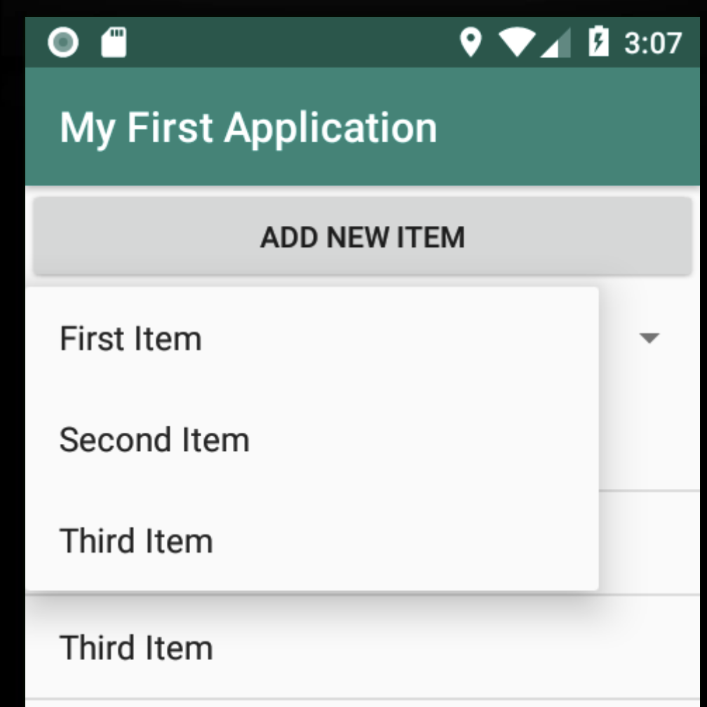

# Spinner View
Die Spinner View Komponente in Android entspricht im Wesentlichen einer DropDown bzw ComboBox. D.h. der User kann aus einer vordefinierten Liste einen Wert auswählen und dieser wird dann in der View angezeigt (bzw. kann natürlich auf die Auswahl reagiert werden).

Die Verwendung eines Spinners ähnelt der einer ListView sehr stark. Auch der Spinner wird mittels Adapter an eine Datenquelle gebunden. Prinzipiell kommen die gleichen Datenquellen wie bei der ListView in Frage.



Der Spinner kann wie jede andere View entweder mittels Designer oder direkt über den TextEditor in das Layout integriert werden.

```xml
<Spinner
    android:id="@+id/spinner"
    android:layout_width="match_parent"
    android:layout_height="wrap_content" />
```
Wir können in diesem Beispiel sogar den gleichen Adapter für Spinner und für ListView verwenden. D.h. wir haben den Adapter bereits initialisiert und mit der Datenquelle verbunden. Jetzt muss er nur noch an den Spinner gebunden werden. (_Würden wir einen eigenen Adapter verwenden wollen - zB weil im Spinner andere Daten als in der ListView angezeigt werden sollen, so müssten wir natürlich einen weiteren Adapter erstellen und initialisieren._)

```java
private void initCombo(Spinner spinner) {
        spinner.setAdapter(mAdapter);
}
```
... und in der ```onCreate``` Methode rufen wir unsere eigene Methode zur Initialisierung des Spinners auf:
```java
protected void onCreate(Bundle savedInstanceState) {
    super.onCreate(savedInstanceState);
    setContentView(R.layout.activity_main);
    mListView = findViewById(R.id.myList);
    mSpinner = findViewById(R.id.spinner);
    fillItemsList(items);
    bindAdapterToListView(mListView);
    mListView.setOnItemClickListener(new AdapterView.OnItemClickListener() {
        @Override
        public void onItemClick(AdapterView<?> adapterView, View view, int i, long l) {
            Toast.makeText(getApplicationContext(), "Item Nr " + i + " klicked", Toast.LENGTH_LONG).show();
        }
    });
    initCombo(mSpinner);
}
```
## Auf Auswahl reagieren
Natürlich kann auch beim Spinner auf die Auswahl reagiert werden. Hier lautet der entsprechende Event ```ItemSelected``` - wir müssen also einen ```OnItemSelectedListener``` an der Spinner View registrieren.
```java
mSpinner.setOnItemSelectedListener(new AdapterView.OnItemSelectedListener() {
           @Override
           public void onItemSelected(AdapterView<?> adapterView, View view, int pos, long id) {
               Toast.makeText(getApplicationContext(), "Item selected", Toast.LENGTH_LONG).show();
           }

           @Override
           public void onNothingSelected(AdapterView<?> adapterView) {

           }
       });
```
Auch hier erhalten wir wieder die Positionsnummer und die ID des ausgewählten Objekts beim Methodenaufruf übergeben.

Auf die aktuelle Auswahl des Spinners kann unabhängig von einem Event folgendermaßen zugegriffen werden:
```java
int pos = mSpinner.getSelectedPosition();
String name = mSpinner.getSelectedItem().toString();
```
Möchte man die aktuelle Auswahl des Spinners festlegen, so kann man dies mithilfe der Methode ```setSelection``` machen.
```java
mSpinner.setSelection(i);
```
