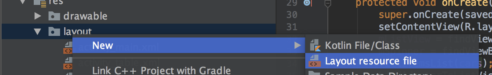

# Eigenes komplexeres Layout für Spinner und ListViews
Bislang haben wir nur sehr einfache vordefinierte oder eigene Layouts verwendet. Natürlich kann man aber den einzelnen Zeilen bzw. Einträgen in Listview und Spinner auch komplexe Layouts zuordnen.



Dieses Layout-File wird wie jedes andere Layout in Android modelliert und dient der Darstellung eines einzelnen Datensatzes.

Zum Beispiel soll ein zweizeiliges Layout verwendet werden, in dem die obere Zeile größer geschrieben ist:
```xml
<?xml version="1.0" encoding="utf-8"?>
<LinearLayout
    xmlns:android="http://schemas.android.com/apk/res/android" android:layout_width="match_parent"
    android:layout_height="match_parent"
    android:orientation="vertical">

    <TextView
        android:id="@+id/txt_make"
        android:layout_width="wrap_content"
        android:layout_height="wrap_content"
        android:text="TextView"
        android:textSize="24sp" />

    <TextView
        android:id="@+id/txt_model"
        android:layout_width="wrap_content"
        android:layout_height="wrap_content"
        android:backgroundTint="@color/colorPrimary"
        android:text="TextView" />
</LinearLayout>
```
Nun müssen wir aber manuell dafür sorgen, dass die richtigen Werte der Objekte mit den richtigen Views aus dem Layout verknüpft werden. In diesem Beispiel wollen wir Objekte vom Typ ```Car``` verwenden und dabei _make_ in der oberen und _model_ in der unteren Zeilen anzeigen.

Dazu müssen wir einen eigenen Adapter implementieren, der von ```BaseAdapter``` abgeleitet wird.

```java
private class TwoRowCarAdapter extends BaseAdapter {
    private List<Car> cars = new ArrayList<>();
    private int layoutId;
    private LayoutInflater inflater;

    public TwoRowCarAdapter(Context ctx, int layoutId, List<Car> cars) {
        this.cars = cars;
        this.layoutId = layoutId;
        // Um das Layout anzeigen zu können, benötigen wir eine Referenz auf den LayoutInflater
        // diesen erhalten wir mittels getSystemService, müssen das Systemservice allerdings
        // dann in einen LayoutInflater casten.
        this.inflater = (LayoutInflater) ctx.getSystemService(LAYOUT_INFLATER_SERVICE);
    }

    // Nun müssen wir dafür sorgen, dass unser Parameter bei den Events die korrekten Werte für
    // id, pos, etc. zurückliefert.

    // Anzahl der vorhandenen Elemente
    @Override
    public int getCount() {
        return cars.size();
    }
    // Liefert das Objekt an Position i aus der Liste
    @Override
    public Object getItem(int i) {
        return cars.get(i);
    }
    // Liefert die ID des Objekts bei Anwendungen mit Datenbanken
    @Override
    public long getItemId(int i) {
        return 0;
    }
    // Hier erfolg das 'Binding' zwischen Datenquelle und View Komponenten aus dem XML-Layout
    @Override
    public View getView(int i, View view, ViewGroup viewGroup) {
        Car car = cars.get(i);
        View listItem = (view == null) ? inflater.inflate(this.layoutId, null) : view;
        ((TextView) listItem.findViewById(R.id.txt_make)).setText(car.getMake());
        ((TextView) listItem.findViewById(R.id.txt_model)).setText(car.getModel());
        return listItem;
    }
}
```
Natürlich muss die verwendete Liste zur Speicherung der Daten nun mit ``Car`` typisiert sein und dementsprechend mit Car Objekten befüllt werden.
```java
public class MainActivity extends AppCompatActivity {
    // ArrayList, in der die Elemente abgelegt sind, die die ListView anzeigt
    private List<Car> cars = new ArrayList<>();
    // Reference auf die ListView
    private ListView mListView;
    private TwoRowCarAdapter mAdapter;
    private Spinner mSpinner;
    ....
```
Die Liste mit Objekten vom Typ ```Car``` befüllen.
```java
// Die Elemente für die ListView werden einfach in die ArrayList gespeichert
private void fillItemsList(List list) {
    list.add(new Car("VW", "Santana" ));
    list.add(new Car("Audi", "100"));
    list.add(new Car("Fiat", "Barchetta"));
}
```

Dann kann der Adapter vom Typ ```TwoRowCarAdapter``` angelegt werden. Wir übergeben in diesem Fall wieder den Kontext, aber das eigene XML Layout und die cars-Liste.
```java
mAdapter = new TwoRowCarAdapter(this, R.layout.my_row_layout, cars);
// Nachdem der Adapter angelegt wurde, muss er mit der ListView verbunden
// werden.
lv.setAdapter(mAdapter);
```

Für eine bessere Performance beim Erstellen der GUI wird empfohlen das View-Holder Pattern umzusetzen bzw. statt der ListView eine RecyclerView zu verwenden. Momentan bleiben wir der Einfachheit halber jedoch bei der Verwendung der ListView.
Informationen zu ViewHolder Pattern und RecyclerView findet man zB:
- https://github.com/ulat/android-RecyclerView
- https://developer.android.com/guide/topics/ui/layout/recyclerview
- https://developer.android.com/training/improving-layouts/smooth-scrolling

## Eigenen Adapter von ArrayAdapter ableiten
Neben der Verwendung von ```BaseAdapter``` als Basisklasse kann auch direkt von der Klasse ```ArrayAdapter``` abgeleitet werden und so ein eigener ArrayAdapter erstellt werden. Wenn als Datenquelle ein kompatibler ArrayTyp verwendet wird, ist diese Variante etwas schneller, als die Verwendung von BaseAdapter. Die Variante mit BaseAdapter lässt dem Entwickler jedoch mehr Freiraum, was zB die Wahl der Datenquelle betrifft. So könnte zB auch auf eine Datenbank zugegriffen werden.

```java
private class TwoRowArrayAdapter extends ArrayAdapter<Car> {

    public TwoRowArrayAdapter(@NonNull Context context, int resource, @NonNull List<Car> objects) {
        ...
    }

    @NonNull
    @Override
    public View getView(int position, @Nullable View convertView, @NonNull ViewGroup parent) {
        ...
    }
}
```
Hier wird die Verwaltung der ArrayList (```getCount```, ```getPos```, etc.) direkt vom ArrayAdapter übernommen und muss nicht selbst implementiert werden. 
