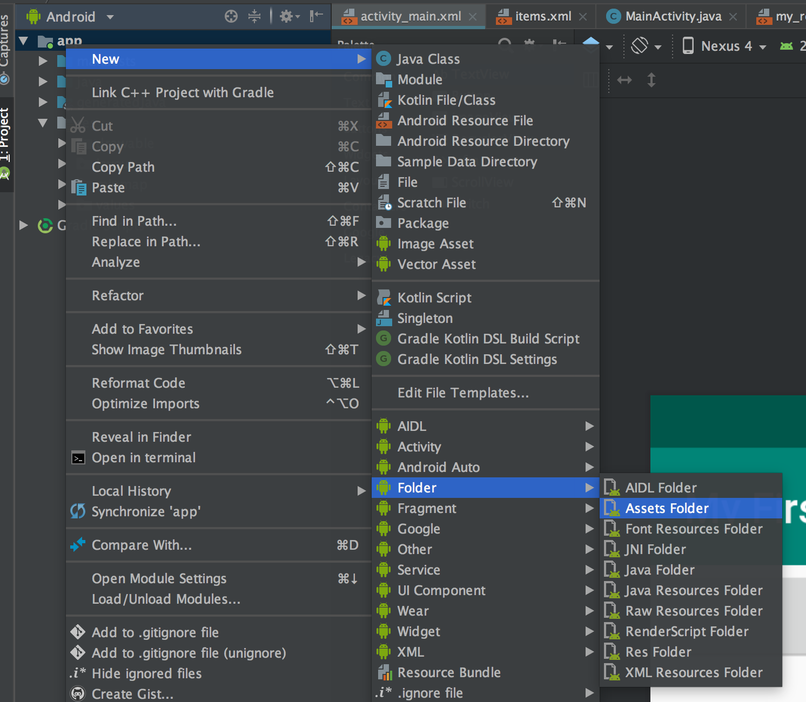

# Assets
Assets sind beliebige Daten, die direkt mit der App ausgeliefert werden. Nach der Installation am Gerät sind Assets sofort am Gerät verfügbar.

Allerdings muss daher bei Änderungen in Assets auch eine neue Version der App im Playstore veröffentlicht werden und der User muss diese neue Version installieren.

Sämtliche Assets werden im Android Projekt in einem Unterordner "assets" abgelegt. Dieser muss jedoch vor Verwendung zuerst erstellt werden.

Dazu wählt klickt man in Android Studio mit der rechten Maustaste auf das Projekt und wählt __New->Folder->Assets Folder__



Der Zugriff auf die Assets, die mit der App mitgeliefert werden erfolgt über eine eigene Klasse, den ```AssetManager```. In einer Activity holt man ein Referenz auf den AssetManager mihilfe von ```getAssets()```. Nun kann auf die Assets zugegriffen werden und mittels ```open()``` ein ```InputStream``` erstellt werden, mit dem die Assets eingelesen werden können:

Codebeispiel:

```java
private InputStream getInputStreamForAsset(String filename) {
    // tries to open Stream on Assets. If fails, returns null
    Log.d(TAG, "getInputStreamForAsset: " + filename);
    AssetManager assets = getAssets();
    try {
        return assets.open(filename);        
    } catch (IOException e) {
        Log.e(TAG, e.toString());
        e.printStackTrace();
        return null;
    }
}
```
Das Root-Verzeichnis für alle Assets lautet: "_assets_". Innerhalb dieses Verzeichnisses können beliebige weitere Unterverzeichnisse angelegt werden.
Nachdem wir nun einen Stream auf die Assets erhalten haben, können wir wie in Java üblich den Stream auslesen:

```java
private void readAssets() {
    // better store assetfilename as String constant!
    InputStream in = getInputStreamForAsset("data.txt");
    BufferedReader bin = new BufferedReader(new InputStreamReader(in));
    String line;
    try {
        while ((line = bin.readLine()) != null) {
            Log.d(TAG, "line: " + line);
        }
    } catch (IOException e) {
        Log.e(TAG, e.toString());
        e.printStackTrace();
    }
}
```
