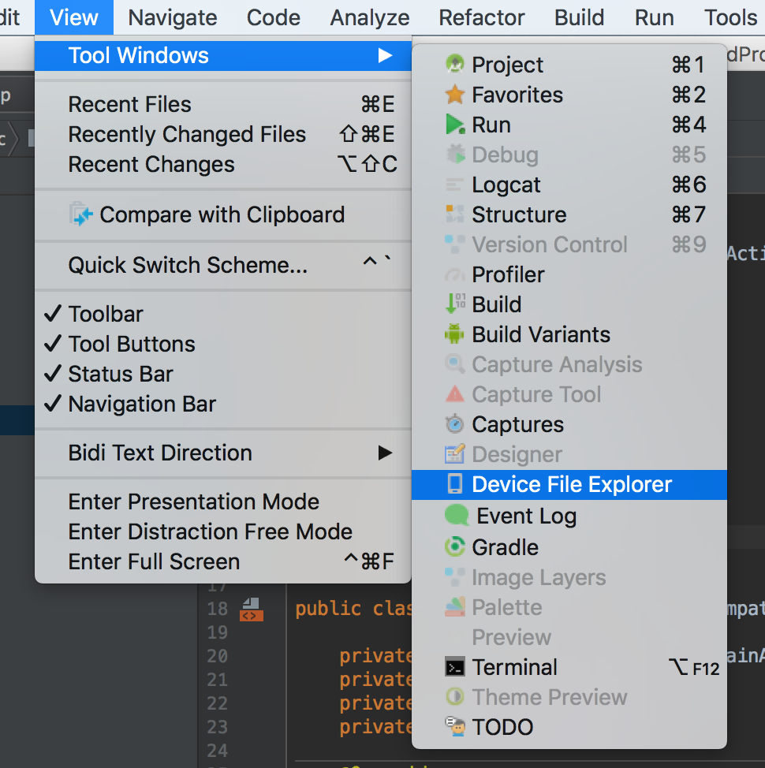
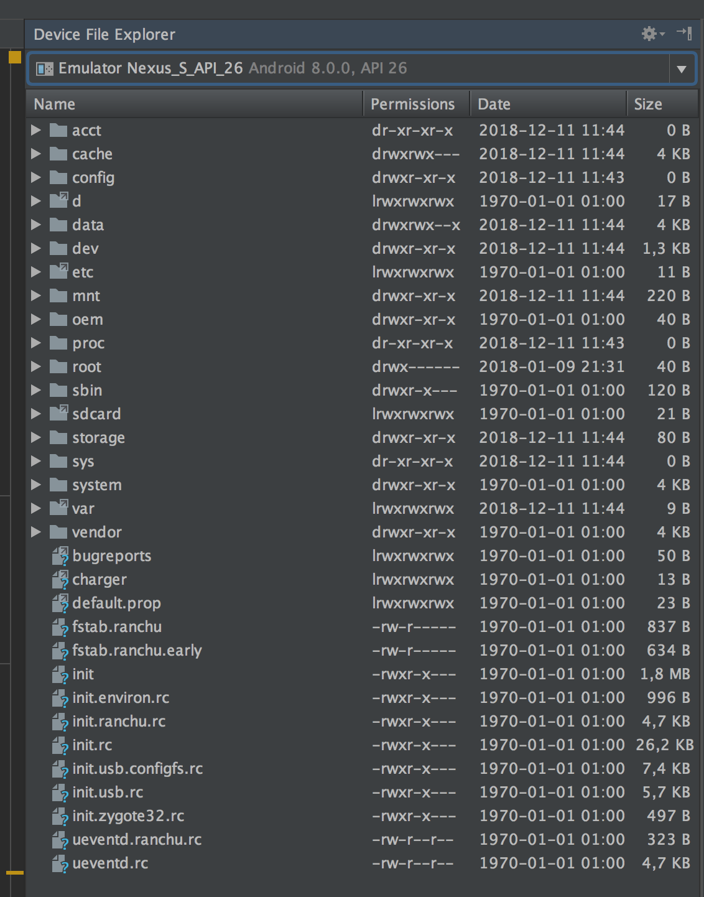
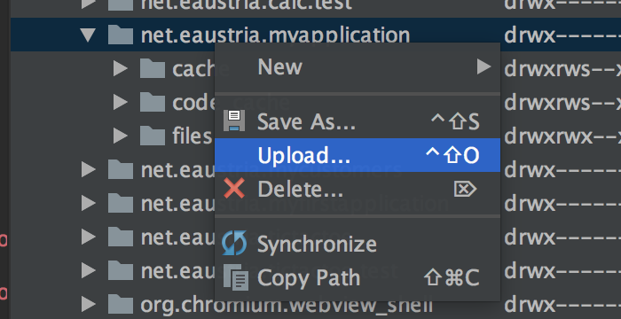

# Dateimanagement in Android

Bislang wurde nur die Weitergabe von Dateien in Form von Assets direkt mit der App besprochen. Dies hat jedoch den Nachteil, dass keine Serialisierung von Daten möglich ist. D.h. sämtliche Änderungen gehen nach dem Schließen der App wieder verloren.

In Android können jedoch eigene Dateien in einem bestimmten Bereich des Telefonspeichers angelegt werden. Die **Dateioperationen sind die gleichen wie unter Java**.

Möchte man jedoch direkt auf eine **eingesetzte SD-Karte schreiben**, so benötigt die App **zusätzliche Berechtigungen**. Dieses Berechtigungskonzept werden wir in einem späteren Kapitel eigens besprechen.

Diese Demo App schreibt einfach in eine Textdatei und zeigt den aktuellen Inhalt im unteren Fenster an:


*Wichtig: Der Dateiname wird ohne jeglichen Pfad angegeben. Der gesamte Pfad wird automatisch ergänzt!*

## Lesen / Schreiben in die Datei

Die Methode ```openFileOutput(filename, MODE_PRIVATE | MODE_APPEND);``` liefert einen FileStream zurück, auf den, wie von Java gewohnt, geschrieben werden kann:

```java
String filename = mFileName.getText().toString();
String input = mInputText.getText().toString();
try {
    FileOutputStream fos = openFileOutput(filename, MODE_PRIVATE | MODE_APPEND);
    PrintWriter out = new PrintWriter(new OutputStreamWriter(fos));
    out.println(input);
    out.flush();
    out.close();
} catch (FileNotFoundException exp) {
    Log.d(TAG, exp.getStackTrace().toString());
}
```

Der Parameter ```MODE_PRIVATE``` besagt, dass in den privaten Speicherbereich der App geschrieben wird. Das Flag ```MODE_APPEND``` gibt an, dass der zu schreibende Inhalt an den bestehenden Dateiinhalt angehängt wird.

Das Lesen erfolgt mithilfe der Methode ```openFileInput(filename)```:

```java
try {
    FileInputStream fis = openFileInput(filename);
    BufferedReader in = new BufferedReader(new InputStreamReader(fis));
    String line;
    StringBuffer buffer = new StringBuffer();
    while ((line = in.readLine()) != null ) {
        buffer.append(line);
    }
    mFileContent.setText(buffer.toString());
    in.close();
} catch (IOException exp) {
    Log.d(TAG, exp.getStackTrace().toString());
}
```

## Das Dateisystem
Durch den Parameter ```MODE_PRIVATE``` haben wir auf den _privaten_ Speicherbereich der App verwiesen. Dieser Pfad folgt immer dem gleichen Schema: ```/data/data/nameOfApp```. Die Dateien liegen immer in einem Unterverzeichnis **files**.

Einsehen kann man das Dateisystem mithilfe vom _Android Device Monitor_ oder mithilfe einer Terminal-Verbindung direkt auf den Emulator.

### getFilesDir()

... liefert den vollen Pfad des lokalen Verzeichnisses:
```java
String filesDir = getFilesDir().getAbsolutePath();
```
### Android Device Monitor
Der _Android Device Monitor_ ist eine der angesprochenen Möglichkeiten, um auf das Dateisystem des Emulators zugreifen zu können. _Ab der Version 3.2 wurde der Menüpunkt zum Starten vom Android Device Monitor aus Android Studio entfernt:_ https://developer.android.com/studio/profile/monitor

Man kann den Device Monitor allerdings **manuell aus der Eingabeaufforderung (Terminal)** starten:
- mit ```cd``` ins Verzeichnis ```android-sdk/tools/``` wechseln
- mit ```monitor``` den device monitor staten.

Um auf das Dateisystem vom Emulator zugreifen zu können bietet Android Studio nun den **Device File Explorer** an. Diesen findet man unter: ```View -> Tools Windows -> Device File Explorer```.





Klickt man mit der rechten Maustaste auf einen Eintrag im Verzeichnis, so kann man Dateien hochladen oder bestehende Dateien vom Emulator löschen.



### Zugriff über Shell-Zugriff auf den Emulator
Von der Commandline kann man sich auch auf das Device/Emulator verbinden. Dazu muss man den Befehl adb shell eingeben.
*Hinweis: Die Datei adb.exe liegt im Unterverzeichnis platform-tools des Installationsverzeichnisses des Android-Sdk, also in der Schule auf der D: Partition!*

Hier kann man das Zugriffsproblem einfach lösen, indem man run-as myAppName eingibt, also z.B. ```run-as my.domain.myAppName```.
