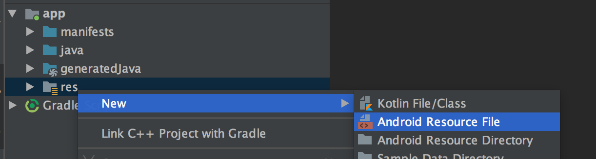
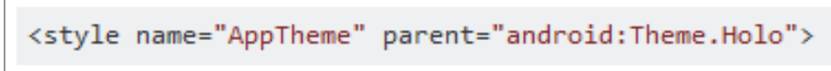
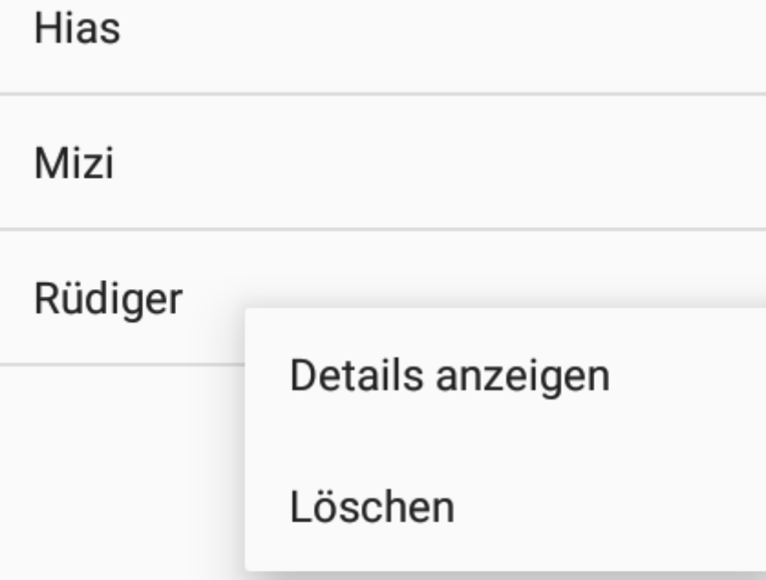

# Menüs in Android

Menüs können in Android auf unterschiedliche Weise dargestellt werden:
  - am unteren Bildschirmrand werden die Menüs eingeblendet.
  - oben in der Actionbar (Titelleiste)

Konfiguriert werden die Menüs mittels XML Dateien, die wie alle anderen Ressourcen im Verzeichnis ```res/menu```stehen. _Sinnvollerweise bennent man die XML Datei entsprechend dem Einsatz des Menüs!_

## Definition der XML Datei
Der Wurzel Tag für ein Menü in XML lautet: ```<menu>```. Die einzelnen Einträge im Menü werden mittels ```<item>``` Tags definiert. Wichtige Attribute sind:
  - `id`: Verpflichtender id-Tag wie bei anderen Ressourcen auch
  - `title`: angezeigter Text vom Menü
  - `ìcon`: Symbol vom Menüeintrag
  - `showAsAction`: Anzeigeoptionen.

Möchte man mehrere Einträge im Menü in einer Gruppe zusammenfassen, so bietet Android den Tag `<group>` an. Diese Gruppe teilt dann Einstellungen über alle darin enthaltenen `item` Tags (wie zB `active state` oder `visibility`).

Weitere Details zu den Menü Tags:
https://developer.android.com/guide/topics/resources/menu-resource.html

Um ein Menü im Android Studio anzulegen, klickt man mit der _rechten_ Maustaste auf den Ordner `res` und wählt `New`->'Android resource file'. Im Dialog, der sich danach öffnet vergibt man einen eindeutigen Namen für das Menu und wählt als __Resource type Menu__ aus.



Das XML File sieht dann für das Menü zum Beispiel so aus:

```xml
<menu xmlns:android="http://schemas.android.com/apk/res/android"
    xmlns:app="http://schemas.android.com/apk/res-auto">

    <item
        android:id="@+id/menu_help"
        android:icon="@android:drawable/ic_menu_help"
        android:title="@string/help"
        app:showAsAction="never" />

    <item
        android:id="@+id/menu_preferences"
        android:icon="@android:drawable/ic_menu_preferences"
        android:tooltipText="@string/prefs"
        app:showAsAction="always" />

    <item
        android:id="menu_quit"
        android:icon="@android:drawable/ic_menu_close_clear_cancel"
        android:title="@string/quit"
        app:showAsAction="never" />
</menu>
```

Als Icons können alle Elemente verwendet werden, die als drawables im Android Projekt in den Ressourcen verfügbar sind. Android liefert jedoch auch eine Reihe von Standard Icons mit, die man allesamt unter ```android:drawble/ic_menu_...``` findet.

Da sich diese Icons jedoch zwischen Android Versionen verändern können wird für produktive Apps empfohlen, lokale Kopien dieser Icons anzufertigen und die Kopien zu referenzieren (nicht über android.drawble....).

## Zuordnung zur Activity

Die Methode `OnCreateOptionsMenu` kann in der Activity überschrieben werden und für das Hinzufügen eines eigenen Menüs genutzt werden. Wichtig ist, dass am Ende der Methode der Superkonstruktor mit `super.OnCreateOptionsMenu` aufgerufen wird, damit mögliche Menüpunte der Basisklasse ebenfalls in das Menü hinzugefügt werden.

```java
@Override
public boolean onCreateOptionsMenu(Menu menu) {
    getMenuInflater().inflate(R.menu.menu_main, menu);
    return super.onCreateOptionsMenu(menu);
}
```

_Sollte das Menü nicht angezeigt werden, kann dies mit dem eingestellten Style zusammenhängen. Öffnet die Datei `styles.xml` und stellt sicher, dass ihr folgenden Eintrag für den Tag "AppTheme" in der Datei stehen habt:_


## showAsAction
Dieser Parameter gibt an, wann das Item eigenständig in der ActionBar angezeigt wird:

| Wert | Funktion |
| ----------: | :----------- |
| always | immer sichtbar |
| never | nie in der ActionBar |
| ifRoom | erscheint nur, wenn in der ActionBar ausreichend Platz vorhanden |
| withText | neben dem Symbol wird zusätzlich auch der Titel-Text angezeigt |

Natürlich kann ich für Hoch- und Querformat die Einstellungen variieren und so zB mehr Menüpunkte direkt in der ActionBar anzeigen, wenn meine App im Querformat benutzer wird (oder zB auf größeren Displays wie Tablets).

Dazu trennt man mehrere Einträge für das Attribut mit dem _Pipe_-Symbol:   `app:showAsAction="always|withText"`.

## Reaktion auf die Menüauswahl

Durch Implementieren der Methode `onOptionsItemsSelected` kann auf die Auswahl durch den User reagiert werden. Der ausgewählte Menüpunkt wird über die ID weitergegeben und kann zB in einem Switch-Statement abgefragt werden.

Liefert die Methode `true` zurück, so bedeutet dies, dass der Klick Event behandelt wurde und die Operation damit abgeschlossen ist.

```java
@Override
public boolean onOptionsItemSelected(MenuItem item) {
    int id = item.getItemId();
    Log.d(TAG, "onOptionsItemSelected: " + id );
    switch (id) {
        case R.id.menu_help:
            Toast.makeText(this, "Help Clicked", Toast.LENGTH_LONG).show();
            break;
        case R.id.menu_preferences:
            Toast.makeText(this, "Preferences Clicked", Toast.LENGTH_LONG).show();
            break;
        case R.id.menu_quit:
            Toast.makeText(this, "Help Clicked", Toast.LENGTH_LONG).show();
            break;
    }
    return super.onOptionsItemSelected(item);
}
```

## Konfiguration der Actionbar
Die ActionBar kann per Code geändert werden:

```java
private void configActionBar() {
   ActionBar actionBar = getSupportActionBar();
   actionBar.setSubtitle("My modified ActionBar");
   actionBar.setTitle("MyActionBar");

   Drawable background = ContextCompat.getDrawable(this,
           android.R.drawable.status_bar_item_app_background);

}
```

_Da die Activity Klasse von `ÀppCompatActivity` abgeleitet ist, muss die Methode `getSupportActionBar()` verwendet werden (anstelle von `getActionBar()`). Damit bekommen wir ein Objekt vom Typ `android.support.v7.app.ActionBar` zurückgeliefert._

## Der Back-Button
Möchte man in der ActionBar einen Button anzeigen, der die Zurück-Taste simuliert, sind folgende Änderungen erforderlich:

`actionBar.setDisplayHomeAsUpEnabled(true)`

Auf den Klick muss in der Methode `onOptionsItemSelected()` reagiert werden. Wir erhalten als ID des MenuItems den Wert `android.R.id.home`.

```java
case android.R.id.home:
   Toast.makeText(this, "Back on AB clicked!", Toast.LENGTH_LONG).show();
   break;
```

## Kontextmenü
Kontextmenüs erscheinen bei längeren Klick auf einen Eintrag. Sie eignen sich insbesondere für Operationen, die auf einzelne Elemente etwa einer Listview angewendet werden sollen.


Programmatisch ist ein Contextmenu genauso zu handhaben, wie die anderen Menus auch:
 - Menü als XML Datei definieren
 - `registerForContextMenu()`: hier ein Element für das Kontextmenü registrieren
 - `onCreateContextMenu()`: Hier kann für jede registrierte View Komponente ein eigenes Menü erstellt werden.
 - `onContextItemSelected()`: Hier kann auf die User-Eingabe im Menü reagiert werden.

### XML Datei erstellen
Das Menü wird als XML-Ressource definiert:
```xml
<?xml version="1.0" encoding="utf-8"?>
<menu xmlns:android="http://schemas.android.com/apk/res/android">
    <item
        android:id="@+id/context_show"
        android:title="@string/context_show" />
    <item
        android:id="@+id/context_delete"
        android:title="@string/context_delete" />

</menu>
```

### Contextmenu an View Komponente registrieren
Möchte man ein Contextmenu verweden, muss jede View-Komponente, mit der ein derartiges Menu verbunden sein sollte, extra registriert werden:

```java
@Override
protected void onCreate(Bundle savedInstanceState) {
   super.onCreate(savedInstanceState);
   setContentView(R.layout.activity_main);
   configActionBar();
   // register context menu to view component
   TextView textView = findViewById(R.id.text_view);
   registerForContextMenu(textView);
   listView = findViewById(R.id.listview);
   registerForContextMenu(listView);
   createListAdapter(listView);
}
```

### Zuordnen vom Contextmenu zur View Komponente
In der Methode `onCreateContextMenu()` wird das jeweilige XML-Menu der View Komponente zugeordnet:
```java
@Override
public void onCreateContextMenu(ContextMenu menu, View v,
                                ContextMenu.ContextMenuInfo menuInfo) {
   int viewId = v.getId();
   if (viewId == R.id.text_view) {
       getMenuInflater().inflate(R.menu.context_menu, menu);
   }
   super.onCreateContextMenu(menu, v, menuInfo);
}
```
### Reaktion auf die Menüauswahl
Die Reaktion erfolgt wieder sehr ähnlich wie bei Optionsmenüs. Sie wird in der Methode `onContextItemSelected()` umgesetzt:
```java
@Override
public boolean onContextItemSelected(MenuItem item) {
    if (item.getItemId() == R.id.context_show) {
        Toast.makeText(this, "Showing details!", Toast.LENGTH_LONG).show();
        return true;
    }
    if (item.getItemId() == R.id.context_delete) {
        Toast.makeText(this, "Deleting item", Toast.LENGTH_LONG).show();
        return true;
    }
    return super.onContextItemSelected(item);
}
```
### ContextMenu für Elemente einer Listview
Möchte man ein Contextmenu den Elementen einer ListView zuordnen, ergibt sich folgendes Problem: Die einzige vorhandene ID ist jene von der ListView selbst. Für das Kontextmenü braucht man aber die ID vom ausgewählten Listeneintrag.

Der  grundlegende Prozess läuft auch bei der ListView gleich ab.

#### Menü registrieren
```java
ListView listView = findViewById(R.id.listview);
registerForContextMenu(listView);
```
Die gesamte ListView Komponente wird für das ContextMenü registriert.

#### Menü erstellen
Auch hier wird das Menü zuerst als XML-Ressource angelegt. _In diesem Beispiel wird für die ListView das gleiche Kontextmenü wie für das Textfeld verwendet. Man könnte hier jedoch natürlich auch ein anderes XML-Menü erstellen!_
```xml
<?xml version="1.0" encoding="utf-8"?>
<menu xmlns:android="http://schemas.android.com/apk/res/android">
    <item
        android:id="@+id/context_show"
        android:title="@string/context_show" />
    <item
        android:id="@+id/context_delete"
        android:title="@string/context_delete" />

</menu>
```
#### Zuweisung vom Menü an die Komponente
Auch hier kann ich ein Menü für mehrere Komponenten verwenden, oder unterschiedliche Menüs zuweisen.
```java
@Override
public void onCreateContextMenu(ContextMenu menu, View v,
                                ContextMenu.ContextMenuInfo menuInfo) {
   int viewId = v.getId();
   if (viewId == R.id.text_view || viewId == R.id.listview) {
       getMenuInflater().inflate(R.menu.context_menu, menu);
   }
   super.onCreateContextMenu(menu, v, menuInfo);
}
```
#### onContextItemSelected
Der wesentliche Unterschied bei der Verwendung eines ContextMenüs in Verbindung mit einer ListView liegt in der Implementierung der Methode `onContextItemSelected`. Hier ist man ja nicht an der gesamten Liste, sondern nur an der ID den angeklickten Eintrags in der Liste interessiert. Diese Information bekommt man von der `MenuInfo`, die im Fall der Liste vom Typ `AdapterContextMenuInfo` ist und entsprechend gecastet werden muss. Diese Klasse hat dann Properties für **id** und **position**.
```java
@Override
public boolean onContextItemSelected(MenuItem item) {
    if (item.getItemId() == R.id.context_show) {
        AdapterView.AdapterContextMenuInfo info =
                (AdapterView.AdapterContextMenuInfo) item.getMenuInfo();
        String name = "";
        if (info != null) {
            long id = info.id;
            int pos = info.position;
            name = info != null ?
                    listView.getAdapter().getItem(pos).toString() :
                    "";
        }
        Toast.makeText(this, "Showing details! "+name ,
                Toast.LENGTH_LONG).show();
        return true;
    }
    if (item.getItemId() == R.id.context_delete) {
        Toast.makeText(this, "Deleting item", Toast.LENGTH_LONG).show();
        return true;
    }
    return super.onContextItemSelected(item);
}
```
## Popup Menu
Es gibt noch eine dritte Variante, ein Menü zu öffnen, nämlich aufgrund eines beliebigen Events, z.B. eines Button-Klicks.
Die zugehörige Klasse heißt PopupMenu.
Das Menü wird wie in den beiden anderen Varianten erzeugt. Es erscheint dann unterhalb jener View, die im Konstruktor von PopupMenu angegeben wird.
Popup Menüs sollten nicht für kontextbezogene Aktionen verwendet werden. Sie eignen sich dafür, wenn nach dem ersten Befehl noch weitere Auswahlmöglichkeiten bestehen. Z.B. kann der Button "New" mit einer Auswahl hinterlegt werden, welches neue Element angezeigt werden soll.

```java
public void showPopupMenu(View view) {
    PopupMenu menu = new PopupMenu(this, view);
    menu.inflate(R.menu.popup_menu);
    menu.setOnMenuItemClickListener( (item) -> {
        Toast.makeText(this, "Popup Menu id: " + item.getItemId(),
                        Toast.LENGTH_LONG).show();
        return true;
    });
    menu.show();
}
```
