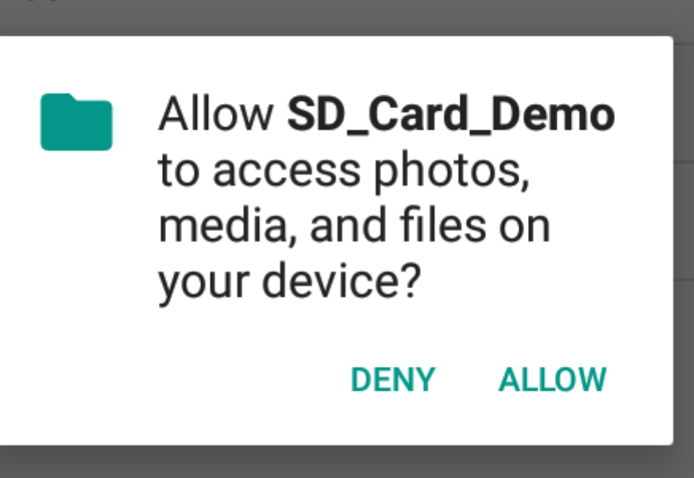
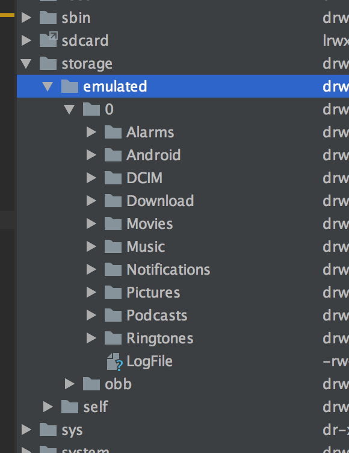

# Berechtigungskonzept zum Speichern auf der SD Karte
Der Speicher auf der SD Karte unterscheidet sich vom internen App-Speicher (den wir bislang verwendet haben) dahingehend, dass die SD Karte von allen installierten Apps gelesen und beschrieben werden kann.

Die Lese- und Schreibvorgänge erfolgen wieder mit den Standard-Board-Mitteln von Java wie z.B. `PrintWriter`. Acht geben muss man nur auf den Aufbau des absoluten Dateinamens.

```java
private void writeToFile(String filename) {
    String state = Environment.getExternalStorageState();
    if (!state.equals(Environment.MEDIA_MOUNTED)) return;
    File outFile = Environment.getExternalStorageDirectory();
    String path = outFile.getAbsolutePath();
    String fullPath = path + File.separator + filename;
    Log.d(TAG, "filename: " + fullPath);
    try {
        PrintWriter out = new PrintWriter(
                                new OutputStreamWriter(
                                    new FileOutputStream(fullPath)));
        out.print(txtInput.getText().toString());
        out.flush();
        out.close();
    } catch (Exception e) {
        Log.e(TAG, e.getLocalizedMessage());
    }
}
```
Vor dem Schreiben auf die SD Karte sollte geprüft werden, ob auch tatsächlich eine SD Karte im Gerät vorhanden ist. (Mithilfe der Methode `Environment.getExternalStorageState()`). Diese liefert verschiedene Strings zurück, wobei `MEDIA_MOUNTED` angibt, dass auf die SD-Karte geschrieben werden kann.

Sicherheitshalber sollte man sich (wie im Beispiel) noch das root-Verzeichnis der SD-Karte mit `getExternalStorageDirectory()` besorgen und nicht direkt als String selbst festlegen.

# Permissions
Bestimmte Aktionen einer App in Android könnten für das Gerät oder den Benutzer weitere Auswirkungen haben. Daher muss der Benutzer zustimmen, dass die App diese Aktionen ausführen darf. Insbesondere der Zugriff auf Systemressourcen ist in Android mit diesem Konzept der `Permission` geschützt.

Es werden __vier Arten von Permissions__ unterschieden:
 - __normale__ Permissions: Berechtigungen, die keine nennenswerte Auswirkung auf die Privatsphäre des Benutzers bzw. der App haben. Diese werden von Android automatisch gewährt.
 Beispiele:
   - Internet
   - Setzen der Zeitzone
   - https://developer.android.com/guide/topics/permissions/overview#normal_permissions

- __Signature__ Permissions: Diese werden zum Installationszeitpunkt vom System gewährt, sofern die App, die die Berechtigung anfragt, mit der gleichen Zertifikatsdatei signiert wurde, mit der auch die Permission signiert wurde.
  - https://developer.android.com/guide/topics/permissions/overview#signature_permissions

- __gefährliche__ Permissions: diese müssen vom Benutzer explizit erteilt werden. (Die App muss die Berechtigung beim Benutzer anfragen.)
  - Zugriff auf Kontaktdaten
  - Zugriff auf Kalendar
  - Benutzung der Kamera
  - Empfangen von SMS
  - Zugriff auf SD-Karte
  - https://developer.android.com/guide/topics/permissions/overview#dangerous_permissions

- __Special__ Permissions: Berechtigungen, die von Apps im Normalfall nicht genutzt werden sollten
  - https://developer.android.com/guide/topics/permissions/overview#special_permissions

 Bis einschl. Android 5 wurden Berechtigungen bereits bei der Installation abgefragt, was zur Folge hatte, dass man entweder alle Berechtigungen auf einmal gewährt, bzw. wenn nicht, die App zur Gänze nicht installiert werden konnte.

 Ab API-Version 23 (diese muss daher in build.gradle bei targetSdkVersion mindestens eingetragen werden) wird der Benutzer erst zur Laufzeit über einzelne Permissions gefragt (gilt aber nur für gefährliche Berechtigungen).

 ## Typischer Ablauf bei der Anfragen nach Berechtigungen

 1. Normale oder gefährliche Permission?

 1. Genauen Namen der Berechtigung, die benötigt wird aus der Android Docu heraussuchen. Diese Berechtigung muss in der Datei `AndroidManifest.xml` eingetragen werden. (Beispielsweise: `android.permission.WRITE_EXTERNAL_STORAGE`):
```XML
 <manifest xmlns:android="http://schemas.android.com/apk/res/android"
    package="net.eaustria.sd_card_demo">
    <uses-permission android:name="android.permission.WRITE_EXTERNAL_STORAGE" />
    <application>
        ...
    </application>
</manifest>
```
__Der Eintrag im Manifest muss sowohl für normale, wie auch für gefährliche Permissions erfolgen!__

 1. Bei gefährlichen Permissions den User an geeigneter Stelle nach Erteilung der Permission fragen. Die Idee hinter dem Konzept ist, dass die App möglicherweise auch mit nur einzelnen Permissions verwendet werden kann. Ist eine Verwendung der App ohne der angefragten Permission jedoch nicht sinnvoll, so kann die Abfrage nach der Permission natürlich direkt in der `onCreate(..)` Methode erfolgen.
Mustercode:
```java
if (checkSelfPermission(Manifest.permission.Xxx)
    !=PackageManager.PERMISSION_GRANTED) {
    requestPermissions(new String[]{Manifest.permission.Xxx},RQ_Xxx);
} else {
    doIt();
}
```
1. Nach Erteilen der Permission kommt das Programm in the Methode `onRequestPermissionsResult()` zurück. Daher muss diese Methode überschrieben werden.
```Java
public void onRequestPermissionsResult( int requestCode,
                                      String[] permissions,
                                      int[] grantResults ) {
  super.onRequestPermissionsResult(requestCode,
                                   permissions,
                                   grantResults);
  if (requestCode==RQ_Xxx) {
    if (grantResults.length>0 &&
        1grantResults[0]!=PackageManager.PERMISSION_GRANTED) {
      //user does not allow
    } else {
      doIt();
    }
  }
}
```
# Demo Beispiel Verwendung der SD Karte
Nun wollen wir diesen Workflow am Beispiel der Verwendung der SD Karte als Speichermedium durchgehen:
## Manifest
Der Tag dazu heißt `<uses-permission>` und muss als direktes Kind des `<manifest>`-Tags angegeben werden. Der Name der Berechtigung ist über die Klasse `android.permission` verfügbar und heißt im Falle des Schreibens auf die SD-Karte `WRITE_EXTERNAL_STORAGE`.
```xml
<manifest xmlns:android="http://schemas.android.com/apk/res/android"
   package="net.eaustria.sd_card_demo">
   <uses-permission android:name="android.permission.WRITE_EXTERNAL_STORAGE" />
   <application>
       ...
   </application>
</manifest>
```
## Abfrage der Permission im Code
Das Schreiben auf die SD-Karte wird als gefährliche Permission eingestuft. Daher muss die Berechtigung auch zur Laufzeit über den Programmcode eingeholt werden.

Mit `checkSelfPermission` wird überprüft, ob die Berechtigung (im Fall der Schreibberechtigung also `WRITE_EXTERNAL_STORAGE`) bereits erteilt wurde. Dies geschieht durch Vergleich mit der Konstanten `PackageManager.PERMISSION_GRANTED`.
```java
public void printInput(View view) {
    Log.d(TAG, "entered printInput");
    if (checkSelfPermission(Manifest.permission.WRITE_EXTERNAL_STORAGE)
        !=PackageManager.PERMISSION_GRANTED) {
        // RQ_WRITE_STORAGE ist just any constant value to identify the request
        requestPermissions(new String[] {Manifest.permission.WRITE_EXTERNAL_STORAGE},
                RQ_WRITE_STORAGE);
    } else {
        writeToFile("LogFile");
    }
}
```
`RQ_WRITE_STORAGE` ist einfach eine Konstante, die in der Klasse definiert wird und den jeweiligen Request identifiziert.  
`private static final int RQ_WRITE_STORAGE = 12345;`

## Verarbeitung der Erteilung bzw. Verweigerung der Permission
Bei Klick auf „Allow“ wird die Methode `onRequestPermissionResult` aufgerufen, die also ebenfalls programmiert werden muss. Hier wird die oben erwähnte RequestCode verwendet, um die Permission zu identifizieren:
```java
@Override
public void onRequestPermissionsResult(int requestCode,
                                      @NonNull String[] permissions,
                                      @NonNull int[] grantResults) {
   super.onRequestPermissionsResult(requestCode, permissions, grantResults);
   if (requestCode==RQ_WRITE_STORAGE) {
       if (grantResults.length>0 && grantResults[0]!=PackageManager.PERMISSION_GRANTED) {
           Log.d(TAG, "SD Card Permission denied");
           Toast.makeText(this,
                   "SD Car Permission wurde verweigert!",
                   Toast.LENGTH_LONG).show();
       } else {
           writeToFile("LogFile");
       }
   }
}
```

__Hinweise:__

- Man beachte hier, dass der eigentliche Code, der nach Erteilen der Permission ausgefüht werden soll (in diesem Fall die Methode `writeToFile` an zwei Stellen aufgerufen werden muss. Einmal, falls die Permission bereits erteilt wurde, und einmal falls der Benutzer die Permission bei der aktuellen Anfrage erteilt.)

- Beim Testen beachtet: Habt ihr die Permission am Emulator einmal erteilt, bleibt diese Auswahl gespeichert. Wollt iht, dass der Abfragedialog erneut angezeigt wird, müsst ihr entweder die einzelne Permission widerrufen oder die App am Emulator deinstallieren!

- AppCompatActivity: Verwendet man eine SDK Version <23, muss man die Methoden aus der Klasse `ActivityCompat` verwenden:
```java
if (ActivityCompat.checkSelfPermission(this,
    Manifest.permission.WRITE_EXTERNALE_STORAGE)
    != PackageManager.PERMISSION_GRANTED) {
            ActivityCompat.requestPermissions(this, new String ....)
}
```
der wesentliche Unterschied liegt in der Verwendung des zusätzlichen Parameter `this`

## Device File Explorer
Den Inhalt der Speicherkarte sieht man im Device File Explorer im Verzeichnis `storage/emulated/0`

