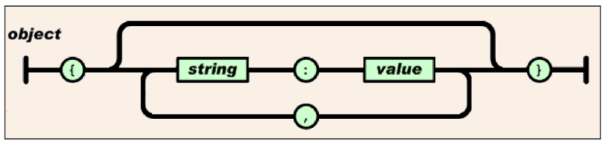
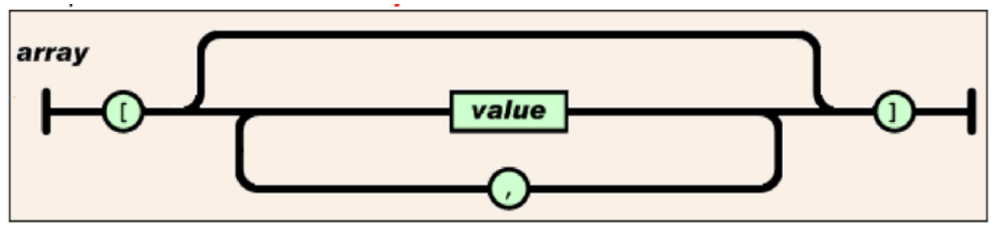
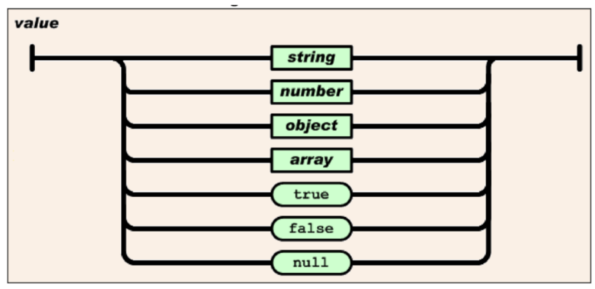
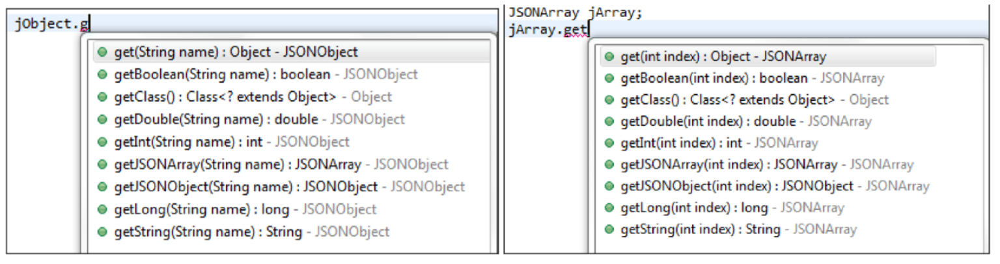

# JSON - JavaScriptObjectNotation

JSON ist das wichtigste Datenformat zur Übertragung von Daten im Web - kann aber auch für Konfigurationen und Einstellungen verwendet werden.

JSON besticht durch folgende Attribute:
 - leicht zu lesen (auch von einem menschlichen User)
 - einfach zu parsen
 - wenig Overhead durch das Format
 - Kann tiefe Strukturen abbilden

Eine JSON-Datei ist immer eine reine Textdatei und kann daher auch leicht mit einer Versionierungssoftware verwaltet werden.

JSON ist unabhängig von der verwendeten Programmiersprache.

Jede JSON-Datei beinhaltet zumindest ein JSON-Objekt, das einfach ein Key-Value-Paar darstellt. Genauso wie eine Map in Java. `Map<String, Object>`



## Komplexere Strukturen in JSON

JSON kann jedoch auch verschachtelte und Komplexere Strukturen abbilden.

Eine JSON-List entspricht einer `ArrayList` in Java.
```JSON
[ value1, value2, value3, ... , valueN]
```


## Values
Als Datentyp kennt JSON folgende Notation:
- string
- number
- object
- array
- true / false
- null

Natürlich kann als Value zB auch ein JSON Array fungieren.



## Beispiele
Unter http://objgen.com/json findet man einen Online Object-Generator, mit dem sehr leicht (unter anderem) JSON Objekte erstellt werden können.

__Modell:__
```
Vorname = Max
Nachname = Müller
Alter n=66
```
__JSON Object:__
```JSON
{
  "Vorname": "Max",
  "Nachname": "Müller",
  "Alter": 66
}
```
__Modell:__
```
namen[]=Theo,Melinda,Bill
```
__JSON Object:__
```JSON
{
  "namen": [
    "Theo",
    "Melinda",
    "Bill"
  ]
}
```
__Modell:__
```
// Model & generate Live JSON data values
// interactively using a simple syntax.
// String is the default value type
product = Live JSON generator
// Number, Date & Boolean are also supported
// Specify types after property names
version n = 3.1
releaseDate d = 2014−06−25
demo b = true
// Tabs or spaces define complex values
person
id number = 12345
name = John Doe
phones
home = 800−123−4567
mobile = 877−123−1234
// Use [] to define simple type arrays
email [] s = jd@example.com, jd@example.org
dateOfBirth d = 1980−01−02
registered b = true
// Use [n] to define object arrays
emergencyContacts[0]
name s = Jane Doe
phone s = 888−555−1212
relationship = spouse
emergencyContacts[1]
name s = Justin Doe
phone s = 877−123−1212
relationship = parent
```
__JSON Object:__
```JSON
{
  "product": "Live JSON generator",
  "version": 3.1,
  "releaseDate": null,
  "demo": true,
  "person": {},
  "id": 12345,
  "name": "John Doe",
  "phones": {},
  "home": "800−123−4567",
  "mobile": "877−123−1234",
  "email": [
    "jd@example.com",
    "jd@example.org"
  ],
  "dateOfBirth": null,
  "registered": true,
  "emergencyContacts": [
    null,
    {}
  ],
  "phone": "888−555−1212",
  "relationship": "spouse"
}
```
## JSON Parsen mit Java in Android
In Android kann mittels einer Java Bibliothek sehr leicht JSON eingelesen (=geparst) bzw. geschrieben werden.

Die wichtigsten Klassen sind:
`JSONObject` und `JSONArray`

Um zu wissen, welche Klasse ich verwenden muss, betrachte ich einfach die JSON Struktur. Alles innerhalb von `[ ... ]` entspricht `JSONArray` und alles zwischen `{ ... }` entspricht `JSONObject`. So kann man mithilfe dieser beiden Klassen, die JSON-Struktur rekursiv parsen.

siehe:
- https://developer.android.com/reference/org/json/JSONObject
- https://developer.android.com/reference/org/json/JSONArray

Um auf die Werte der JSON-Objekte zugreifen zu können, stehen entsprechende _getter-Methoden_ zur Verfügung:



### JSON Parsen Beispiel

Ausgehend von folgender JSON Struktur kann man die Java Klassen einsetzen, um die Inhalte einzulesen:

```JSON
{   "name": "Tom",
    "birthday": "1940-02-10",
    "age": 76,
    "married": false,
    "car": null,
    "favorite_foods": [
        "cookie",
        "chips",
        "fish"
    ],
    "passport": {
        "id": 100001,
        "nationality": "American"
    }
}
```

__Java Code zum Parsen obiger Datenstruktur:__

```java
    import org.json.JSONObject;
    private static void readJSON() throws Exception {
    String content = /*INHALT DES FILES*/
    // Convert JSON string to JSONObject
    JSONObject jsonObject = new JSONObject(content);
}
```
__Auslesen von einzelnen Werten:__
```java
String name = jsonObject.getString("name");
int age = jsonObject.getInt("age");
JSONArray favorite_foods =
jsonObject.getJSONArray("favorite_foods");
for (int i = 0; i < favorite_foods.length(); i++) {
    String food = (String) favorite_foods.get(i);
    System.out.println(food);
}
// Or convert the JSONArray to Java List
List<Object> foods = favorite_foods.toList();
for (Object food : foods) {
    System.out.println((String)food);
}
boolean married = tomJsonObject.getBoolean("married");
```
### Handling von Null-Werten
In dem oben aufgefuhrten JSON-File wird der Wert von ”car“ auf null gesetzt. Der Key existiert also ist aber auf null gesetzt. Man kann nun uberprüfen ob ein Key existiert.

```java
jsonObject.has("car"); // true, der "car" key existiert
                        //obwohl dieser JSONObject.NULL ist
jsonObject.has("house"); // false, der "house" existiert nicht
```
__Jedoch ist das `null` in Java nicht ident mit `JSONObject.NULL`:__
```java
/* Key ist vorhanden aber der Wert ist null
(JSONObject.NULL) */
jsonObject.opt("car") == JSONObject.NULL; // true
jsonObject.opt("car") == null; // false, JSONObject.NULL
                               //ist nicht das selbe wie null
/* der Key ist nicht vorhanden im JSON */
jsonObject.opt("house") == JSONObject.NULL; // false
jsonObject.opt("house") == null; // true
```
__Wobei die Methode isNull(String key) hier nicht differenziert__
```java
jsonObject.isNull("car"); // true
jsonObject.isNull("house"); // true
```
### JSON File aus Java heraus generieren
Man kann JSON-Files mittels des JSONObjects auch generieren lassen. Dazu legt man ein neues JSONObject an, und setzt die entsprechenden Attribute.
```java
JSONObject jsonObj = new JSONObject();
jsonObj.put("name", "Tom");
jsonObj.put("birthday", "1940-02-10");
jsonObj.put("age", 76);
jsonObj.put("married", false);
// null kann nicht direkt gesetzt werden
jsonObj.put("car", JSONObject.NULL);
jsonObj.put("favorite_foods", new String[] { "cookie",
"fish", "chips" });
```
__Man kann naturlich auch ein ¨ JSONObject in ein JSONObject verpacken.__
```java
// {"id": 100001, "nationality", "American"}
JSONObject passportJsonObj = new JSONObject();
passportJsonObj.put("id", 100001);
passportJsonObj.put("nationality", "American");
// der wert ist nun ein JSONObject
jsonObj.put("passport", passportJsonObj);
```
__Das JSON wird nun wie folgt erzeugt:__
```java
String json = null;
if (prettyPrint) {
// es werden 4 Leerzeichen als Einrueckung gemacht
    json = jsonObj.toString(4);
} else {
    json = jsonObj.toString();
}
```
