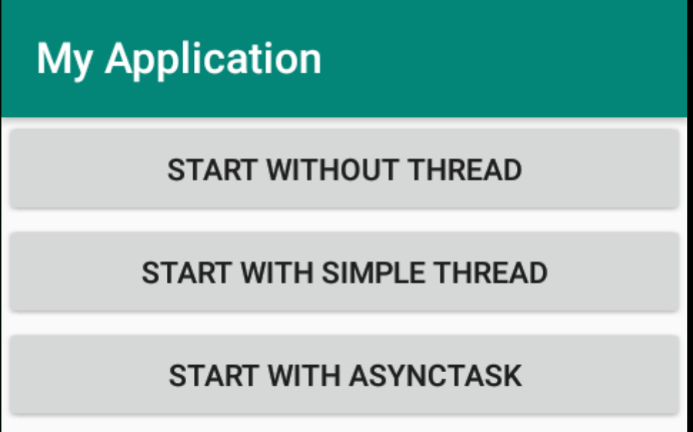

# Nebenläufigkeit mit AsyncTask
AsyncTask ist eine Möglichkeit, nebenläufige Prozesse in Android zu erzeugen, womit wir jedoch auch die Möglichkeit haben, nach Fertigstellung des Tasks, die Ergebnisse an die View weiterzureichen.

Anhand eines Beispiels soll die Vorgangsweise erläutert werden und auch klar werden, warum AsyncTask in gewissen Fällen die beste Alternative ist.

## Ohne Nebenläufigkeit

Das Beispiel soll von einem Server den Namen einer Person ermitteln, von der die ID bekannt ist. Der Server bekommt also eine ID (Typ Integer) als Parameter und gibt den Namen als String zurück.



Der Aufruf von `Thread.sleep(5000)` simuliert einen länger andauernden Task. Wenn der simulierte Task fetig ist, wird ein Toast angezeigt.

```java
public void startWithoutThread(View view) {
    try {
        Thread.sleep(5000);
        showToast("Thread Ready");
    } catch (InterruptedException e) {
        Log.d(TAG, e.getLocalizedMessage());
    }
}
```
Der Toast erscheint also erst 5 Sekunden, nachdem der Button geklickt wurde. __Während dieser Zeit können jedoch auch keine anderen Buttons geklickt werden - das Userinterface ist eingefroren.!__

Dies liegt daran, dass das UI am Mainthread läuft. Jede Operation, die unsere App ausführt, läuft ebenfalls standardmäßig am Mainthread weshalb der Aufruf von `Thread.sleep(5000)` natürlich das UI blockiert. Dies ist problematisch, da das Android Betriebssystem erkennen kann, wenn ein UI nicht reagiert und die App schließen kann. Wir erhalten in diesem Fall einen `ANR-Fehler` (`Application not responding`).

## Mit "klassischem" Threading

Der nächste Ansatz wäre, sich der Java Boardmittel zu bedienen und die länger andauernde Tätigkeit in einen eigenen Thread auszulagern.

```java
public void startSimpleThread(View view) {
    (new Thread() {
        @Override
        public void run() {
            TextView textView = findViewById(R.id.txt_msg);
            textView.setText("Thread Ready");
        }
    }).start();
}
```
Das UI ist in diesem Fall nicht mehr blockiert - während der neue Thread schläft, können die anderen Buttons der App problemlos gedrückt werden.

## AsyncTask Framework

Die sicher eleganteste Variante ist die Verwendung des AsyncTask-Frameworks in Android. Dieses bietet über CallBack-Methoden eine saubere Struktur:

Schematischer Ablauf einer Hintergrundaufgabe mittels Android AsyncTask-Frameworks:

 1. Zugriff auf das UI. Jetzt kann z.B. ein Fortschrittsbalken angezeigt werden.
 1. Auslagerung der länger andauernden Tätigkeit in einen eigenen Thread
 1. Immer wenn sich der aktuelle Fortschritt ändert, können wir auf den UI-Thread zugreifen und den Fortschritt setzen.
 1. Nach Beendigung des Hintergrundthreads erhalten wir das Ergebnis zurückgeliefert und können nun wieder das UI aktualisieren.

Als erstes müssen wir eine eigene Klasse schreiben, die von `AsyncTask` ableitet. Diese Klasse können wir dann in unserer App verwenden und einfach den entsprechenden Thread starten:

```java
public void startAsyncTask(View view) {
    ServerTask task = new ServerTask();
    task.execute("AsyncTask Thread ready");
}
```

Unsere entsprechende AsyncTask Klasse können wir entweder in einer eigenen Datei oder als innere Klasse der Activity definieren. Dies liegt im Ermessen des Entwicklers. Benötige ich den Task nur in der aktuellen Activity, so verwende ich eine innere Klasse, benötige ich den Task öfters, so lege ich eine neue Datei an.

Im Demobeispiel wird der Task mittels innerer Klasse angelegt:

```java
private class ServerTask extends AsyncTask<String, Integer, String> {
    @Override
    protected void onPreExecute() {
        // here we could do some UI manipulation before the worker
        // thread starts
        super.onPreExecute();
    }

    @Override
    protected void onProgressUpdate(Integer... values) {
        // do some UI manipulation while progress is modified
        super.onProgressUpdate(values);
    }

    @Override
    protected String doInBackground(String... strings) {
        // workhorse methode
        String msg = strings[0];
        return msg;
    }

    @Override
    protected void onPostExecute(String s) {
        // called after doInBackground finishes        
        mTextView.setText(s);
        showToast(s);
        super.onPostExecute(s);
    }
}
```
Bei der Ableitung von `AsyncTask` können wir unsere Klasse mit dem Diamont Operator typisieren:  
In unserem Fall `<String, Integer, String>`.

__Diese Typen entsprechen den Typen folgender Methodenparameter:__

Der erste Parametertyp (`String`) ist der Eingangsparametertyp der Methode `doInBackground`.  
Der zweite Typ (`Integer`) ist der Eingangsparametertyp der Methode `onProgressUpdate`.  
Der dritte Typ (`String`) ist der Rückgabetyp der Methode `doInBackground` und der Eingangsparametertyp der Methode (`onPostResult`). Hier kann man auch das Muster erkennen: Der Rückgabewert der Methode `doInBackground` kommt als Eingangswert in den Aufruf der Methode `onPostExecute`. D.h. innerhalb von `onPostExecute` kann einerseits auf die Ergebnisse des Hintergrundthreads und andererseits auch auf die UI-Komponenten zugegriffen werden.

Beachte: _Bei der Typisierung müssen immer Objektdatentypen verwendet werden (Integer, Boolean, String, etc.) für primitive Datentypen sind die entsprechenden Wrapperklassen zu verwenden - `null` kann natürlich auch verwendet werden._

### Die einzelnen Methoden der Klasse `AsyncTask` im Überblick:

 - `onPreExecute`: Wird beim Start des AsyncTask Objekts aufgerufen. Hier kann auf das UI zugegriffen werden und z.B. eine Fortschrittsbalken eingeblendet werden.
 - `doInBackground`: Hie erfolgt die länger andauernde Arbeit im Hintergrundprozess. Die Methode liefert die Ergebnisse mitels `return` an die im Anschluss aufgerufene Methode `onPostExecute` zurück. Diese Methode kann z.B. für den Download oder die Abfrage an ein Webservice verwendet werden.
 - `onPostExecute`: Wird nach Abschluss der nebenläufigen Arbeit aufgerufen. Sie erhält beim Aufruf die Ergebnisse von `doInBackground` und kann das UI manipulieren (z.B. die heruntergeladenen Ergebnisse anzeigen.)
 - `onProgressUpdate`: läuft auf dem UI-Thread und wird aufgerufen, wenn innerhalb der Methode `doInBackground` die Methode `publishProgress` aufgerufen wird.

### AsyncTask mit Fortschrittsbalken

Insbesondere beim Herunterladen von großen Datenmengen ist es für den User angenehm, zu wissen, wieviel bereits geladen wurde.

__Folgende Änderungen sind dafür notwendig:__

1. Im Layout müssen wir eine View Komponente hinzufügen. Wir verwenden einen horizontalen Fortschrittsbalken - wir könnten jedoch auch jede andere View Komponente dafür verwenden und zB. den Fortschritt in Prozent in einer TextView anzeigen.

```xml
<ProgressBar
    android:id="@+id/progressBar"
    style="?android:attr/progressBarStyleHorizontal"
    android:layout_width="match_parent"
    android:layout_height="wrap_content"
    android:max="100"
    android:visibility="invisible" />
```

1. In der Methode `onPreExecute` muss eine View Komponente angezeigt werden, die für die Anzeige des Fortschritts verwendet werden soll:

```java
@Override
protected void onPreExecute() {
    // here we could do some UI manipulation before the worker
    // thread starts
    mProgressBar = findViewById(R.id.progressBar);
    mProgressBar.setVisibility(View.VISIBLE);
    super.onPreExecute();
}
```
1. In der Methode `onProgressUpdate` muss der Fortschrittsbalken aktualisiert werden:

```java
@Override
protected void onProgressUpdate(Integer... values) {
    // do some UI manipulation while progress is modified
    mProgressBar.setProgress(values[0]);
    super.onProgressUpdate(values);
}
```
1. In der Methode `doInBackground` muss die Methode `publishProgress` aufgerufen werden, immer wenn sich der Fortschritt ändert.

```java
@Override
protected String doInBackground(String... strings) {
    // workhorse methode
    for (int i=0;i<10,i++) {
        publishProgress(i*10);
        try {
            Thread.sleep(2000);
        } catch (InterruptedException e) {
            Log.d(TAG, e.getLocalizedMessage());
        }
    }
    String msg = strings[0];
    return msg;
}
```
1. Nachdem die Arbeit im Hintergrund erledigt ist, sollte der Fortschrittsbalken natürlich auch wieder verschwinden. Dazu müssen wir die Methode `onPostExecute` anpassen:

```java
@Override
protected void onPostExecute(String s) {
    // called after doInBackground finishes
    mProgressBar.setVisibility(View.INVISIBLE);
    mTextView.setText(s);
    showToast(s);
    super.onPostExecute(s);
}
```
