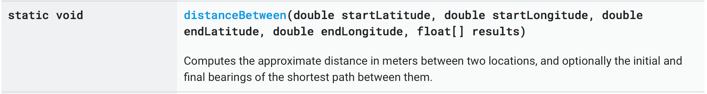
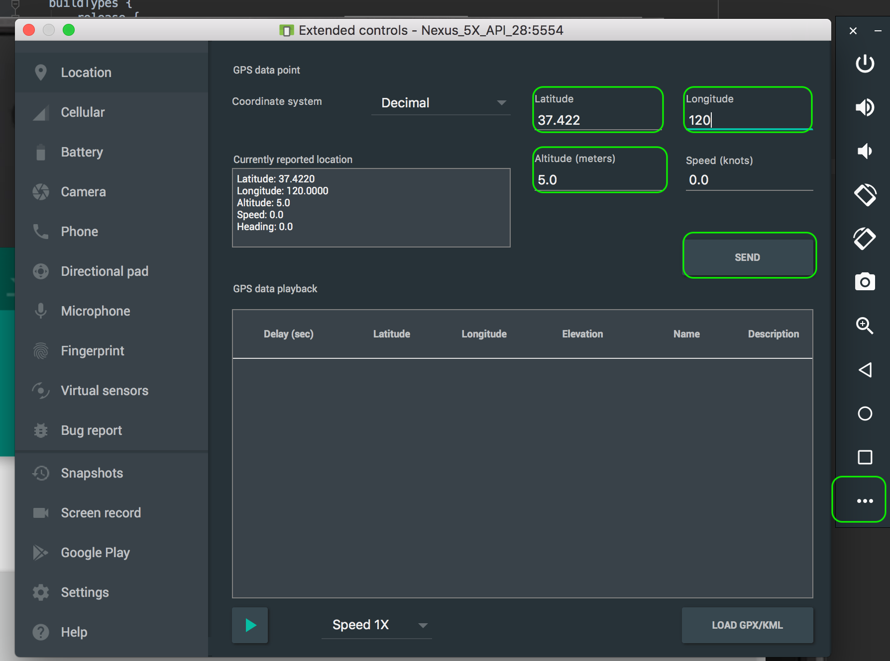

# Verwendung des GPS Sensors in Android

Der GPS Sensor liefert die Positionskoordination des jeweiligen Device. Insbesondere bei mobilen Endgeräten ist der Standort interessant, da sich daraus neue Anwendungsmöglichkeiten erschließen.

Meine App kann z.B. die tagesaktuelle Karte von Restaurants in meiner unmittelbaren Nähe anzeigen. Unter Zuhilfenahme des Standorts kann die App für den Benutzer weitaus nützlichere Informationen anbieten.

Android bietet über die Klasse `LocationManager` Zugriff auf dieses Systemservice. Die Abfrage der Koordination erfolgt dabei entweder:

 - __synchron__: _die aktuelle Position wird abgefragt_ oder
 - __asynchron__: _die App registriert sich beim `LocationManager` und wird bei Positionsänderungen automatisch informiert._

## Anfordern vom LocationManager

Der erste Schritt ist die Erzeugung eines Objekts vom Typ `LocationManager`. Dieser ist als Systemservice (ähnlich wie der `LayoutInflater`) verfügbar. Man kann des LocationManager daher mit der Methode `getSystemService()` aufrufen.

Überlicherweise erfolgt dieser Aufruf in der Methode `onCreate`:

```java
@Override
protected void onCreate(Bundle savedInstanceState) {
   super.onCreate(savedInstanceState);
   setContentView(R.layout.activity_main);
   registerSystemService();
}

private void registerSystemService() {
   locationManager = (LocationManager) getSystemService(LOCATION_SERVICE);
   // from Api 23 and above you can call getSystemService this way:
   // locationManager = (LocationManager) getSystemService(LocationManager.class);
}
```
## Anfordern der Permission
Um die Position zu bestimmen kann zwischen zwei Genauigkeitsstufen gewählt werden:
 - __coarseLocation__ und
 - __fineLocation__

Der Entwickler der App muss entscheiden, wie genau die gewünschte Position sein muss. Je genauer, die gewünschte Positionsbestimmung erfolgen soll, um so mehr Strom wird für die Bestimmung benötigt.....

Benötigt man eine genaue Positionsbestimmung mittels GPS Sensor, so ist die Permission __fineLocation__ erforderlich. Reicht eine ungefähre Standortbestimmung aus, so benötigt man die Permission __coarseLocation__ - dann wird die Position über den Netzwerkprovider bestimmt.

Beide Permissions (egal ob coarse oder fine) fallen in die Kategorie _dangerous permissions_ - daher muss die Berechtigung sowohl im Manifest eingetragen, wie auch dynamisch abgefragt werden.


__Eintrag im Manifest:__

```xml
<uses-permission android:name="android.permission.ACCESS_FINE_LOCATION" />
<uses-permission android:name="android.permission.ACCESS_COARSE_LOCATION" />
```
_Natürlich muss_ `ACCESS_COARSE_LOCATION` _nicht extra eingetragen werden, wenn_ `ACCESS_FINE_LOCATION` _gefordert wird._

__Dynamische Abfrage der Permission:__
Wie bei jeder anderen _gefährlichen_ Permission muss auch bei der Location Permission die Berechtigung dynamisch im Code abgefragt werden:
```java
private void checkPermissionGPS() {
    Log.d(TAG, "checkPermissionGPS");
    String permission = Manifest.permission.ACCESS_FINE_LOCATION;
    if (ActivityCompat.checkSelfPermission(this, permission)
            != PackageManager.PERMISSION_GRANTED) {
        ActivityCompat.requestPermissions(this,
                new String[]{ permission },
                RQ_ACCESS_FINE_LOCATION );
    } else {
        gpsIsGranted();
    }
}
```
auch hier kann der RequestCode wieder beliebig gewählt werden und sollte als Konstante in der Klasse gespeichert werden:
```java
private static final int RQ_ACCESS_FINE_LOCATION = 123;
private boolean isGpsAllowed = false;
```
Nachdem der Request-Permision Dialog dem Benutzer angezeigt wurde, kehrt der Programmfluss wieder zur Activity zurück und die Call-Back Methode `onRequestPermissionsResult` wird aufgerufen:
```java
@Override
public void onRequestPermissionsResult(int requestCode,
                                      @NonNull String[] permissions,
                                      @NonNull int[] grantResults) {
   super.onRequestPermissionsResult(requestCode, permissions, grantResults);
   if (requestCode != RQ_ACCESS_FINE_LOCATION) return;
   if (grantResults.length > 0 &&
       grantResults[0] != PackageManager.PERMISSION_GRANTED) {
       makeToast("Permission ACCESS_FINE_LOCATION denied!");
   } else {
       gpsGranted();
   }
}
```
In der Methode `gpsGranted` kann nun unser flag gesetzt werden, dass der Zugriff auf die Location bzw. den GPS Sensor vom Benutzer erlaubt wurde:
```java
private void gpsGranted() {
    Log.d(TAG, "gps permission granted!");
    isGpsAllowed = true;
}
```
## Asynchrone Abfrage der Positionsdaten
Die asynchrone Variaten bedeutet, dass sich die App für die Benachrichtigung umm etwaige Änderungen der GPS Daten beim Sensormanager registriert.

Vorgehensweise:
1.	Methoden des Interface `LocationListener` implementieren
2.	`onResume()`: mit `requestLocationUpdates` LocationListener registrieren
3.	`onPause()`: mit `removeUpdates` vom LocationManager abmelden
4.	Positions-Info des `Location-Objekts` verarbeiten

### LocationListener
Für die Verarbeitung der Positions-Informationen muss das Interface `LocationListener` implementiert werden. Das könnte man entweder in der Klasse direkt, oder auch als anonyme Klasse implementieren.

Implementierung mittels anonymer innerer Klasse:

```java
private void gpsGranted() {
    Log.d(TAG, "gps permission granted!");
    isGpsAllowed = true;
    showAvailableProviders();
    locationListener = new LocationListener() {
        @Override
        public void onLocationChanged(Location location) {
            Log.d(TAG, "onLocationChanged");
        }
        @Override
        public void onStatusChanged(String provider, int status, Bundle extras) {
            Log.d(TAG, "onStatusChanged");
        }
        @Override
        public void onProviderEnabled(String provider) {
            Log.d(TAG, "onProviderEnabled");
        }
        @Override
        public void onProviderDisabled(String provider) {
            Log.d(TAG, "onProviderDisabled");
        }
    };
}
```
Die wichtigste Methode ist `onLocationChanged`, die aufgerufen wird, wenn sich die Positionsdaten geändert haben. Diese Methode erhält ein Objekt vom Typ `Location` beim Aufruf mitübergeben, in dem die neuen Koordination stecken.
https://developer.android.com/reference/android/location/Location.html

__Wichtige Methoden der Klasse `Location`:__




### Registrierung beim Provider in der `onResume` Methode
Nun muss der Listener für den Erhalt der Positionsänderungen beim LocationManager registriert werden:
```java
@Override
protected void onResume() {
   Log.d(TAG, "onResume");
   super.onPostResume();
   if (isGpsAllowed) {
       locationManager.requestLocationUpdates(
               LocationManager.GPS_PROVIDER,
               3000,
               0,
               locationListener);
   }
}
```
__Folgende Parameter müssen angeben werden:__
1.	__Name des Providers__. Der `GPS_PROVIDER` arbeitet am genauesten, verbraucht jedoch am meisten Ressourcen. Die andere Möglichkeit wäre `LocationManager.NETWORK_PROVIDER`: ungenauer, aber deutlich ressourcenschonender.
2.	Wert in Millisekunden der festlegt, __wie oft Positionsmeldungen an den Listener geschickt werden__ sollen. Je kleiner der Werte desto öfter wird benachrichtigt (_und desto höher ist der Akku-Verbrauch!_)
0 heißt: so oft wie möglich
3.	__Distanz__ in Meter die festlegt, wie oft (d.h. bei welcher Positionsabweichung) die neue Position an den Listener geschickt wird.
0 heißt: so oft wie möglich
4.	Objekt, das __LocationListener__ implementiert

### Abmelden von Provider in der `onPause` Methode
Da wie bereits erwähnt der Stromverbrauch des `LocationManagers` relativ hoch ist, sollte man sich von ihm wieder abmelden, wenn die Activity deaktiviert wird. Die entsprechende Methode zum Abmelden ist daher `onPause` _(aus diesem Grund muss die Anmeldung auch in `onResume` und nicht in `onCreate` erfolgen)._

```java
@Override
protected void onPause() {
   Log.d(TAG, "onPause");
   super.onPause();
   if (isGpsAllowed) locationManager.removeUpdates(locationListener);
}
```
### Locationdaten auswerten
Wenn sich nun also die Position ändert, erfährt unser listener davon in der Methode `onLocationChanged`. Wie bereits erwähnt erhält die Methode ein Objekt vom Typ `Location`, das die neuen Koordination enthält.
```java
private void displayLocation(Location location) {
    Log.d(TAG, "displayLocation");
    double lat = location==null ? -1 : location.getLatitude();
    double lon = location==null ? -1 : location.getLongitude();
    mLongitude.setText(String.format("%.4f", lon));
    mLatitude.setText(String.format(".4f", lat));
}
```

## Synchrone Abfrage der GPS Koordinaten
Unabhängig von der Benachrichtigung über den Listener kann der `LocationManager` jederzeit nach der letzten aktuellen Position gefragt werden. Der Rückgabewert ist auch in diesem Fall ein Location-Objekt mit allen Informationen zur aktuellen Position.
```java
public void btnClickUpdateCoordinates(View view) {
    Log.d(TAG, "btnClickUpdateCoordinates");
    if (isGpsAllowed) {
        Location location = locationManager.getLastKnownLocation(
                LocationManager.GPS_PROVIDER);
        displayLocation(location);
    }
}
```
## Setzen der Koordinaten am Emulator
Am Emulator können die Koordinaten ganz leicht geändert werden. Einfach über das Menü vom Emulator die Einstellungen öffnen und dann die neuen Koordinaten in die entsprechenden Felder eintragen. Anschließend auf den Button _SEND_ klicken, damit die neuen Koordinaten an den Emulator übertragen werden.



## Wo finde ich die Koordinaten der gewünschten Adresse?
Um beim Testen realistische Koordinaten zur Verfügung zu haben, kann ich die gewünschte Adresse einfach über google maps suchen. In der URL sind die Längen- und Breitengrade dann als Parameter enthalten:
`https://www.google.com/maps/place/Htl+Grieskirchen/@48.2353413,13.8336671,17.06z/data=!  ...`

## Verfügbare Provider anzeigen
Falls man wissen möchte, welche Location-Provider auf dem Smartphone vorhanden sind, kann man das über den LocationManager mit der Methode getAllProviders() eruieren:
```java
private void showAvailableProviders() {
    Log.d(TAG, "showAvailableProviders");
    List<String> providers = locationManager.getAllProviders();
    StringBuilder message = new StringBuilder();
    for (String name : providers) {
        boolean isEnabled = locationManager.isProviderEnabled(name);
        message.append(name+" is"+(!isEnabled? " not"+" enables \n\n"));
    }
    makeToast(message.toString());
}
```
