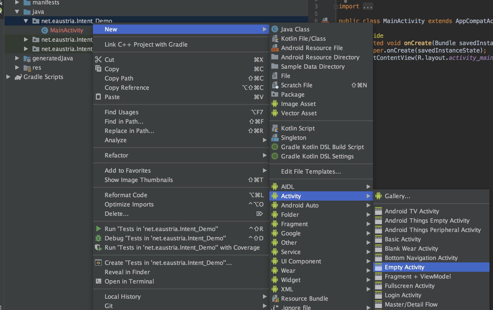
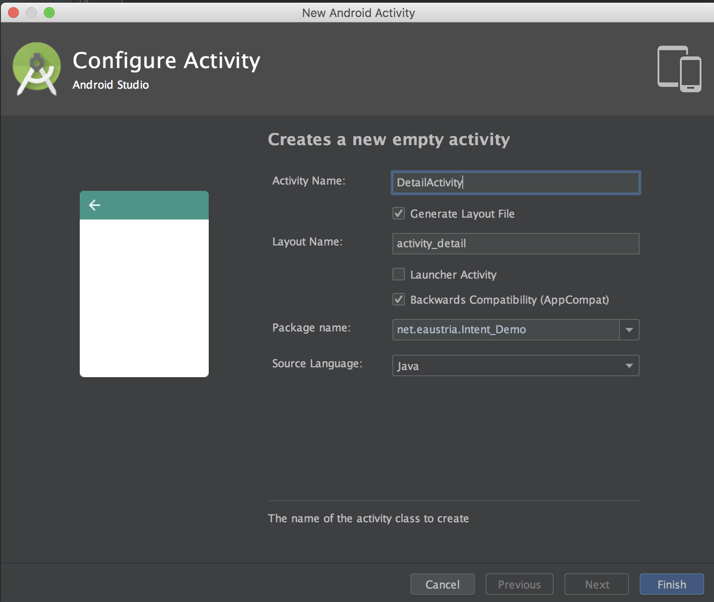
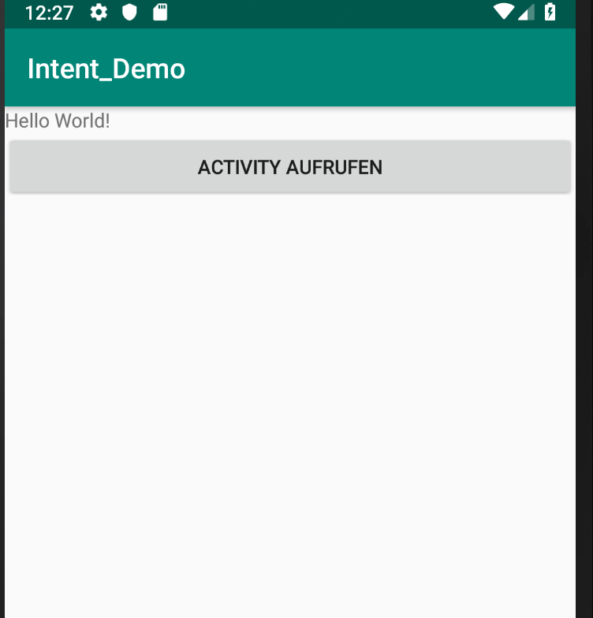
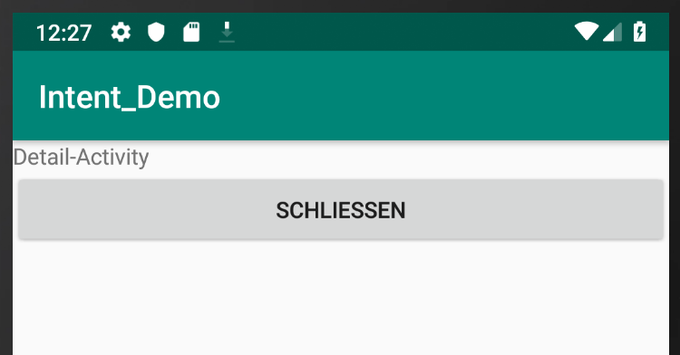

# Intents
Die Idee hinter mobilen UIs liegt in einem logischen Interaktionsablauf. In Android bedeutet dies, dass eine Funktionalität für den User in einer Activity gekapselt sein soll - eine Activity hat also genau eine Funktion für den User.

_Dieses Konzept kann mit der Programmierung verglichen werden, wo eine Funktion genau eine Anforderung erledigebn soll._

__Intents__ stellen in Android das Konzept dar, mit dem neue Activities gestartet werden können bzw. zwischen Activities gewechselt werden kann.

Auf diesem Weg kann auch eine neue App gestartet werden. Diesbezüglich werden zwei Kategorien von Intents unterschieden:

 - __explizite Intents:__ die Activity, die gestartet werden soll, wird eindeutig angegeben.
 - __implizite Intents:__ wir definieren nur die Aufgabe und lassen dem Android Betriebssystem die Wahl der App über.

## Explizite Intents
Mit expliziten Intents werden in der Regel eigene Activities der App aufgerufen.

Folgende Schritte sind dafür notwendig:

1.	__Activity-Klasse__ für dieses Layout erzeugen
1.	__Layout__ mit XML erzeugen
1.	Activity __in Manifest eintragen__ – wichtig: Name muss Name der Klasse sein
1.	An geeigneter Stelle (z.B. bei Klick auf Button) diese __Activity aufrufen__ mit: `startActivity(new Intent(this, ActivityToShow.class));`

Bei den ersten drei Schritten wird man aber von Android Studio gut unterstützt.

### Activity erzeugen
Erzeugen einer neuen Activity über das Kontextmenü in Android Studio.


__Entsprechende Details der Activity angeben:__



__Das entsprechende Layout Resource File wurde ebenfalls automatisch erstellt:__

```java
protected void onCreate(Bundle savedInstanceState) {
   super.onCreate(savedInstanceState);
   setContentView(R.layout.activity_detail);
}
```
### Layout anpassen
Das erstellte Layout kann natürlich - wie das Layout jeder anderen Activity auch - direkt im XML Code oder über den graphischen Designer angepasst werden:

```xml
<?xml version="1.0" encoding="utf-8"?>
<android.support.constraint.ConstraintLayout xmlns:android="http://schemas.android.com/apk/res/android"
    xmlns:app="http://schemas.android.com/apk/res-auto"
    xmlns:tools="http://schemas.android.com/tools"
    android:layout_width="match_parent"
    android:layout_height="match_parent"
    tools:context=".DetailActivity">

</android.support.constraint.ConstraintLayout>
```
### Eintrag ins Manifest tätigen
Auch der Eintrag in der Manifest-Datei wurde bereits von Android Studio erstellt:

```xml
<?xml version="1.0" encoding="utf-8"?>
<manifest xmlns:android="http://schemas.android.com/apk/res/android"
    package="net.eaustria.Intent_Demo">
    <application
        android:allowBackup="true"
        android:icon="@mipmap/ic_launcher"
        android:label="@string/app_name"
        android:roundIcon="@mipmap/ic_launcher_round"
        android:supportsRtl="true"
        android:theme="@style/AppTheme">
        <activity android:name=".DetailActivity"></activity>
        <activity android:name=".MainActivity">
            <intent-filter>
                <action android:name="android.intent.action.MAIN" />

                <category android:name="android.intent.category.LAUNCHER" />
            </intent-filter>
        </activity>
    </application>
</manifest>
```
### Aufruf der Activity im Code
An geeigneter Stelle (z.B. bei Klick auf Button) kann man nun die Detail-Activity aufrufen.

Dazu verwendet man die Methode `startActivity(new Intent(this, ActivityToShow.class));`

Man muss das Anzeigen dieser neuen Activity mit einem Event verbinden, z.B. mit dem Click-Event eines Buttons.

Jene Activity, die aufgerufen werden soll, muss in einem Intent (=einer Absichtserklärung) an die Methode `startActivity` übergeben werden.

```java
public void startActivity(View view) {
    Intent intent = new Intent(this, DetailActivity.class);
    startActivity(intent);
}
```
Im ersten Parameter wird - wie bei Android üblich - der Kontext mitübergeben. Dies ist im Demobeispiel einfach die MainActivity. Der zweite Parameter gibt die Klasse der zu startenden Activity an.

Nach dem Start legt sich die neue Activity direkt über die alte.





## Bundles
Benötigt die aufgerufene Activity Daten vom Aufrufer, so können diese über `Bundle` Objekte übergeben werden.

In einem Bundle werden die Daten wie in einer `Map` als _key:value_ Paare gespeichert.

Mit der Methode `putExtra(key, value)` können zusätzliche Werte dem Bundle hinzugefügt werden.

```java
public void startActivity(View view) {
   Intent intent = new Intent(this, DetailActivity.class);
   intent.putExtra("msg", "Hello World on Detail Activity");
   startActivity(intent);
}
```
Der erste Parameter - der _key_ - ist immer vom Typ String. Der zweite ist einem beliebigen Typ. Auf diese Weise können einem Intent verschiedene Datentypen übergeben werden.

Möchte man Objekte von eigenen Klassen einem Intent mitübergeben, so muss man dafür Sorge tragen, dass diese Klassen das Interface `Serializable` implementieren.

Ist dies der Fall, können mithilfe der Methode `putExtra` Objekte von beliebigen Typen übergeben werden.

__Beispiel:__
```java
class SuperMessage implements Serializable {
   private String msg;
   public SuperMessage(String msg) {
       this.msg = msg;
   }
   public String getMsg() {
       return msg;
   }
   public void setMsg(String msg) {
       this.msg = msg;
   }
}

public void startActivity(View view) {
   Intent intent = new Intent(this, DetailActivity.class);
   intent.putExtra("msg", "Hello World on Detail Activity");
   intent.putExtra("myMsg", new SuperMessage("Extra Message"));
   startActivity(intent);
}
```
Nun wollen wir diese Parameter jedoch auch wieder auslesen können. Dazu geht man in der aufrufenden Activity folgendermaßen vor:
1. Mit der Methode `getIntent()` kann auf Intent-Objekt zugegriffen werden.
1. Vom Intent kann das Bundle mithilfe der Methode `getExtras` herausgelöst werden.
1. Aus dem Bundle können nun mit entsprechenden get-Methoden die übergebenen Werte ausgelesen werden.

```java
protected void onCreate(Bundle savedInstanceState) {
  super.onCreate(savedInstanceState);
  setContentView(R.layout.activity_detail);
  Intent intent = getIntent();
  Bundle bundle = intent.getExtras();
  String msg1 = bundle.getString("msg");
  MainActivity.SuperMessage superMessage =
          (MainActivity.SuperMessage)bundle.getSerializable("myMsg");

}
```
## Implizite Intents
Während wir beim Starten eines expliziten Intents genau die Activity-Klasse festlegen, die gestartet werden soll, geben wir beim impliziten Intent nur die Absicht an.

Für einen Impliziten Intent braucht man zwei Parameter:
1.	__Aktion des Intent__ – was soll die Zielkomponente machen
2.	__URI__ – zusätzliche Daten für die Zielkomponente
3.	
Man kann eventuell noch über Permissions den Zugriff einschränken
Der Aufruf selbst erfolgt wieder mit `startActivity`.

### Beispiel Maps Activity
In Android kann mit einem impliziten Intent eine Map angezeigt werden. Die Aktion dafür heißt `Intent.ACTION_VIEW`.

Die Daten werden als String übergeben, der als Uri-Parameter angegeben werden. Der String muss eine bestimmte Form haben: `geo:Breitengrad,Längengrad?z=zoomlevel` Der Zoomlevel gibt an, wie weit man in die Karte hineinzoomt. Der Wert muss zw. 1 (gesamte Erde) und 21 (maximale Auflösung) liegen.

```java
public void openMap(View view) {
  String pos="geo:48.2206636,16.3100208?z=12";
  Uri uri = Uri.parse(pos);
  Intent intent = new Intent(Intent.ACTION_VIEW);
  intent.setData(uri);
  startActivity(intent);
}
```

Über den Intent-Parameter `setData` wird dem Aufruf die Uri, die Längen- und Breitengrad beinhaltet, mitgegeben.

### Keine App für Intent vorhanden
Im vorigen Beispiel wird die Android Map-App geöffnet. Doch was passiert, wenn keine passende App am Gerät vorhanden ist?

```java
public void openUnknownIntent(View view) {
    try {
        startActivity(new Intent("Unknown Action"));
    } catch (Exception exc) {
        Log.d("TAG", exc.getLocalizedMessage());
    }
}
```
Im Ergebnis wird eine Exception geworfen, die angibt, dass keine entsprechende App gefunden werden konnte.
```
No Activity found to handle Intent { act=Unknown Action }
```
### Beispiel Telefonanruf
#### Action_Dial
Möchte man aus der App heraus einen Telefonanruf durchführen, so steht auch ein entsprechender Intent zur Verfügung.

 - Die Aktion muss in diesem Fall Intent.ACTION_DIAL heißen
 - Die Daten sind die Telefonnummer, wobei davor ein tel: stehen muss.

```java
public void openPhoneCall(View view) {
   String phone = "tel:(+43) 732 1234567";
   Uri uri = Uri.parse(phone);
   Intent intent = new Intent(Intent.ACTION_DIAL, uri);
   startActivity(intent);
}
```
__Verwendet man `ACTION_DIAL` wird die Telefonnummer nur vorbelegt. Der User muss den Anruf noch durch einen Button-Klick auslösen__
#### Action_Call
Im Unterschied zu `ACTION_DIAL` startet `ACTION_CALL` den Telefonanruf. Dafür ist jedoch eine Permission erfoderlich, die im Manifest eingetragen werden muss:
```xml
<uses-permission android:name="android.permission.CALL_PHONE"/>
```

Die Permission muss auch wieder dynamisch geprüft werden:

```java
public void openPhoneCallWithDialing(View view) {
    String perm = Manifest.permission.CALL_PHONE;
    if (ActivityCompat.checkSelfPermission(this, perm) !=
          PackageManager.PERMISSION_GRANTED) {
      ActivityCompat.requestPermissions(this,
              new String[]{perm}, RQ_CALL_PHONE);
    } else {
      dial();
    }
}
```
```java
public void onRequestPermissionsResult(int requestCode, @NonNull String[] permissions,
                                      @NonNull int[] grantResults) {
   super.onRequestPermissionsResult(requestCode, permissions, grantResults);
   if (requestCode!=RQ_CALL_PHONE) return;
   if (grantResults.length>0 && grantResults[0]!=PackageManager.PERMISSION_GRANTED) {
       Toast.makeText(this, "Sorry, no permission!", Toast.LENGTH_LONG).show();
   } else {
       dial();
   }
}
```

Beim Aufruf der DIAL Action muss eine mögliche SecurityException abgefangen werden:

```java
private void dial() {
    String phone = "tel:(+43)732 123456";
    Uri uri = Uri.parse(phone);
    Intent intent = new Intent(Intent.ACTION_CALL, uri);
    try {
        startActivity(intent);
    } catch (SecurityException e) {
        Log.d(TAG, e.getLocalizedMessage());
    }
}
```
## Selbst implizite Intents verarbeiten
Natürlich kann auch unsere App implizite Intents empfangen. Wir könnten etwa eine eigene App zum Anzeigen von SMS, E-Mail oder beliebigen anderen impliziten Intents schreiben.

Um unserer App das Empfangen von impliziten Intents zu erlauben, muss im Manifest ein entsprechender Intent-Filter eingetragen werden.

| Bezeichnung | Beschreibung |
| --- | ---- |
| `<action android:name="xxx">` |	Aktion, auf die die Activity reagieren soll. Der Name muss eindeutig sein. Für eigene Filter sollte man folgende Namensgebung wählen: Paketname.intent.action.Actionname |
| `<category android:name="xxx">` |	Legt fest, wie die Activity aufgerufen werden soll.  Übliche Werte: android.intent.category.DEFAULT: normal starten android.intent.category.LAUNCHER: die Activity ist die Startseite |
| `<data android:scheme="xxx">` |	Damit kann man dem Intent-Filter eine URI angeben um zu erzwingen, dass die Daten (zweiter Parameter des Intent beim Aufruf) ein bestimmtes Format haben. Dies ist etwa beim Dialer der Fall, wo die Daten das Format „tel: 1234567“ haben müssen. |

Natürlich kann unsere App vordefinierte Intents empfangen. Eine Liste der Intents findet man unter: http://developer.android.com/reference/android/content/Intent.html

### Beispiel MAIN Intent Filter
```xml
<activity android:name=".MainActivity">
   <intent-filter>
       <action android:name="android.intent.action.MAIN" />

       <category android:name="android.intent.category.LAUNCHER" />
   </intent-filter>
```
Der "Standard"-IntentFilter für die MainActivity gibt an, dass diese Activity geöffnet wird, wenn der User die App startet.

### Beispiel Eigener IntentFilter
So definieren wir, dass die DetailActivity auch von außen geöffnet werden kann:
```xml
<activity android:name=".DetailActivity">
   <intent-filter>
       <action android:name=".SHOW_DETAIL" />
       <category android:name="android.intent.category.DEFAULT" />
   </intent-filter>
</activity>
```
Um der zu öffnenden Activity auch Daten mitgeben zu müssen, fügen wir einen entsprechenden TAG bei der Definition des Intents ein:

```xml
<activity android:name=".DetailActivity">
    <intent-filter>
        <action android:name=
            "net.eaustria.intent.action.Intent_Demo.SHOW_DETAIL" />
        <category android:name="android.intent.category.DEFAULT" />
        <data android:scheme="msg" />
    </intent-filter>
</activity>
```

Nun erwartet der Intent, dass Daten im entsprechenden Format beim Erstellen des Intents mitgegeben werden.

```java
public void openDetailImplicit(View view) {
   Intent intent = new Intent("net.eaustria.intent.action.Intent_Demo.SHOW_DETAIL");
   intent.setData(Uri.parse("msg:Hello! Started implicitly"));
   intent.putExtra("msg", "Hello! Start implicitly");
   startActivity(intent);
}
```

Die Daten können jedoch auch direkt mit der jeweiligen `put`-Methode übergeben werden: `intent.putExtra("msg", "Hello! Start implicitly");`.
