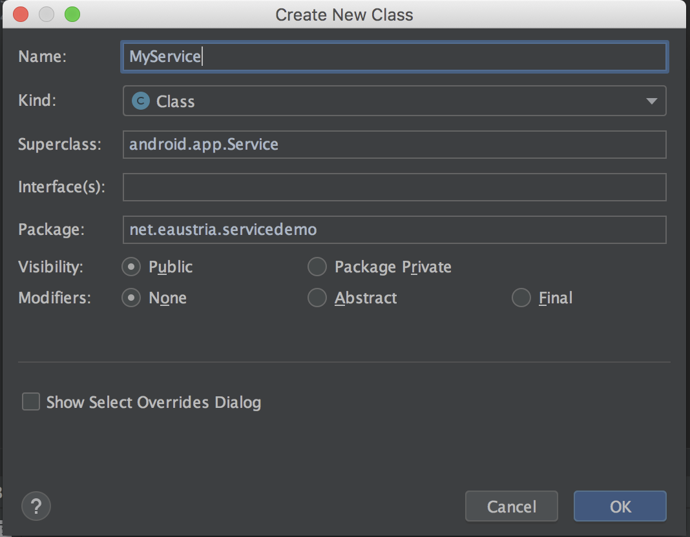
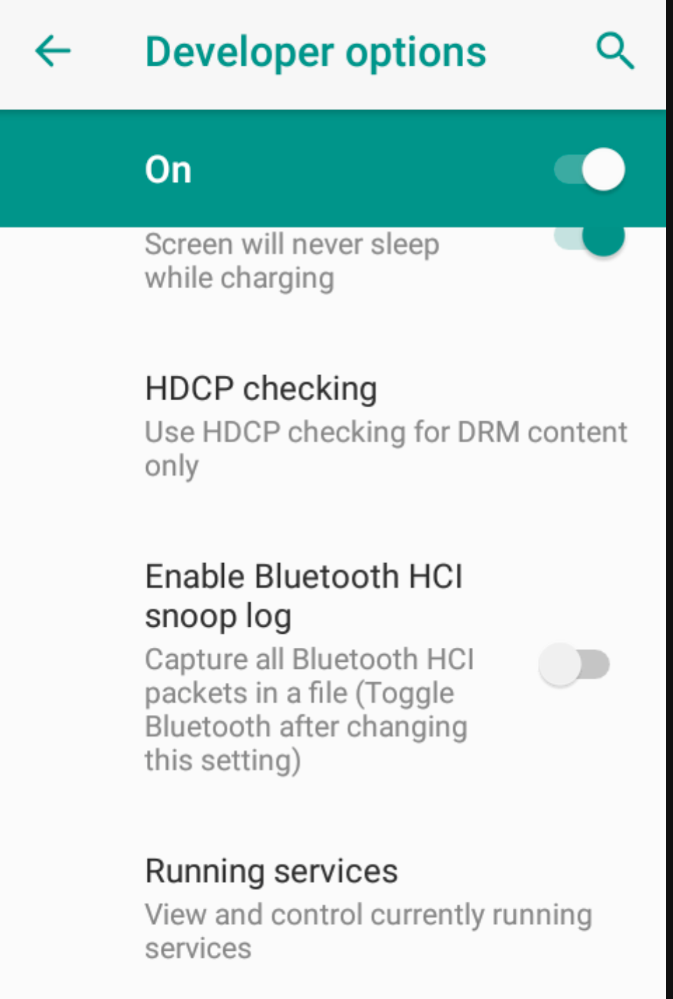
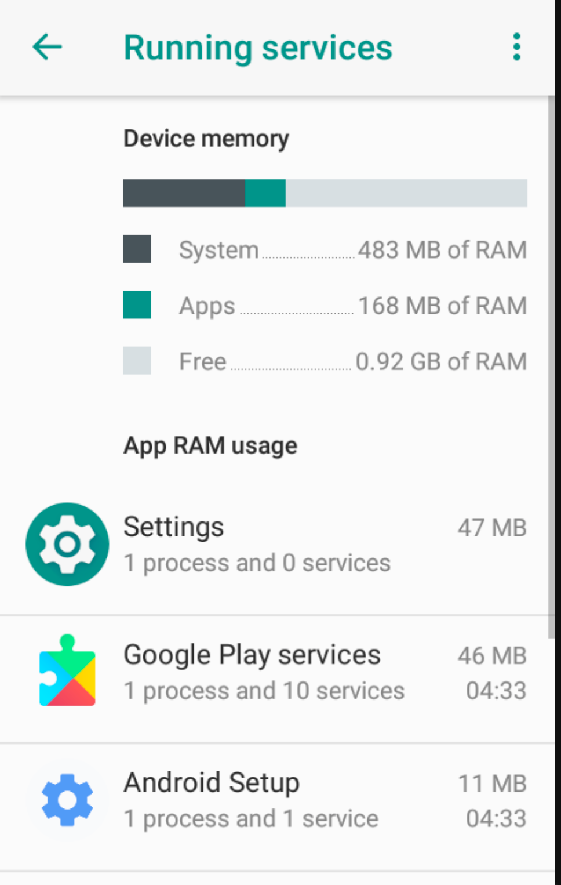

# Services in Android

Services kann man sich als Hintergrunddienst bzw. als Activities ohne User-Interface vorstellen.

## Erstellen eines neuen Services

Folgende **Schritte sind zum Erstellen eines Services** erforderlich:

1.	Erstellen einer von Service abgeleiteten Klasse
1.	Registrierung des Service im Manifest
1.	Service von einer Activity aus starten

Als erstes erstellt man eine neue Java-Klasse. Hierbei ist darauf zu achten, dass diese von der Klasse `Service` erbt.



In der angelegten Klasse muss eine Methode namens `onBind()` überschrieben werden, da diese in de Superklasse `Service` als abstrakt definiert ist. Die Methode `onBind()` ist jedoch nur für gebundene Services relevant, mit denen wir uns später beschäftigen werden. Aus diesem Grund lassen wir die Implementierung vorerst leer.

```java
@Override
public IBinder onBind(Intent intent) {
    return null;
}
```

## Erstellen eines Services und Lifecycle eines Service

Auch ein Service durchläuft einen Lebenszyklus, wie eine Activity. Das Service implementiert ebenfalls die Methoden `onCreate()` und `onDestroy()`. Wird das Service gestartet, so wird jener Code ausgeführt, der in der Methode `onStartCommand()` implementiert wurde.

```java
public class MyService extends Service {

    private static String TAG = MyService.class.getSimpleName();

    @Override
    public IBinder onBind(Intent intent) {
        return null;
    }

    @Override
    public int onStartCommand(Intent intent, int flags, int startId) {
        Log.d(TAG, "onStartCommand: Service: onStartCommand");
        return super.onStartCommand(intent, flags, startId);
    }

    @Override
    public void onCreate() {
        Log.d(TAG, "Service started");
        super.onCreate();
    }

    @Override
    public void onDestroy() {
        Log.d(TAG, "Service destroyed")
        super.onDestroy();
    }
}
```
Die Methode `onStartCommand()` erhält unter anderem als Aufrufparameter ein Objekt von Typ `Intent`. Die ist jener Intent, mit dem das Service gestartet wurde. Werden dem Service also zusätzliche Daten über das Intent-Objekt mitgegeben, so können diese innerhalb der Methode `onStartCommand()` verwendet werden.

## Registrieren des Service
Wie jede andere Komponente einer Android-App auch, müssen Services im Manifest registriert (=eingetragen werden). Dazu reicht folgender Tag:

```xml
<service android:name=".MyService" />
```

## Service starten
Der Aufruf eines Service erfolgt ähnlich wie jener einer Activity. Allerdings steht für den Start von Services die Methode `startService()` zur Verfügung. Diese Methode erwartet als Parameter ebenfalls ein Intent Objekt, in dem die Klasse des zu startenden Service enthalten ist.

```java
public void startService(View view) {
    Log.d(TAG, "startService: entered");
    Intent intent = new Intent(this, MyService.class);
    // the service can use the data from the intent
    String msg = "Service started from MainActivity";
    intent.putExtra("msg", msg);
    startService(intent);
}
```
Der String-Wert, der dem Intent als Extra übergeben wurde, steht im Service als Aufrufparameter der Methode `onStartCommand()` zur Verfügung:
```java
@Override
public int onStartCommand(Intent intent, int flags, int startId) {
   Log.d(TAG, "onStartCommand: Service: onStartCommand");
   if (intent.hasExtra("msg")) {
       Log.d(TAG, "onStartCommand: Message:" + intent.getStringExtra("msg"));
   }
   return super.onStartCommand(intent, flags, startId);
}
```

## Service stoppen

Das Service kann von jeder Activity aus genauso gestoppt werden, so wie es gestartet wurde. Der einzige Unterschied liegt an der verwendeten Methode. Zum Stoppen verwendet man die Methode `stopService()`.

```java
public void stopService(View view) {
    Log.d(TAG, "stopService: entered");
    Intent intent = new Intent(this, MyService.class);
    stopService(intent);
}
```

Die zweite Variante ist, dass sich das Service selbst stoppt. Dazu ruft man innerhalb des Service die Methode `stopSelf()` auf.

```java
public int onStartCommand(Intent intent, int flags, int startId) {
    Log.d(TAG, "onStartCommand: Service: onStartCommand");
    if (intent.hasExtra("msg")) {
        Log.d(TAG, "onStartCommand: Message:" + intent.getStringExtra("msg"));
    }
    new Thread( () -> {
        try {
            Thread.sleep(1*1000);
        } catch (InterruptedException e) {
            Log.e(TAG, "onStartCommand: " + e.getMessage() +
                    "\n" + e.getStackTrace());
        }
        Log.d(TAG, "onStartCommand: selfstopping service");
        stopSelf();
    }).start();
    return START_STICKY;
}
```
**Anmerkung zu START_STICKY**:

Da Android jederzeit Activities oder Services beenden kann, wenn der Speicher des Geräts nicht ausreicht, kann über diese Konstanten definiert werden, wie mit dem Service im Falle eines Beenden durch das Betriebssystem umgegangen werden soll:

- **START_STICKY**: Erstellt das Service neu und ruft `onStartCommand` mit `null` als Intent erneut auf.
- **START_NOT_STICKY**: Das Service wird nicht neu erstellt (und somit auch `onStartCommand` nicht wieder aufgerufen)
- **START_REDELIVER_INTENT**: Startet das Service neu und ruft `onStartCommand` mit dem gleichen Intent-Objekt erneut auf.

## Threading
Ein Service läuft grundsätzlich im gleichen Prozess, wie die Acitivity, die das Service gestartet hat. D.h. alle Aktionen, die länger dauern können, müssen - wie in einer Activity auch - in einen eigenen Thread ausgelagert werden.

### Worker Thread erzeugen
Wir legen in der Service Klasse ein Thread Objekt an, für das wir eine Implementierung der `run`-Methode anbieten:

```java
public class MyService extends Service {
    ...
    private Thread worker;
    ...
```

In der `onCreate`-Methode erzeugen wir das neue Thread Objekt und weisen die Methode `doWork` als Implementierung der `run`-Methode des Thread zu:

```java
@Override
public void onCreate() {
    Log.d(TAG, "Service started");
    worker = new Thread(this::doWork);
    super.onCreate();
}
private void doWork() {
    try {
        Log.d(TAG, "doWork: entered");
        Log.d(TAG, "Thread start: thread-name: "
                + Thread.currentThread().getName());
        Thread.sleep(1 * 1000);
    } catch (InterruptedException e) {
        Log.e(TAG, "onStartCommand: " + e.getMessage() +
                "\n" + e.getStackTrace());
    }
    Log.d(TAG, "Thread end: thread-name: "
            + Thread.currentThread().getName());
}
```

In der `onStartCommand`-Methode können wir nun den neuen Thread starten. Hierbei kann mithilfe von `isAlive()` geprüft werden, ob der Thread läuft, damit nicht irrtümlich ein bereits laufender Thread nochmals gestartet wird.

```java
if (intent.hasExtra("startNewThread")) {
   if (!worker.isAlive()) worker.start();
...
```

Mithilfe von `worker.interrupt()` kann der Thread nun wieder gestoppt werden.

```java
@Override
public void onDestroy() {
    Log.d(TAG, "Service destroyed");
    worker.interrupt();
    worker = null;
    super.onDestroy();
}
```

## Intent-Service
Möchte man das Service hauptsächlich für Hintergrundtätigkeiten nutzen, so bietet sich ein Intent-Service an. Leitet man die Implementierung der Service-Klasse von der Klasse `IntentService` ab, so braucht man sich nicht extra um das Thread-Thema kümmern. Es is nur erforderlich, die Methode `onHandleIntent` zu implementieren. Wird die Methode verlassen, so wird auch automatisch `onDestroy` aufgerufen.

Dem Konstruktor wird der Name des zu erstellenden Worker-Threads übergeben.

```java
public MyIntentService() {
    super("MyIntentService");
}
```

Als nächstes wird die Methode `onHandleIntent` überschrieben, in der die Arbeit erledigt wird.

```java
@Override
protected void onHandleIntent(Intent intent) {
   Log.d(TAG, "onHandleIntent: entered");
   Log.d(TAG, "onHandleIntent: Thread: " +
           Thread.currentThread().getName());
   for (int i=1; i<=3; i++) {
       Log.d(TAG, "onHandleIntent: ....working");
       try {
           Thread.sleep(1000);
       } catch (InterruptedException e) {
           Log.e(TAG, "onHandleIntent: " + e.getMessage());
       }
   }
   Log.d(TAG, "onHandleIntent: finished");
}
```

## Anzeigen der laufenden Services am Emulator

Um die Services anzuzeigen, die momentan am Gerät bzw. Emulator laufen, wählt man unter **Developer Options** --> **Running Services** aus.
In der Übersicht kann man laufende Services auch manuell beenden. In diesem Fall erfolgt jedoch kein Aufruf der `onDestroy` Methode für die einzelnen Services.




