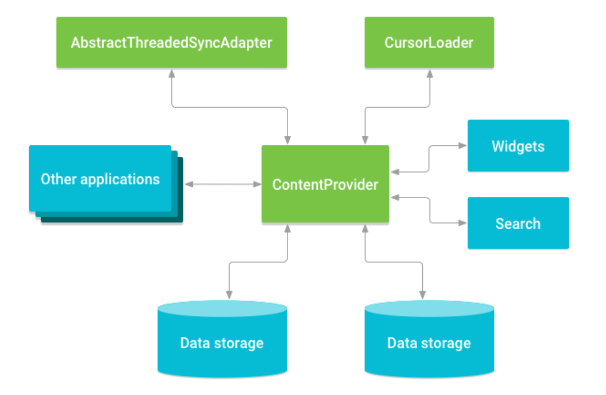
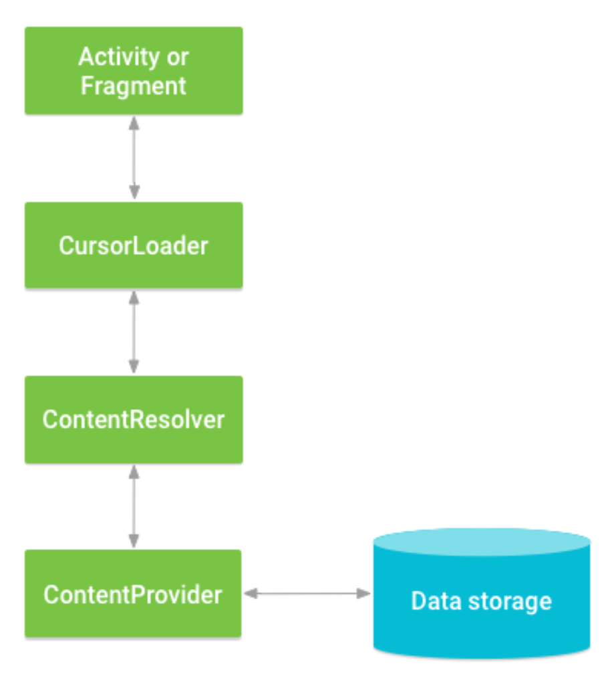
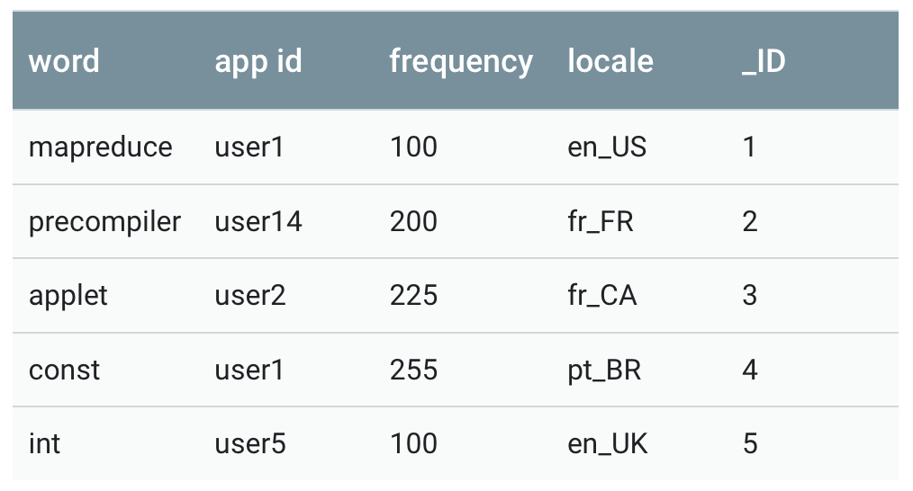
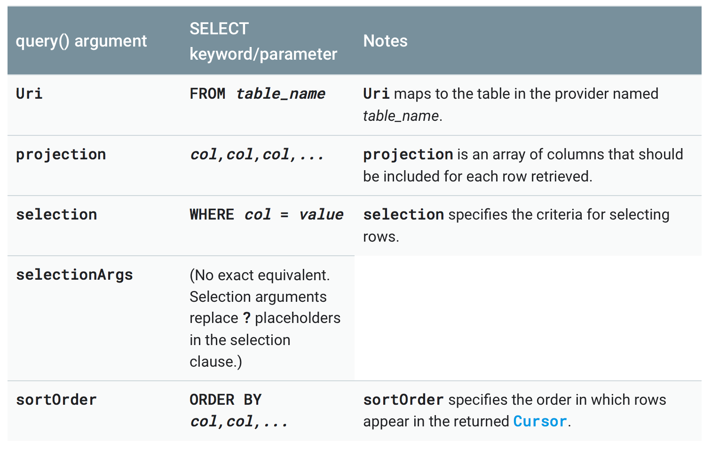
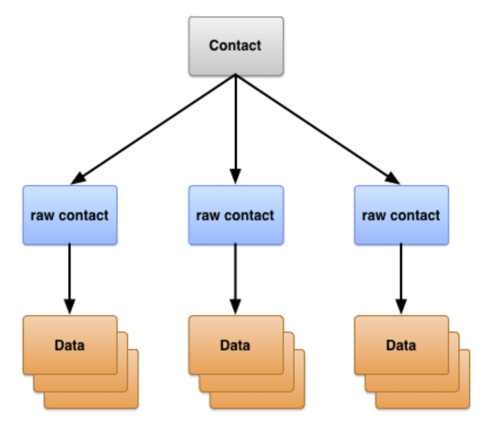
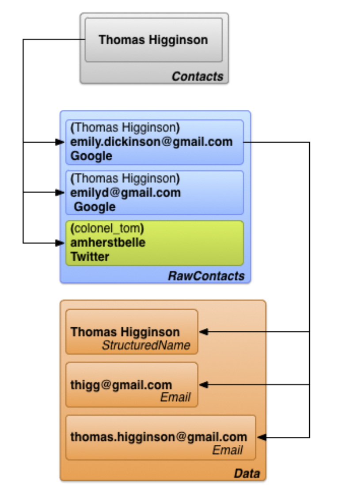

# Content Provider
Der Content Provider stellt in Android eine zentrale Schnittstelle über App-Grenzen hinweg zum Zugriff auf verschiedene Datenquellen dar. Typischerweise fragt man als Entwickler entweder Daten bei einem Content Provider ab, oder man bietet über die eigene App hinaus Daten für anderen Applikationen am Gerät an.

Die Darstellung der Daten erfolgt ähnlich wie in einer Datenbank über Tabellen.

Das _Content-Provider Universum_:



## Zugriff auf einen Content Provider

Der Zugriff auf einen Content Provider erfolgt mittels `ContentResolver` Objekt. Das `ContentResolver` Objekt kommuniziert mit dem `Provider`-Objekt (eine Instanz der Klasse `Provider`). Das `Provider`-Objekt erhält die Anfragen der Clients, führt diese aus und liefert die Ergebnisse zurück. Der `ContentResolver` bietet die entsprechenden "**CRUD**"-Methoden (_create, retrieve, update, delete_) an, über welche der Speicher manipuliert werden kann.

Das Standard-Pattern für den Zugriff auf einen Provider stellt der `CursorLoader` dar. Mittels `CursorLoader` kann asynchron eine Abfrage auf einen ContentProvider ausgeführt werden. Die `Activity` bzw. das `Fragment` ruft einen `CursorLoader` mit der Abfrage auf, der diese über den `ContentResolver` and den `ContentProvider` weiterleitet.



Die Android Umgebung bietet verschiedene eigene ContentProvider an. Einer davon ist das user-dictionary, das die Schreibform von benutzerdefinierten Wörtern abspeichert.



In dieser Tabelle stellt jede Zeile genau ein benutzerdefiniertes Wort dar. Die Spalten repräsentieren die Eigenschaften dieses Eintrags. Die erste Zeile beinhaltet die Bezeichnungen der Spalten.

Um eine Liste der gespeicherten Wörter zu erhalten, kann die `query()` Funktion über ein `ContentResolver`-Objekt verwendet werden.

```java
// Queries the user dictionary and returns results
cursor = getContentResolver().query(
    UserDictionary.Words.CONTENT_URI,   // The content URI of the words table
    projection,                        // The columns to return for each row
    selectionClause,                   // Selection criteria
    selectionArgs,                     // Selection criteria
    sortOrder);                        // The sort order for the returned rows
```

Die Abfrage wir wie eine _SQL-Query_ generiert:



### Content URIs

Um einen Provider ansprechen zu können, ist eine spezielle URI (ContentURI) des Providers erforderlich. Schreibt man einen eigenen Provider ist diese natürlich frei definierbar. Für Provider, die Android bereits anbietet, sind auch die URIs fix definiert.

Die URI für die _words-Tabelle_ lautet: `content://user_dictionary/words` und unterteilt sich folgendermaßen:

- `user_dictionary`: _provider authority_
- `words`: _provider Pfad_
- `content://`: Schema - bei ContentProvider immer gleich

Um auf eine einzelne Zeile eines Providers zugreifen zu können, erlauben viele Provider, die ID der Zeile an den Pfad anzuhängen. Bsp.:

```java
Uri singleUri = ContentUris.withAppendedId(UserDictionary.Words.CONTENT_URI,4);
```

### Abfragen auf den Content Provider

Um einen Provider abfragen zu können, müssen die entsprechenden Permissions im Manifest File eingetragen sein. Diese kann jeweils als _read_ bzw. _write_ Permission ausgeprägt sein.

Um auf das UserDictionary zugreifen zu dürfen, ist die Permission `android.permission.READ_USER_DICTIONARY` erforderlich.

Nun kann die Abfrage konstruiert werden:

```java
// A "projection" defines the columns that will be returned for each row
String[] mProjection =
{
    UserDictionary.Words._ID,    // Contract class constant for the _ID
                                 // column name
    UserDictionary.Words.WORD,   // Contract class constant for the
                                 // word column name
    UserDictionary.Words.LOCALE  // Contract class constant for the
                                 // locale column name
};

// Defines a string to contain the selection clause
String selectionClause = null;

// Initializes an array to contain selection arguments
String[] selectionArgs = {""};
```

Mithilfe der Methode `ContentResolver.query()` kann nun - ähnlich einer SQL Abfrage auf eine Datenbank - auf die Daten zugegriffen werden. Jene Spalten, die im Ergebnis enthalten sein sollen, fasst man in der _Projection_ zusammen. Die Projektion umfasst also alle Spalten, die abgefragt werden sollen.

Die _Selection_ stellt Kriterien zusammen, welche Zeilen im Ergebnis zurückgeliefert werden sollen und wird bei ContentProvider in zwei Teile aufgesplittet:

- **selection clause**: beinhaltet die logischen und boolschen Ausdrücke, denen Daten aus dem Provider entsprechen müssen, damit sie im Result zurückgeliefert werden.
- **selection arguments**: werden im selection clause Platzhalter in Form von `?` verwendet, so liefert selection arguments dafür die konkreten Werte.

Beispiel:

```java
/*
 * This defines a one-element String array to contain the selection argument.
 */
String[] selectionArgs = {""};

// Gets a word from the UI
searchString = searchWord.getText().toString();

// Remember to insert code here to check for invalid or malicious input.

// If the word is the empty string, gets everything
if (TextUtils.isEmpty(searchString)) {
    // Setting the selection clause to null will return all words
    selectionClause = null;
    selectionArgs[0] = "";

} else {
    // Constructs a selection clause that matches the word that the user entered.
    selectionClause = UserDictionary.Words.WORD + " = ?";

    // Moves the user's input string to the selection arguments.
    selectionArgs[0] = searchString;

}

// Does a query against the table and returns a Cursor object
mCursor = getContentResolver().query(
    UserDictionary.Words.CONTENT_URI,// The content URI of the words table
    projection,                      // The columns to return for each row
    selectionClause,              // Either null, or the word the user entered
    selectionArgs,              // Either empty, or the string the user entered
    sortOrder);                    // The sort order for the returned rows

// Some providers return null if an error occurs, others throw an exception
if (null == mCursor) {
    /*
     * Insert code here to handle the error. Be sure not to use the cursor!
     * You may want to call android.util.Log.e() to log this error.
     *
     */
// If the Cursor is empty, the provider found no matches
} else if (mCursor.getCount() < 1) {

    /*
     * Insert code here to notify the user that the search was unsuccessful.
     * This isn't necessarily an error. You may want to offer the user the
     * option to insert a new row, or re-type the
     * search term.
     */

} else {
    // Insert code here to do something with the results

}
```

Auf einer SQL Datenbank würde die Query folgendermaßen aussehen:
```
SELECT _ID, word, locale FROM words WHERE word = <userinput> ORDER BY word ASC;
```

Würde man die Zeilen selektieren wollen, so verwendet man den _selection clause_:

```java
// Constructs a selection clause with a replaceable parameter
String selectionClause =  "var = ?";
// Defines an array to contain the selection arguments
String[] selectionArgs = {""};
// Sets the selection argument to the user's input
selectionArgs[0] = userInput;
```
### Anzeigen der Ergebnisse der Abfrage

Die `ContentResolver.query()`-Methode liefert ein Objekt vom Typ `Cursor` zurück, welches das Ergebnisdatenset beinhaltet. Wie bei einem Datenbank-Cursor kann nun über dieses Ergebnisdatenset iteriert werden.

Ein deartiges Cursor-Objekt kann leicht an eine ListView Komponente mithilfe eines `SimpleCursorAdapter`-Objekts gebunden werden:

```java
// Defines a list of columns to retrieve from the Cursor and load into an
// output row
String[] wordListColumns =
{
    UserDictionary.Words.WORD,   // Contract class constant containing
                                 // the word column name
    UserDictionary.Words.LOCALE  // Contract class constant containing
                                 // the locale column name
};

// Defines a list of View IDs that will receive the Cursor columns for each row
int[] wordListItems = { R.id.dictWord, R.id.locale};

// Creates a new SimpleCursorAdapter
cursorAdapter = new SimpleCursorAdapter(
    getApplicationContext(),  // The application's Context object
    R.layout.wordlistrow,     // A layout in XML for one row in the ListView
    mCursor,                  // The result from the query
    wordListColumns,          // A string array of column names in the cursor
    wordListItems,            // An integer array of view IDs in the row layout
    0);                       // Flags (usually none are needed)

// Sets the adapter for the ListView
wordList.setAdapter(cursorAdapter);
```

### Auslesen der Daten für weitere Verarbeitung

Natürlich können die Ergebnisdaten nicht nur angezeigt, sondern auch für die weitere Verarbeitung ausgelesen werden. Dazu iteriert man einfach über das `Cursor`-Objekt:

```java
// Determine the column index of the column named "word"
int index = mCursor.getColumnIndex(UserDictionary.Words.WORD);
/*
 * Only executes if the cursor is valid. The User Dictionary Provider returns
 * null if an internal error occurs. Other providers may throw an Exception
 * instead of returning null.
 */
if (mCursor != null) {
    /*
     * Moves to the next row in the cursor. Before the first movement in the
     * cursor, the "row pointer" is -1, and if you try to retrieve data at
     * that position you will get an
     * exception.
     */
    while (mCursor.moveToNext()) {

        // Gets the value from the column.
        // cursor contains different get methodes for different datatypes
        newWord = mCursor.getString(index);

        // Insert code here to process the retrieved word.

        ...

        // end of while loop
    }
} else {
    // Insert code here to report an error if the cursor is null or the
    // provider threw an exception.
}
```

### Permissions für DictionaryProvider

Um auf das Benutzerdictionary zugreifen zu können, benötigt die App eine der beiden Permissions, die im Manifest eingetragen werden müssen:

- `android.permission.READ_USER_DICTIONARY`
- `android.permission.WRITE_USER_DICTIONARY`

Entweder für lesendend oder zusätzlich für schreibenden Zugriff.

### Modifizieren von Daten
Mithilfe der Interaktion zwischen Provider Client und ContentProvider können natürlich auch Daten manipuliert (insert, update, delete) werden.

#### Insert
Um Daten hinzuzufügen, verwendet man die Methode `ContentResolver.insert()`. Diese Methode fügt eine neue Zeile hinzug und liefert die content URI für das hinzugefügte Objekt zurück.

```java
// Defines a new Uri object that receives the result of the insertion
Uri newUri;

...

// Defines an object to contain the new values to insert
ContentValues newValues = new ContentValues();

/*
 * Sets the values of each column and inserts the word.
 * The arguments to the "put" method are "column name" and "value"
 */
newValues.put(UserDictionary.Words.APP_ID, "example.user");
newValues.put(UserDictionary.Words.LOCALE, "en_US");
newValues.put(UserDictionary.Words.WORD, "insert");
newValues.put(UserDictionary.Words.FREQUENCY, "100");

newUri = getContentResolver().insert(
    UserDictionary.Words.CONTENT_URI,   // the user dictionary content URI
    newValues                          // the values to insert
);
```

Die neuen Datenelemente werden innerhalb eines Objekts vom Typ `ContentValues` eingepackt. `ContentValues` stellt eine Map-Struktur zur Verfügung, in die mithilfe von _put-Methoden_ die Werte hinzugefügt werden. Der Key ist jeweils der Spaltenname und der Value der tatsächliche Inhalt. Einen leeren Inhalt kann man mithilfe der Methode `ContentValues.putNull()` hinzufügen.

Die Spalt `_ID` wird nicht explizit hinzugefügt, da diese automatisch verwaltet wird. Die neue ID ist aus dem Rückgabewert der `insert`-Methode ersichtlich:
```
content://user_dictionary/words/<id_value>
```

#### Update
Um eine Zeile zu modifizieren wird wieder ein Objekt vom Typ `ContentValues` verwendet, welches die zu aktualisierenden Werte beinhaltet. Die entsprechende Methode auf client Seite lautet: `ContentResolver.update()`.

Welche Datensätze geändert werden sollen, wird über den `selectionClause` gesteuert.

Der Rückgabewert ist die Anzahl der geänderten Datensätze.

```java
// Defines an object to contain the updated values
ContentValues updateValues = new ContentValues();

// Defines selection criteria for the rows you want to update
String selectionClause = UserDictionary.Words.LOCALE +  " LIKE ?";
String[] selectionArgs = {"en_%"};

// Defines a variable to contain the number of updated rows
int rowsUpdated = 0;

...

/*
 * Sets the updated value and updates the selected words.
 */
updateValues.putNull(UserDictionary.Words.LOCALE);

rowsUpdated = getContentResolver().update(
    UserDictionary.Words.CONTENT_URI,   // the user dictionary content URI
    updateValues,                      // the columns to update
    selectionClause,                   // the column to select on
    selectionArgs                      // the value to compare to
);
```

#### Delete

Das Löschen von Datensätzen erfolgt nach dem gleichen Schema wie das Abfragen. Man spezifiert Kriterien, denen die zu löschenden Zeilen entsprechen müssen. Zum Löschen ruft man dann die Methode `ContentResolver.delete()` auf.

Der Rückgabewert beinhaltet die Anzahl der gelöschen Datensätze.

```java
// Defines selection criteria for the rows you want to delete
String selectionClause = UserDictionary.Words.APP_ID + " LIKE ?";
String[] selectionArgs = {"user"};

// Defines a variable to contain the number of rows deleted
int rowsDeleted = 0;

...

// Deletes the words that match the selection criteria
rowsDeleted = getContentResolver().delete(
    UserDictionary.Words.CONTENT_URI,   // the user dictionary content URI
    selectionClause,                   // the column to select on
    selectionArgs                      // the value to compare to
);
```

# Contacts Provider

Mihilfe des Konzepts _Contacts Provider_ kann auf sämtliche Daten über Personen, die am Android Gerät gespeichert sind, über eine zentrale Schnittstelle zugegriffen werden. Dieser Provider kumuliert ein breites Spektrum an verschiedenen Datenquellen und bietet diese über eine gemeinsame Schnittstelle an.

Der Zugriff erfolgt mithilfe von verschiedenen `contract classes` und `interfaces`.

## Aufbau vom Contacts Provider
Der Contacts Provider stellt einen Android `Content Provider` dar. Er vereint drei verschiedene Datentypen über eine Person, die aus verschiedenen Tabellen stammen.



Diese drei Tabellen werden in der Regel über die Namen der entsprechenden _contract classes_ angesprochen. Diese Klassen definieren Konstante für _content URIs_, _Spaltennamen_ und _Spaltenwerte_:

`ContactsContract.Contact` Tabelle:
- Zeilen repräsentieren verschiedenen Personen, basierend auf Aggregationen von Rohdaten

`ContactsContract.RawContacts` Tabelle:
- Die Zeilen der Tabelle beinhalten eine Zusammenfassung der Daten über die Person, die zu einem bestimmten User Account und Typ gehört.

`ContactsContract.Data` Tabelle:
- Die Zeilen beinhalten Detailinformationen über die Rohdaten des Kontakts, wie etwa E-Mail Adressen oder Telefonnummer.

### Raw Contacts
Ein _Raw Contact_ stellt die Daten über eine Person dar, die aus einem einzigen Account Typ und Account Namen stammen. Der Contacts Provider erlaubt mehr als eine online-Quelle für die Daten über die Person, weshalb mehrere _raw contacts_ für eine Person parallel am Gerät existieren können.

Der meiste Inhalt ist nicht direkt in der Tabelle `ConatctsContract.RawContacts` gespeichert, sondern in einer oder mehreren Zeilen der `ContactsContract.Data` Tabelle abgelegt. Jede Zeile besitzt eine Spalte `Data.RAW_CONTACT_ID`, welche den `RawContact._ID` -Wert beinhaltet, der in der Tabelle `ContactsContract.RawContacts` referenziert wird.

Welche Spalten finden wir in der Tabelle `ConatctsContract.RawContacts`?

| | | |
|-|-|-|
|`ACCOUNT_NAME`|Account name für die Quelle dieses Kontakts. Z.B. account name für ein Google Konto|Das Format dieses Eintrags hängt vom Account Typ ab und muss nicht zwinged ein bestimmtes Format (zB E-Mail Adresse) aufweisen.|
|`ACCOUNT_TYPE`| Account type, der die Quelle dieses Eintrags darstellt. Der Account Type eines Google Accounts ist zB `com.google`. | |
|`DELETED`| Flag, ob eine raw contact gelöscht wurde. | Durch dieses Flag kann der Contacts Provider die Zeile intern aufrecht erhalten, bis alle verbundenen Sync-Adapter den Eintrag ebenfalls von deren Servern gelöscht haben. |

Um zu verstehen, wie der _raw contacts_ Provider arbeitet, nehmen wir den Kontakt _Markus Müller_ an. Dieser Benutzer hat drei verschiedene User Accounts am Gerät gespeichert:

- markus.mueller@gmail.com
- mmueller@gmail.com
- Twitter Account: "max2000"

In den Geräteeinstellungen hat der Benutzer die Funktion _Sync Contacts_ für all drei Accounts aktiviert. Angenommen unser Benutzer _Markus_ öffnet ein neues Browserfenster und logged sich in GMAIL mit seiner E-Mail Adresse _markus.mueller@gmail.com_ ein. Er öffnet seine Kontakte und fügt den Eintrag _Susi Huber_ hinzu. Später logged er sich mit seiner E-Mail Adresse _mmueller@gmail.com_ in GMAIL ein und sendet eine E-Mail an _Susi Huber_, welche ihn automatisch als Kontakt hinzufügt. Er folgt weiter dem Twitter Account _SuperSusi_ (Account von Susi Müller) auf Twitter.

Der Contacts Provider erstellt drei _Raw Contacts_ aus diesen Interaktionen:

1. Einen _Raw Contact_ `Susi Müller`, der mit der E-Mail Adresse `markus.mueller@gmail.com` assoziiert wird. Der User Account Type ist `Google`.
1. Ein zweiter _Raw Contact_ wird für `Susi Müller` angelegt und mit der E-Mail Adresse `mmueller@gmail.com` verknüpft. Der User Account Type ist wieder `Google`
1. Ein dritter _Raw Contact_ wird für `Susi Müller` angelegt. Diesmal erfolgt die Verknüpfung mit _max2000_. Der User Account Type ist `Twitter`.

### Daten
Die Daten zu jedem _Raw Contact_ werden in der Tabelle `ContractsContract.Data` gespeichert. Die verknüpfte `_ID` ermöglicht, dass ein einzelner Kontakt mit mehreren Instanzen vom gleichen Datentyp (zB gmail Konto) verknüpft ist.

Über Unterklassen von `ContactsContract.CommonDataKinds` kann auf vereinfachte Weise auf die Daten aus dem Provider zugegriffen werden.

Beispiel:

- `ContactsContract.CommonDataKinds.Email`
- `ContactsContract.CommonDataKinds.Photo`
- `ContactsContract.CommonDataKinds.StructuredPostal`

### Contacts
Der Contacts Provider aggregiert die _Raw Contacts_ über alle gespeicherten Accounts hinweg und bildet daraus einen _contact_. Auf diese Weise kann sämtliche Information über einen bestimmten Kontakt relativ leicht abgefragt werden.

Wird eine neuer _Raw Contact_ hinzugefügt, für den noch keine anderen Daten gespeichert sind, so erstellt der _Contacts Provider_ automatisch einen neuen Eintrag.

Struktur im _Contacts Provider_:



## Erforderliche Berechtigungen
Um auf die Kontakte am System zugegreifen zu können, sind natürlich auch Berechtigungen erforderlich:

- **Lesezugriff:** `READ_CONTACTS`
- **Schreibzugriff:** `WRITE_CONTACTS`

Beide Permissions müssen im Manifest eingetragen werden.

## Contacts Provider abfragen
Da der Contacts Provider hierarchisch aufgebaut ist, ist es oftmals hilfreich, einen Eintrag abzufragen und anschließend alle Kind-Elemente abzufragen, die mit dem Eintrag verknüpft sind. Um derartige Abfragen zu vereinfachen, stellt der Contacts Provider `entity constructs` zur Verfügung, die ähnlich wie `JOINS` auf Datenbank Tabellen agieren.
