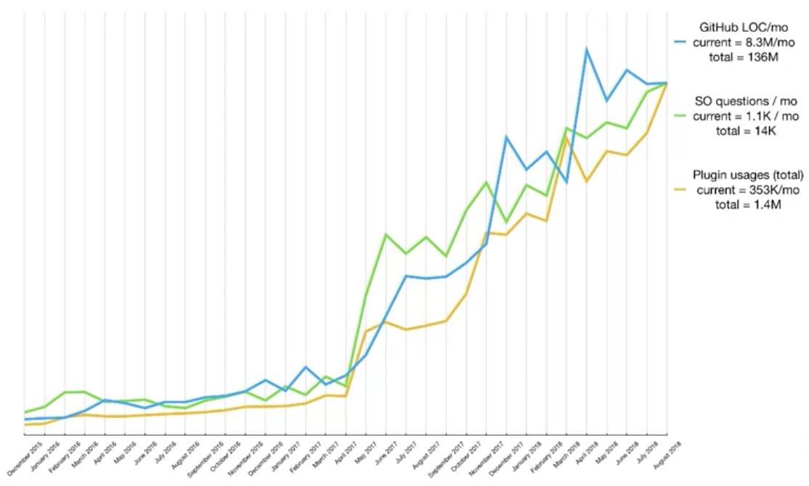
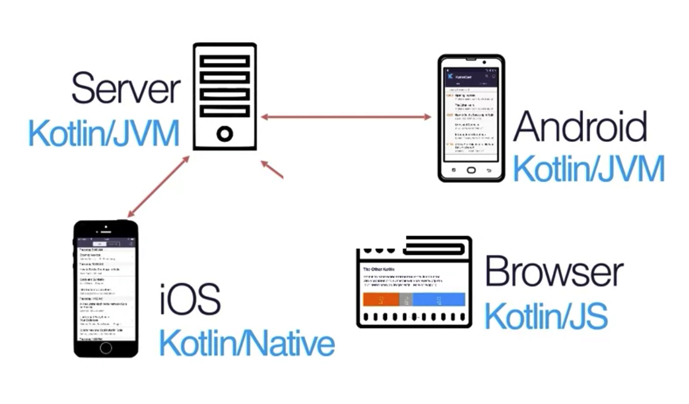

## Historischer Abriss und Kernfunktionalitäten von Kotlin

Kotlin ist - genauso wie Java - eine statisch typisierte Sprache. Doch kann auf die explizite Angabe von Typen vielfach verzichtet werden, was Kotlin sehr dynamisch wirken lässt.

Kotlin wurde von dem Unternehmen JetBrains entwickelt und ist im Unterschied zu Java eine sehr moderne Sprache - bleibt aber dennoch vollständig kompatibel zu Java Quellcode.

Die Entwicklung startete vor 10 Jahren im Jahr 2010. Somit können wir Kotlin inzwischen als etablierte Sprache betrachten, die aber trotzdem nicht einmal halb so alt ist wie Java.

JetBrains' Ziel war die Entwicklung einer __in der Praxis leicht einzusetzenden Programmiersprache__, die die besten Entwicklungen der letzten Jahre aus anderen Sprachen wie Java, Scala, C#, Groovy, Python, C, C++, Swift, etc. versucht zu vereinen.

| Jahr | Details |
|------|-------|
| 2010 | Projekt Kick Off |
| 2012 | Kotlin wird als Open Source Projekt veröffentlicht |
| 2016 | Release Kotlin V1.0 |
| 2017 | Kotlin wird zur offiziellen Sprache für Android |
| 2018 | Release Kotlin V1.3 |
| 2020 | Release Kotlin V1.4 |

Der Einsatz im Android Universum bedeutete einen gewaltigen Akzeptanzschub.

Kotlin eignet sich jedoch genauso gut für die Entwicklung von Server-Applikationen. Das Deployment von Kotlin Code kann auf verschiedenen VMs erfolgen:

- __Kotlin auf JVM__
- __Kotlin auf JS__ (Webdevelopment)
- __Kotlin Native__

Aufgrund der Kompatibilität mit Android werden wir uns auf den Einsatz von JVM beschränken.

Ziel der unterschiedlichen VMs ist jedoch, die __Entwicklung einer Full-Stack-Applikation mit nur einer einzigen Sprache__ sowohl für Front- als auch für das Backend zu ermöglichen.

Jedes Jahr erscheint eine neue Hauptversion von Kotlin. Die zentrale Entwicklung erfolgt nach wie vor durch JetBrains.
