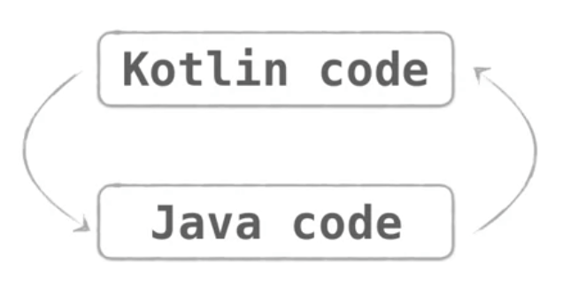

# Von Java zu Kotlin

Kotlin ist zu Java voll kompatibel. D.h. man kann (theoretisch) auch in einem einzigen Projekt Java und Kotlin-Source-Code mischen.



Da Java, wie auch Kotlin/JVM auf der JVM laufen, kann man Java Code direkt aus Kotlin aufrufen und auch umgekehrt Kotlin Code aus Java Programmen heraus aufrufen. So können betehende Java Projekte sukzessive nach Kotlin migriert werden.

_Verständnisfrage:_ __Kompiliert Kotlin Code nach:__

- Java Source Code oder
- **Java bytecode**?

## Java to Kotlin Converter

Mithilfe des _Java-to-Kotlin-Converter_ kann Java Code direkt nach Kotlin migriert werden. Auf diese Weise kann man die Kotlin Syntax sehr einfach erlernen.

Demobeispiel des Java-to-Kotlin Konverters:

__Person-Class in Java__
```java
public class Person {
    private final String name;
    private final int age;

    public Person(String name, int age) {
        this.name = name;
        this.age = age;
    }

    public String getName() {
        return this.name;
    }

    public int getAge() {
        return this.age;
    }
}
```

Anhand dieser einfachen Java Klasse demonstrieren wir die Konvertierung zu Kotlin.

__Person-Class in Kotlin__

```kotlin
class Person(val name: String, val age: Int)
```
Dieses einfache Beispiel zeigt, wie schlank die gleiche Klasse in Kotlin geschrieben werden kann. In Hinblick auf die Ausführung des Programms hat dies jedoch keinerlei Auswirkungen, da der gleiche Java-Byte-Code generiert wird.

Wir können einer Klasse in Kotlin zusätzlich noch das Prefix ```data``` voranstellen:
```kotlin
data class Person(val name: String, val age: Int)
```
Dadurch werden automatisch verschiedenen Methoden im Hintergrund generiert (```equals```, ```toString``` und ```hashCode```).

**Instantiieren von Objekten der Klasse***

In Java würden wir nun Objekte folgendermaßen instantiieren:

```java
Person person = new Person("Alice", 27);
System.out.println(person.getName());
```
... das Gleiche in Kotlin:

```Kotlin
val person = Person("Alice", 27)
println(person.name)
```
In Kotlin gibt es kein Schlüsselwort ```new```. Ein Objekt wird einfach durch einen Aufruf der Klassen (genauso wie eine Funtion) erstellt.

**Ein weiteres Beispiel**

Nun betrachten wir ein anderes Beispiel. Erstellen wir folgende einfache Methode in Java. Die recht einfache Methode ```updateWeather``` weist zwei verschiedenen Variablen unterschiedliche Werte, abhängig von der Temperatur zu - wobei ```color``` ein Wert aus einem ```enum``` darstellt.

```java
enum Color { BLUE, ORANGE, RED }

public void updateWeather(int degrees) {
    String description;
    Color color;
    if (degrees < 10) {
        description = "cold";
        color = Color.BLUE;
    } else if (degrees < 25) {
        description = "mild";
        color = Color.ORANGE;
    } else {
        description = "hot";
        color = Color.RED;
    }   
}
```

**Was macht der automatische Konverter daraus?**

```kotlin
internal enum class Color {
     BLUE, ORANGE, RED
 }

 fun updateWeather(degrees: Int) {
     val description: String
     val color: Color
     if (degrees < 10) {
         description = "cold"
         color = Color.BLUE
     } else if (degrees < 25) {
         description = "mild"
         color = Color.ORANGE
     } else {
         description = "hot"
         color = Color.RED
     }
 }
 ```
Der Code sieht in Kotlin sehr ähnlich aus. Einige Syntax-Unterschiede sind jedoch bereits zu erkennen (```fun``` für die Deklaration einer Funktion, etc.) Im Wesentlichen sehen die beiden Code-Snippets recht ähnlich aus.

**Tatsächlich ist das aber nicht die einfachste Schreibweise für diesen Code, die Kotlin erlaubt.**

Wir können die drei Variablendeklarationen zu einer einzige zusammenfassen:

```kotlin
fun updateWeather(degrees: Int) {
    val (description: String, color: Color) =
    if (degrees < 10) {
        Pair("cold", Color.BLUE)
    } else if (degrees < 25) {
        Pair("mild", Color.ORANGE)
    } else {
        Pair("hot", Color.RED)
    }
}
```
_In Java müssen wir bei der Variablendeklaration stets den Typ angeben. Kotlin ist zwar - genauso wie Java - typsicher, bei der Deklaration kann jedoch auf die Angabe des Typs verzichtet werden, wenn dieser aus dem Kontext abgeleitet werden kann._

```kotlin
fun updateWeather(degrees: Int) {
    val (description, color) =
    if (degrees < 10) {
        Pair("cold", Color.BLUE)
    } else if (degrees < 25) {
        Pair("mild", Color.ORANGE)
    } else {
        Pair("hot", Color.RED)
    }
}
```

**Nun können wir noch die Zuweisung durch die Verwendung des Schlüsselworts ```when``` deutlich vereinfachen:**

```kotlin
fun updateWeather(degrees: Int) {
    val (description, color) = when {
        degrees < 10) -> Pair("cold", Color.BLUE)
        degrees < 25) -> Pair("mild", Color.ORANGE)
        else -> Pair("hot", Color.RED)
    }
}
```

__Das ```when```Statement in Kotlin ist vergleichbar mit dem ```switch``` in Java. Es eignet sich besonders dann, wenn wir mehrere ```if-else``` Statements verwenden müssten.__

**Nun können wir auch noch das ```Pair``` eliminieren.**

```kotlin
fun updateWeather(degrees: Int) {
        val (description, color) = when {
            degrees < 10 -> "cold" to Color.BLUE
            degrees < 25 -> "mild" to Color.ORANGE
            else -> "hot" to Color.RED
        }
    }
```
Dieses Beispiel zeigt, dass der Kotlin-Konverter zwar ein praktisches Tool ist, jedoch nicht immer den _besten_ bzw. _elegantesten_ Kotlin Code erzeugt.

Hier nochmal die Gegenüberstellung der Implementierungen in Java und Kotlin.

__Java__

```java
public void updateWeather(int degrees) {
        String description;
        Color color;
        if (degrees < 10) {
            description = "cold";
            color = Color.BLUE;
        } else if (degrees < 25) {
            description = "mild";
            color = Color.ORANGE;
        } else {
            description = "hot";
            color = Color.RED;
        }
    }  |   fun updateWeather(degrees: Int) {
        val (description, color) = when {
            degrees < 10 -> "cold" to Color.BLUE
                degrees < 25 -> "mild" to Color.ORANGE
            else -> "hot" to Color.RED
        }
    }
```
__Kotlin__

```kotlin
fun updateWeather(degrees: Int) {
        val (description, color) = when {
            degrees < 10 -> "cold" to Color.BLUE
            degrees < 25 -> "mild" to Color.ORANGE
            else -> "hot" to Color.RED
        }
}
```
