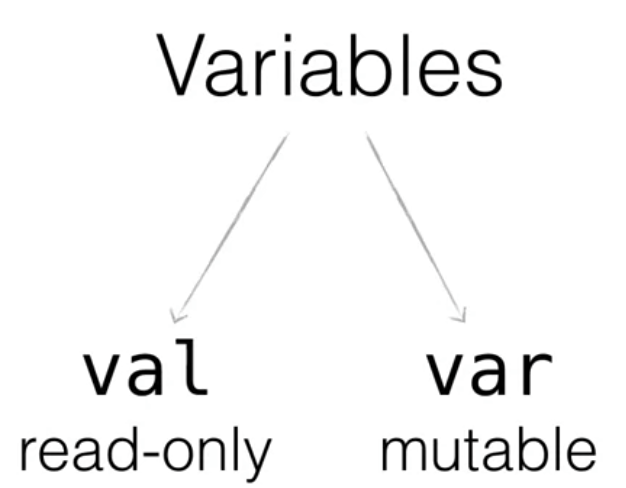
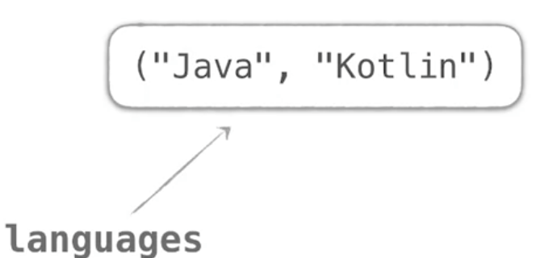

# Variable in Kotlin

In Kotlin können Variablen mit den Schlüsselwörtern ```val``` (_read only Variable - Konstante_) und ```var``` (_"echte" Variable_) deklarier werden.


|Java | Kotlin|
| --- | --- |
|```final``` | ```val```|
| _Kontante_ | _read only Variable_ |

Die Typangabe kann bei der Deklaration von Variablen weggelassen werden. Der Compiler leitet diese automatisch ab.

```kotlin
val greeting = "Hi!" // gleich zu:
val greeting = "Hi!": String
```

__Warum ist folgender Code nicht ausführbar?__

```kotlin
var string = 1
string = "abc"
```

__Können *val-Werte* verändert werden?__

Ja! Mit ```val``` erzeuge ich einfach eine Referenz auf einen Speicherbereich. Ändert sich der Inhalt im Speicher, ändert sich natürlich auch der Wert, auf den ```val``` referenziert.

```kotlin
val languages = mutableListOf("Java")
languages.add("Kotlin")
```



__Doch warum funktioniert folgender Code nicht?__

```kotlin
val languages = listOf("Java")
languages.add("Kotlin")
```

_Dies ist nicht möglich, da man in kotlin eine ```readonly``` Liste nicht verändern kann._

Mit Kotlin sollten Variablen nach Möglichkeit mit ```val``` und veränderlichen Typen deklariert werden, da dieses Muster näher am Stil der funktionalen Programmierung und damit an der Kernidee von Kotlin liegt.
