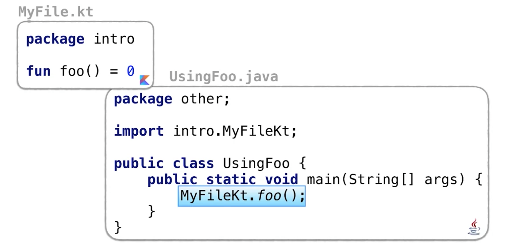
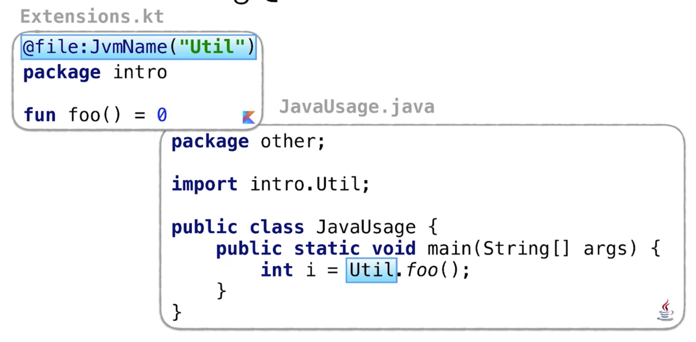

# Funktionen in Kotlin

Funktionen werden in Kotlin nach folgendem Schema definiert:

```kotlin
fun max(a: Int, b: Int): Int {
    return if (a > b) a else b
}
```

Die Typen der Aufrufparemter werden (im Unterschied zu Java) hinter die Bezeichnung gestellt.

Besteht eine Funktion nur aus einem Rückgabewert, so kann diese auch einfacher direkt in einer einzigen Zeile geschrieben werden:
```kotlin
fun max(a: Int, b: Int): Int = if (a > b) a else b
```
Sollen keine Werte beim Aufruf zurückgeliefert werden, so kann der Typ ```:Unit``` verwendet werden oder alternativ kein Rückgabetyp verwendet werden.
```kotlin
fun display(a: Int, b: Int): Unit {
    println(max(a, b))
}
```

## Wo können Funktionen deklariert werden?
In Kotlin können Funktionen an verschiedenen Stellen definiert werden.

- Top-Level Funktion (ohne zugehörige Klasse)
- Member-Function in einer Klasse
- Lokale Funktion

Beispiele:
```kotlin
// Top Level
fun topLevel() = 1
// MemberFunction
class A {
    fun member() = 2
}
// Local function
fun other() {
    fun local() = 3
}
```
_Auf diese Weise können auch Funktion innerhalb von anderen Funktionen definiert werden._

__Kann eine Top-Level Kotlin Funktion aus Java Code heraus aufgerufen werden?__

Ja! Aus Java Code heraus wird eine Top-Level Kotlin Funktion als ```static``` importiert. Als Klassenname in Java der Dateiname, der Datei, in der die Kotlin Top-Level Funktion definiert wurde, verwendet.



Alternativ zu obiger Abbildung kann für die Kotlin-Datei auch die ```@JvMName``` Annotation verwendet werden.



So kann eine beliebige Bezeichnung für die Klasse der Kotlin-Datei gewählt werden.

## Default Werte für Funktionsparameter

Was gibt folgender Quellcode aus?
```kotlin
println(listOf('a', 'b', 'c').joinToString(
    separator = "", prefix = "(", postfix = ")"))
```
Ausgabe: ```(abc)```

Die Funktion ```joinToString``` fügt die Elemente einer Liste zu einem einzigen String zusammen. Wobei die Elemente durch den für ```spearator``` angegebenen Wert getrennt werden. Die beiden Werte von ```prefix``` bzw. ```postfix``` werden am Anfang respektive am Ende des Strings hinzugefügt.

Werte für Funktionsparameter können mit oder auch ohne der Bezeichnung des Parameters übergeben werden.

```kotlin
println(listOf('a', 'b', 'c').joinToString(postfix = "."))
```
Ausgabe: ```a, b, c.```

Der Default Wert für ```separator``` ist also das Komma.

### Default Werte für die Parameter eigener Funktionen deklarieren
Natürlich können auch bei eigenen Funktionen Default-Werte für die Parameter angegeben werden.
```kotlin
fun displaySeparator(character: Char = '*', size: Int = 10) {
    repeat(size) {
        print(character)
    }
}
```
Beispiele für Aufrufe dieser Funtktion:
{:width="300"}

An diesem Aufruf ```displaySeparator(size=5) //***** ``` sieht man, dass die Parameter inklusive Bezeichnung aufgerufen werden müssen, sofern wir sie nicht in der definierten Reihenfolge angeben bzw. - wie in diesem Fall - nur den zweiten Funktionsparameter verwenden wollen.

Doch was gibt folgender Aufruf aus?
```Kotlin
displaySeparator(3, '5')
```

_Dieser Aufruf kann nicht kompiliert werden, da die Parameter ohne Bezeichnung in der Reihenfolge der Definition an den Funktionsaufruf gebunden werden. D.h. hier wird ```3``` als Parameter ```character``` verwendet und ```'5'``` als Parameter ``` size```._

Allerdings würde der Aufruf funktionieren, wenn wir die Parameter direkt bezeichnen:

```Kotlin
displaySeparator(size=3, character='5')
```
Ausgabe: ```555```


## Überladungen von Funktionen
Aus Java ist der Entwickler gewöhnt, Funktionen mit verschiedenen Parameter-Variationen zu überladen. Beispielsweise für die Funktion ```displaySeparator``` könnten die überladenen Varianten so aussehen:

```java
public void displaySeparator(char character, int size) { ... }

public void displaySeparator(char character) {
    displaySeparator(character, 10);
}

public void displaySeparator() {
    displaySeparator('*');
}
```
Für diese Anwendung können in Kotlin die Default-Werte für Parameter verwendet werden.

_Doch wie kann eine Kotlin-Funktion mit Default-Parameterwerten aus Java Code heraus aufgerufen werden?_

```fun sum(a: Int = 0, b: Int = 0, c: Int = 0)```

Für einen Aufruf aus Java, muss die Funktion mit Angabe von Werten für alle Parameter aufgerufen werden.

Um die Funktion mit Default-Werten auch von Java aus nutzen zu können. Muss diese mit der Annotation ```@JvmOverloads``` ausgezeichnet werden.

Default-Werte in Kotlin sparen im Vergleich zu Java eine Menge an Codezeilen hinsichtlich der Überladungen von Funktionen ein.

__Caveat___: Wird die JvmOverloads-Annotation verwendet, werden Überladungen nicht für alle möglichen (in obigem Fall 2^3), sondern nur für inkrementelle Angabe von Parameterwerten generiert.

```java
public static final int sum(int a, int b, int c)
public static final int sum(int a, int b)
public static final int sum(int a)
public static final int sum()
```
