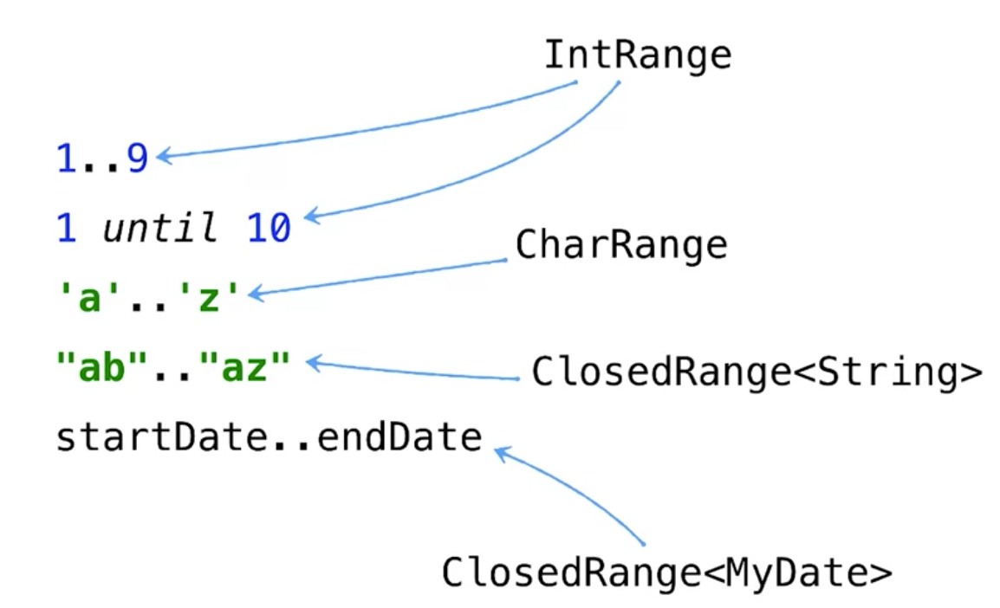
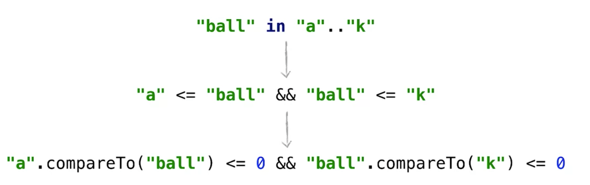

# Ranges in Kotlin
## Das Schlüsselwort ```in``` in Kotlin
Ein wesentliches Schlüsselwort in Kotlin in Verbindung mit Ranges ist ```in```. Dieses hat keine direkte Entsprechung in Java.

Das Schlüsselwort ```in``` können wir in zwei Use-Cases verwenden:

1. **Mit einer ```for```-Schleife zur Iteration über ein Intervall:**
```kotlin
for (i in 'a'..'z') {...}
```
1. **Zur Überprüfung, ob ein Element in einem Range enthalten ist:**  
```kotlin
c in 'a'..'z'
```

### Anwendungsbeispiel
Folgende Funktion prüft für ein Zeichen, ob es ein Klein- oder Großbuchstabe ist:

```kotlin
fun isLetter(c: Char) = c in 'a'..'z' || c in 'A'..'Z'
```

Das Konstrukt ```c in 'a'..'z'``` ist in diesem Beispiel das Äquivalent zu folgendem Ausdruck ```'a' <= c && c <= 'z'```. _Während des Compile Vorgangs wird genau dieser Code vom Compiler erzeugt._

## Verneinung vom ```in``` Operator in Kotlin
Der Operator ```in``` kann auch verneint werden:

```kotlin
fun isNotDigit(c: Char) = c !in '0'..'9'
```

Diese Funktion prüft, ob das übergebene Zeichen keine Ziffer ist - also nicht im Intervall (_range_) von 0 bis 9 enthalten ist.

## Der ```in```Operator in Verbindung mit ```when```
Der ```in```Operator kommt häufig in Verbindung mit ```when``` zum Einsatz:

```kotlin
fun recognizeChar(c: Char) = when(c) {
    in '0'..'9' -> "It's a digit!"
    in 'a'..'z', in 'A'..'Z' -> "It's a letter"
    else -> "Unknown char"
}
```

## Ranges verschiedener Typen
Ranges können wir in Kotlin auf Basis verschiedener Typen erstellen. Natürlich als Zahlenintervalle auf Basis von ```Int```. Doch auch mit ```String```'s können Intervalle erstellt werden.

Intervalle können auf Basis jedes vergleichbaren Typs in Kotlin aufgebaut werden.  



```kotlin
// int ranges
val intRange: IntRange = 1..9
val anotherIntRange: IntRange = 1 until 10
// char range
val charRange: CharRange = 'a'..'z'
// string range
val stringRange: ClosedRange<String> = "ab".."az"
// range of custom date class (would have to declare the class MyDate!
val dateRange: ClosedRange<MyDate> = startDate..endDate
```

Strings werden in Kotlin wie auch in Java lexikographisch (_also nach dem Alphabet_) verglichen. Der Compiler erzeugt also im Hintergrund einen Aufruf der ```compareTo```-Methode.



_Beispiel:_

```kotlin
"ball" in "a".."k" // --> true
"zoo"  in "a".."k" // --> false
```

Während in Java die ```compareTo```-Methode explizit aufgerufen werden muss, kann in Kotlin für jeden Typen, der das ```Comparable```-Interface erfüllt, ein Range definiert werden. So können wir z.B. ein Datum direkt über Vergleichsoperatoren miteinander vergleichen:

```Kotlin
class MyDate : Comparable<MyDate>

if (myDate.compareTo(startDate) >= 0 &&
   myDate.compareTo(endDate) <= 0) { ... }
```

Einfacher können wir das folgendermaßen realisieren:

```Kotlin
if (myDate >= startDate && myDate <= endDate) { ... }
```

Oder mittels einer Prüfung auf ein Intervall:

```Kotlin
if (myDate in startDate..endDate) { ... }
```
