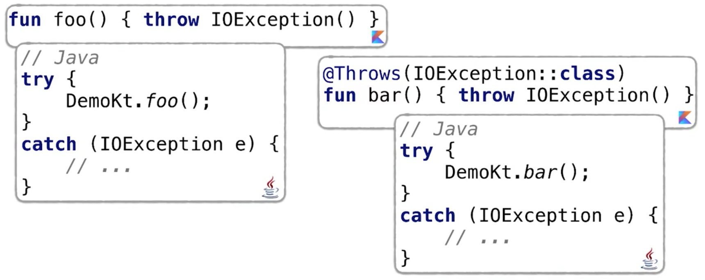

# Exception Handling in Kotlin
In Kotlin erfolgt das Exception ähnlich wie in Java. Kotlin unterscheidet jedoch nicht zwischen _checked_ und _unchecked_ Exceptions. Kotlin können Ausnahmen behandelt werden oder auch nicht. Die Funktion muss dazu in der Signatur keine Angabe machen - im Unterschied zu Java.
```kotlin
val percentage =
    if (number in 0..100)
        number
    else
        throw IllegalArgumentException(
            "A percentage value must be between 0 and 100: $nunber"
        )
```
Wird in Kotlin eine Exception geworfen, ist die ein Rückgabewert, der genauso einer Variablen zugeteilt werden kann. Der Rückgabewert von ```throw``` kann jedem beliebigen Variablentyp zugeordnet werden.

Mit dem ```try ... catch``` Konstrukt können in Kotlin Exceptions abgefangen werden, auf einen bestimmten Typ geprüft und der Code zur Behandlung der Ausnahmen ausgeführt werden.
```kotlin
val number = try {
    Integer.parseInt(string)
} catch (e: NumberFormatException) {
    // do something
    return
}
```
_Auch in diesem Beispiel wird der Rückgabewert von try/catch direkt einer Variablen zugewiesen, da auch try/catch in Kotlin ein Ausdruck ist._

## Annotation einer Funktion mit ```@Throws```
In Kotlin müssen Funktionen nicht explizit angeben, dass sie möglicherweise eine Exception werfen. Wir können dies jedoch mithilfe der ```@Throws``` Annotation dennoch angeben.

_In welchen Fällen kann dies sinnvoll sein?_

Betrachten wir folgendes Beispiel. Macht es einen Unterschied in Bezug auf den Aufruf der Funktionen ```foo``` bzw. ```bar```.



Beide Funktionen werden eine ```IOException```, jedoch ist nur die Funktion ```bar``` mit einer entsprechenden Annotation in Kotlin versehen. Möchte ich in Java später die Funktion aufrufen, wird die entsprechende Annotation benötigt. Denn das erste Beispiel führt in Java zu einem Compile-Fehler, da eine Exception nicht abgefangen werden kann, wenn sie in dem entsprechenden Codeblock nicht geworfen wird.

_Verwendet man die Funktion nur in Kotlin Code, so kann auf die Annotation verzichtet werden. Soll die Funktion jedoch auch von Java Code aus aufgerufen werden könnne, so ist das Einfügen der Annotation erforderlich, um spätere Compile-Fehler zu vermeiden._
