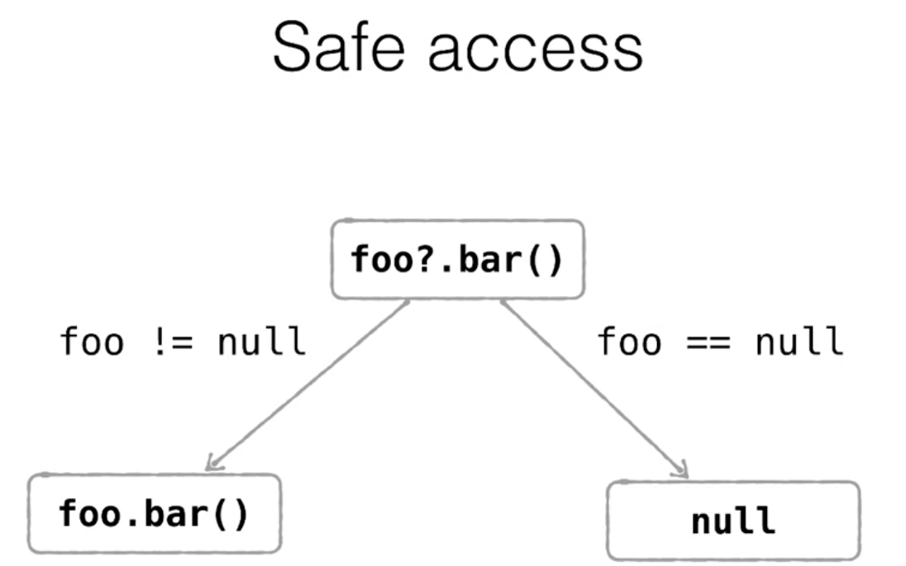
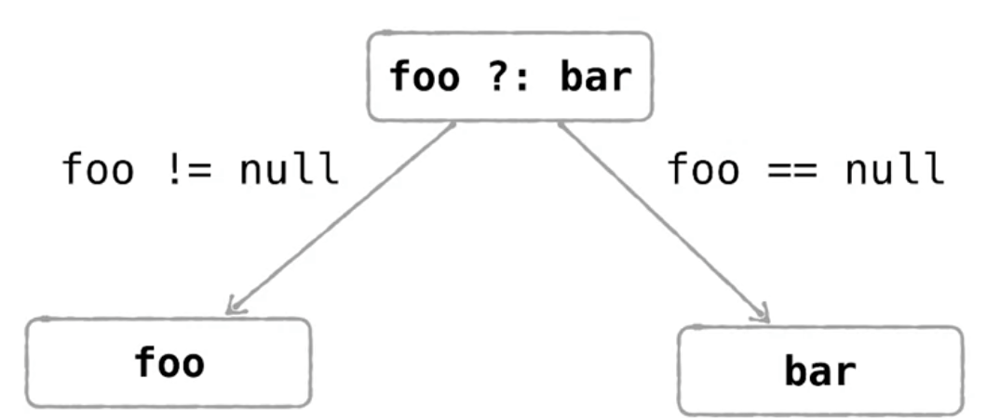
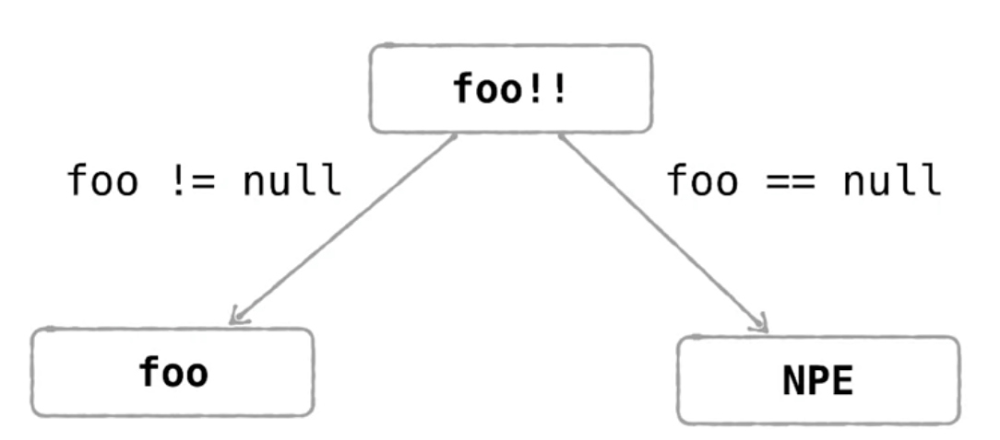
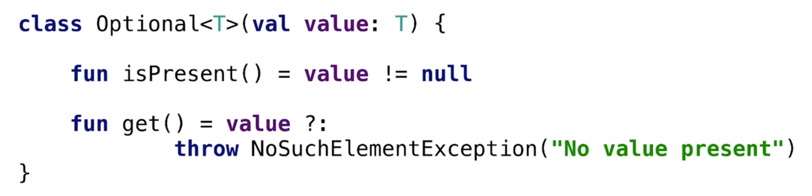
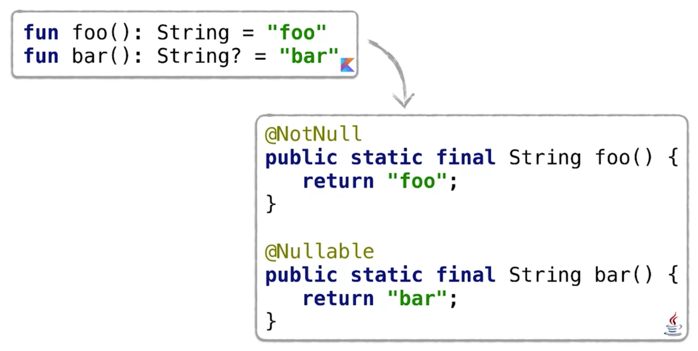
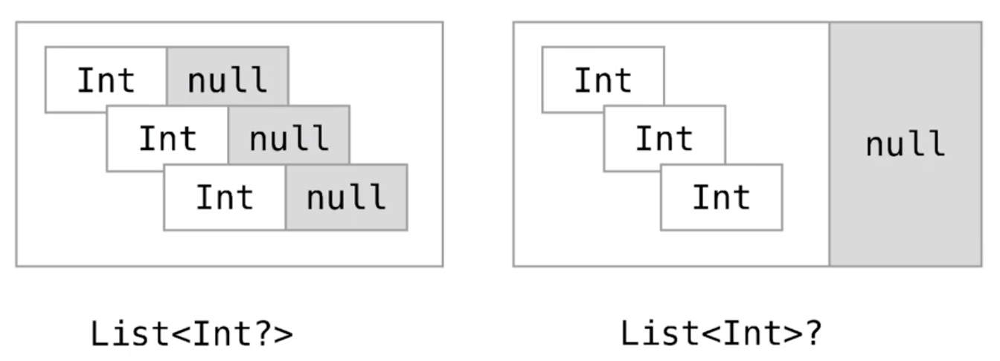

# Nullable Typen in Kotlin
Vielen Programmieren unterlaufen immer wieder `Null-Pointer` Exceptions - also Ausnahmen, die auftreten, weil eine Variable referenziert wird, die auf keinen konkreten Speicherbereich zeigt. Solche Fehler vorab zu vermeiden ist oftmals schwierig, da sie erst zur Laufzeit auffallen.

`Nullpointer-Exceptions` fallen daher in die Kategorie der Laufzeitfehler. Diese kann der Compiler bei der statischen Prüfung nicht entdecken. Ein Ansatz moderner Programmiersprachen besteht daher darin, diese Exceptions auf die Ebene der Compile-Fehler herunterzuholen  und sie somit für den Compiler aufspürbar zu machen.

In Kotlin unterscheiden wir `Nullable` und `not Nullable` Types:
```kotlin
val s1: String = "always not null"
val s2: String? = null
```
Verwenden wir beim Anlegen der Variablen einen klassischen Typ (wie in diesem Beispiel `String`) so sind diese Variablen automatisch `non-nullable`. Das bedeutet, dass nur tatsächliche Referenzen und keine _Null-Pointer_ in dieser Variablen gespeichert werden können.

Dies würde der Compiler in Kotlin also nicht zulassen:
```kotlin
val s1: String = null
```
Möchte ich der Variablen `s1` jedoch auch `null` zuweisen können, müsste die Variablendeklaration folgendermaßen aussehen:
```kotlin
val s1: String? = null
```
Wir müssen also nur das _Fragezeichen_ `?` an den Typ der Variablen anfügen.

Greifen wir auf Methoden von `non-nullable` Variablen zu, so lässt dies auch der Compiler problemlos zu, da ja keine `Null-Pointer-Exception` auftreten kann. Wurde die zugrunde liegende Variable jedoch als `nullable` definiert, so fällt die Compiler-Prüfung negativ aus.

Wir müssen daher zumindest prüfen, ob die Variablen-Referenz nicht `null` ist.

```kotlin
// This works fine, because s1 is not-nullable
s1.length

// This does not work, because s2 is nullable
s2.length

// we have to check a possible null-reference
if (s2 != null) {
    s2.length
}
```

## Safe-Access Ausdruck in Kotlin
Die vorherige Prüfung auf `null` Referenzen können wir in Kotlin jedoch eleganter als `safe access expression` formulieren, indem wir einfach ein `?` vor den Funktionsaufruf stellen:
```kotlin
s2?.length
```


Der `safe access` prüft also intern, ob die Variabel eine `Null`-Referenz beinhaltet und gibt dann direkt `null` zurück. Ansonsten wird der Funktionsaufruf durchgeführt.

Mithilfe eines _safe-access_ können wir die Ausdrücke vereinfachen, wenn wir den Rückgabewert eines Funktionsaufrufs verwenden möchten:
```kotlin
val s: String?
// Without safe-access-expression
val length = if (s != null) s.length else null
// with safe-access-expression
val length = s?.length
```
**Frage: Welchen Typ leitet Kotlin nun für die Variable `length` aus dem Code ab?**
Die korrekte Antwort lautet: `Int?` - also ein `nullable Integer`.

Doch kann ich auch hier den `nullable Int` umgehen:
```kotlin
val s: String?
// Without safe-access-expression
val length = if (s != null) s.length else 0
// with safe-access-expression
val length = s?.length ?: 0
```
Nun ist die Variable `length` vom Typ `not-nullable Int`, da `0` gespeichert wird, sollte der Aufruf von `s.length` mit einem `null` beendet werden.




**Code zur Vertiefung:**
```kotlin
val a: Int? = null
val b: Int? = 1
val c: Int = 2

val s1 = (a ?: 0) + c
val s2 = (b ?: 0) + c
print("$s1$s2")
```
Was gibt obiger Quelltext aus?

> 23

## Erzwingen von `Null-Pointer-Exceptions`
In Kotlin können wir `Null-Pointer-Exceptions` auch explizit erzwingen: `foo!!`. Durch diesen Aufruf wird entweder die Variabel zurückgegeben oder eine `Null-Pointer-Exception` geworfen.

 

 Diese Variante ist auch interessent, wenn mehrere Methodenaufrufe aneinander gekettet wurden:
 ```kotlin
 person.company!!.address!!.country
 ```
 In diesem Beispiel könnte ich nicht erkennen, an welcher Stelle die Null-Pointer-Exception aufgetreten ist. Daher bietet sich für diesen Fall ein _klassisches_ Exceptionhandling an.

**Verständnisfragen: Welche dieser Anweisungen liefert einen Compile-Fehler?:**
```kotlin
fun isFoo1(n: Name) = n.value == "foo"
fun isFoo2(n: Name?) = n.value == "foo"
fun isFoo3(n: Name?) = n != null && n.value == "foo"
fun isFoo4(n: Name?) = n?.value == "foo"

fun main(args: Array<String>) {
    isFoo1(null)
    isFoo2(null)
    isFoo3(null)
    isFoo4(null)
}
```
Antwort:
* `isFoo1(null)`: Dieser Aufruf funktioniert nicht, da wir nicht `null` mitübergeben können, wenn ein `not-nullable-type` erwartet wird.
* `isFoo2(null)`: Dieser Aufruf compiliert ebenfalls nicht. Denn die Funktion akzeptiert zwar `nullable-types`, prüft intern jedoch nicht auf `null`. Dies erlaubt der Kotlin-Compiler nicht. Akzeptiert eine Funktion auch `null`-Werte, so muss sie diese intern abfangen.
* `isFoo3(null)`: Diese Funktion arbeitet korrekt mit `nullable types`. Es wird auf `null` geprüft.
* `isFoo4(null)`: Diese Funktion kompiliert ebenfalls korrekt, da sie inhaltlich gleich wie die Funktion 3 implementiert ist.

**Wie lautet die Ausgabe dieser Funktion?**
```kotlin
val x: Int? = 1
val y: Int = 2
val sum = x ?: 0 + y
println(sum)
```

> 1

Warum? Der `?` (_Elvis-Operator_) hat einen höheren Rang als der `+`-Operator (Daher wird dieser vor dem `+`-Operator ausgewertet.) Möchten wir in diesem Fall ein anderes Verhalten, so müssen wir entsprechend Klammern setzen: `val sum = (x ?: 0) + y`.

## Umsetzung von Nullable Types
Intern sind die `nullable`-Types mithilfe von Annotations implementiert: `@Nullable`, `@NotNull`. So kann der Compiler einfach die entsprechenden Annotationen zu den Typen hinzufügen, ohne einen Performance-Overhead dadurch zu produzieren.

Zusätzlich gibt es den Typ `Optional`:



Dieser Typ speichert den Wert oder das Fehlen eines Wertes. Sogesehen lösen Nullable-Types und Optionals das gleiche Problem. Unterschiede ergeben sich jedoch hinsichtlich der Performance.

Der Optional-Typ stellt einen Wrapper für den zugrundeliegenden Typ dar. Das bedeutet, dass für jede Variable ein zusätzliches Objekt erstellt werden muss. Nullable-Typen hingegen werden rein durch die Annotation implementiert.

Da der Kotlin Code nach Java Byte-Code transpiliert wird, setzt der Compiler bei Nullable Typen einfach die entsprechenden Annotationen bei den Java-Typen:



Aus diesem Grund wird der not-nullable Typ nur zur Compile-Zeit geprüft. Zur Laufzeit entspricht er einfach dem zugrundeliegenden Java-Typen.

### Nullability und generische Datentypen

Wie sieht die Implementierung nun bei generischen Datentypen aus? Betrachten wir den Unterschied zwischen einer Liste von nullable-Ints und einer nullable-Liste von Ints:



Im ersten Fall kann jedes Element der Liste `null` oder `not-null` sein. Im zweiten Fall kann nur die gesamte Liste `null` oder `not-null` sein (Sollten zusätzlich auch noch alle Elemente `nullable` sein, so müssen an beiden Stellen `?` eingefügt werden.)


**Beispiel: Wo müssten in diesem Fall `?` eingefügt werden, damit der Code korrekt compiliert werden kann?**
```kotlin
fun foo(list1: List<Int?>, list2: List<Int>?) {
#1  list1.size
#2  list2.size

#3  val i: Int =
#4    list1.get(0)
#5  val j: Int =
#6    list2.get(0)
}
```
Die erste Liste besteht aus `nullable`-Elementen. Dies Liste selbst ist `not-nullable`. Daher können wir sie ohne weitere Vorsichtsmaßnahmen referenzieren.

Allerdings wirft der Compiler für Zeile `#4` einen Fehler. Denn der Type des Elements aus der Liste ist `nullable`, die Variable `i`, der wir den Wert zuweisen möchten, jedoch nicht. Daher müssen wir Zeile `#3` folgendermaßen ändern:
```kotlin
#3  val i: Int? =
```
Betrachten wir nun die zweite Liste! Hier ist die gesamte Liste `nullable`. Daher müssen wir mehrere `?` einfügen, damit der Code compiliert werden kann:
```kotlin
#2  list2?.size

#5  val j: Int? =
#6    list2?.get(0)
```

## Safe-Casts
Aus Java sind wir gewohnt, dass wir ein Objekt auf den erwarteten Typ prüfen, bevor wir die entsprechenden Objektmethoden aufrufen:
1. Typprüfung durchführen
1. Type-Case durchführen
1. entsprechende Objektmethode aufrufen

```kotlin
if (any is String) {
    val s = any as String
    s.toUpperCase()
}
```
In diesem Schema entspricht `is` dem `instanceof`-Operator und `as` dem entsprechenden Typecast.

Mithilfe von Kotlin kann dieses Prozedere jedoch verkürzt werden. Wir können nach der Typprüfung die Objektmethoden direkt aufrufen:
```kotlin
if (any is String) {
    any.toUpperCase()
}
```
Dieses Verhalten wird in Kotlin als _smart-cast_ bezeichnet. Jedoch können wir den Sourcecode noch weiter vereinfachen, indem wir statt des _smart-cast_ einen _safe-cast_ verwerden:
```Kotlin
(any as? String)?.toUpperCase()
```
So erhalten wir entweder das Ergebnis des _smart-cast_ oder das Ergebnis _null_.

## Relevanz von Nullability
Das Thema der `Null-Pointer-Exceptions` verfolgte Programmierer seit Anbeginn der Programmierung von Softwaresystemen. Aus diesem Grund wurd in Kotlin die Kontrolle über Nullability direkt in das Typ-Sytem von Kotlin integriert und nicht über eine eigene Bibliothek zur Verfügung gestellt.
