# Lambda Funktionen in Kotlin
Als _Lambdas_ (bzw. _lambda Funktionen_) bezeichnen wir annonyme Funktionen, die als Ausdruck verwendet werden können.

Aus früheren Versionen von Java waren wir es gewohnt, für diesen Zweck annonyme innere Klassen zu verwenden.

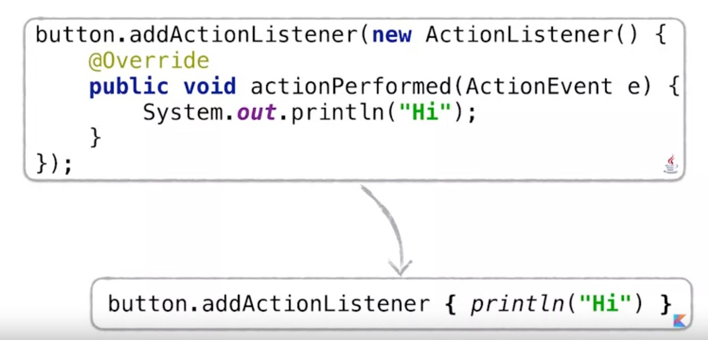

Lambda Funktionen ermöglichen es, mit Collection Datentypen in einem funktionalen Stil zu arbeiten, was den Code im Allgemein besser lesbar macht.

```kotlin
val employees: List<Employee>

data class Employee(
    val city: City, cal age: Int
)

employees.filter { it.city == City.PRAGUE }
         .map { it.age }
         .average()
```

## Lambda Syntax in Kotlin
In Kotlin werden Lambda Ausdrücke immer innerhalb von geschweiften Klammern geschrieben: `{ x: Int, y: Int -> x+y}`. Immer wenn innerhalb der geschweiften Klammern ein Lambda-Ausdruck steht, werden diese Klammern fett dargestellt.

Innerhalb der Klammern stehen zuerst die Lambda-Parameter: `x: Int, y: Int`, dann der Pfeil `->` und rechts vom Pfeil der Lambda-Body: `x+y`.

Wird der Lambda-Ausdruck als Argument an eine Funktion übergeben, so steht der gesamte Lambda-Ausdruck innerhalb der Funktionsparameter: `list.any({ i:Int -> i > 0})`. Ist der Lambda-Ausdruck jedoch der letzte Funktionsparameter, so kann man diesen auch aus den Klammern des Funktionsaufrufs herausheben: `list.any() { i:Int -> i > 0}`.

Sind die Klammern des Funktionsaufrufs nach Herausheben des Lambda-Ausdrucks leer, so kann man diese in Kotlin auch weglassen: `list.any { i:Int -> i > 0}`.

Wenn der Typ im Lambda-Ausdruck aus dem Kontext abgeleitet werden kann, kann dieser auch beim Funktionsaufruf weggelassen werden: `list.any { i -> i > 0}`.

Hat der Lambda-Ausdruck sein eigenes Argument, so kann dieses durch das Schlüsselwort `it` ersetzt werden: `list.any { it > 0}`. Das Schlüsselwort `it` kann immer dann verwendet werden, wenn der Lambda-Ausdruck nur ein Argument hat und keine andere Bezeichnung für dieses Argument generiert.

Besteht der Lambda-Ausdruck aus mehreren Anweisungen, so können wir einfach mehere Zeilen innerhalb der Klammern des Lambda-Ausdrucks einfügen:
```Kotlin
list.any {
    println("processing $it")
    it > 0
}
```
In der letzten Zeile des Lambda-Ausdruck steht der Rückgabewert des gesamten Lambdas.

## Destructuring Declarations mit Lambda-Ausdrücken
Wenn der Lambda-Ausdruck ein Paar von Werten als Argument akzeptiert (z.B. ein _key-value-pair_ als Eintrag in eine `Map`), kann die sogenannte _destructuring syntax_ verwendet werden.
```kotlin
map.mapValues { entry -> "${entry.key} -> ${entry.value}!"}
```
Die gleiche Syntax haben wir bereits bei der Iteration über Schleifen gesehen. Anstatt nun jeweils auf `entry.key` und `entry.value` zu referenzieren, können wir die Variable aus zwei Variablen destrukturieren:

```Kotlin
map.mapValues { key, value -> "$key -> $value!"}
```

## Auf Collections im _functional Style_ zugreifen
Beginnen wir mit `filter` und `map`.

_Wie hoch ist das Durchschnittsalter der Mitarbeiter in der Niederlassung in Timbuktu?_

```Kotlin
val employees: List<Employee>

data class Employee(
    val city: City, cal age: Int
)

employees.filter { it.city. == City.TIMBUKTU}.map { it.age }.average()
```
### Die `filter`-Funktion
Die Erweiterungsfunktion `filter` filtert den Inhalt der Collection und behaltet nur jene Elemente, die den Filterkriterien genügen.
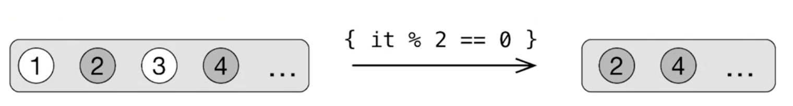
Die Funktion `filter` liefert die gefilterten Element als Ergebnis zurück.

### Die `map`-Funktion
Die `map`-Funktion transformiert jedes Element in der Collection (in dem sie eine bestimmte Operation auf jedes Element, das in der Collection enthalten ist, anwendet).

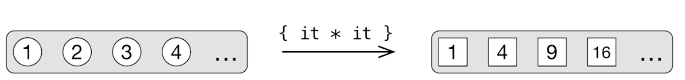

### Die `any`-Funktion
Die `any`-Funktion prüt, ob es zumindest ein Element in der Collection gibt, das dem übergegebenen Kriterium entspricht. (Beispielsweise, gibt es zumindest eine gerade Zahl in der List?)

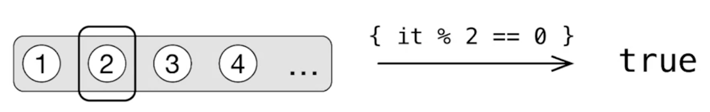

Mithilfe der Parameter `all` und `none` kann der Rückgabewert beeinflusst werden. Wird `all` als Aufrufparameter mitübergeben, so müssen allen Elemente in der Liste dem Kriterium entsprechen. Verwenden wir den Parameter `None`, so liefert die Funktion nur dann `true` zurück, wenn keines der Elemente den Kriterien entspricht.

### Die `find`-Funktion
Mithilfe der `find`-Funktion kann in der Collection nach einem Element gesucht werden, das dem Kriterium entspricht. Wird kein Element gefunden, so liefert die Funktion `null` zurück.

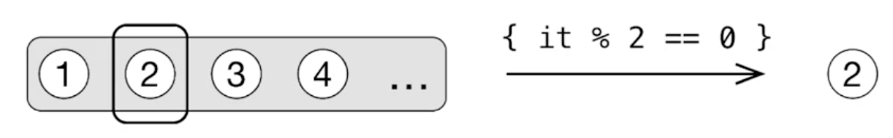

Die Funktionalität kann auch mithilfe der Funktion `first` bzw. `firstOrNull` realisiert werden.

### Die `count`-Funktion
Die `count`-Funktion liefert die Anzahl der Elemente in der Collection, die dem jeweiligen Kriterium entsprechen.


### Die `partition`-Funktion
Mit der Funktion `partition` können Collections in zwei Collections aufgeteilt werden. Eine, die alle Elemente enthält, die dem Kriterium entsprechen und eine, die jene Elemente enthält, die dem Kriterium nicht entsprechen.
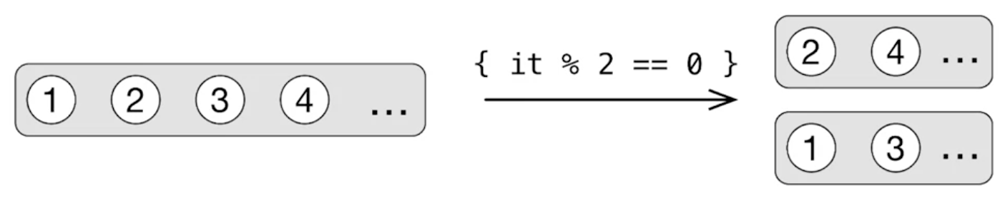

### Die `groupBy`-Funktion
Möchten wir unsere Collection in mehr als zwei Teile unterteilen, so können wir die Funktion `groupBy` verwenden.

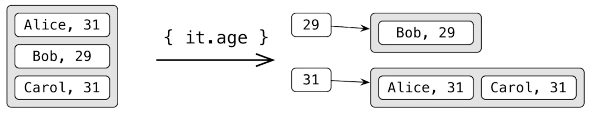

Als Funktionsparameter geben wir jenes Element an, das den Gruppierungsschlüssel darstellt. Als Rückgabewert erhalten wir eine Map, deren key das Gruppierungselement und deren value eine Liste mit den entsprechenden Elementen ist, die in die jeweilige Gruppe fallen.

### Die `associateBy`-Funktion
Mithilfe der Funktion `associateBy` können wir die Elemente in einer Liste über einen neuen Schlüssel ansprechen. Wir erhalten als Rückgabewert eine Map, deren key das übergebene Kriterium ist.

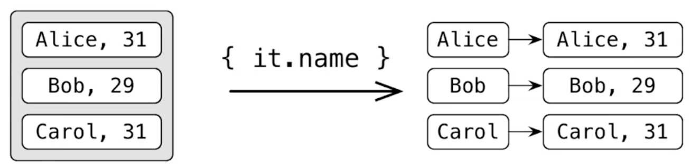

Bei der Verwendung der Funktion `associateBy` müssen wir beachten, dass die `key`-Elemente einzigartig sein müssen. Duplikate werden von dieser Funktion verworfen.

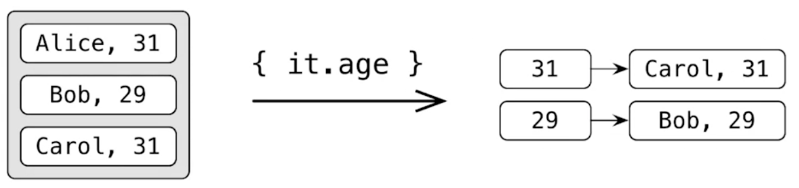

Mithilfe von `associate` können wir auch aus einer Liste eine Map Datenstruktur aufbauen:

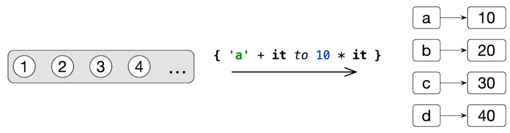

In obigem Beispiel definiert `'a'+it` die keys und `10*it` die values.

### Die `zip`-Funktion
Diese Funktion wird vor allem auch Python-Programmieren bekannt sein. Mithilfe von `zip` können wir gleichzeitig über zwei Listen iterieren.

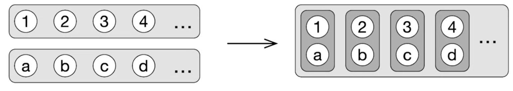

Die Bezeichung `zip` soll eine Analogie zu einem _Zipper_ (Reißverschluß) darstellen, bei dem immer jeweils ein Element von beiden Seiten verwendet wird.

Haben die beiden Listen nicht die gleiche Anzahl an Elementen, so ist das Ergebnis von `zip` genauso lang wie die kürzere der beiden Listen.

#### Variante der Funktion: `zipWithNext`
Mithilfe von `zipWithNext` können jeweils benachbarte Elemente einer Liste zu den Elementen der neuen Liste zusammengefügt werden.

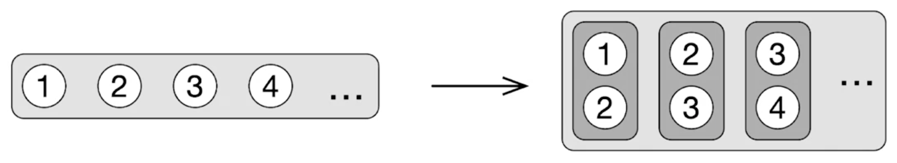

### Die `flatten`-Funktion
Mithilfe der `flatten`-Funktion kann eine Liste erstellt werden, die sämtliche Elemente einer hierarchischen Liste vereint. Die Hiearchie in der Liste wird durch den Einsatz dieser Funktion entfernt.

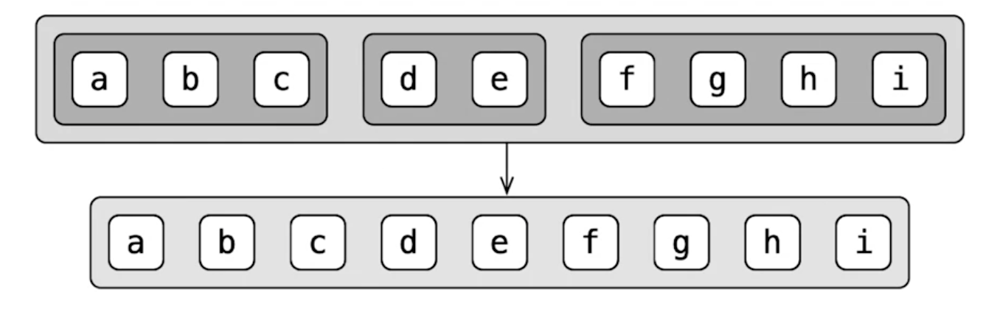

#### Variaten die 'flatMap'-Funktion
Die Methode `flatMap` verbindet die `map`-Funktion mit der `flatten`-Funktion. Zuerst werden mittels Lambda-Ausdruck die Elemente der Liste konvertiert (_map_) und daraus dann eine flache Liste geniert (_flatten_). Nach dem ersten Funktionsaufruf von `map` erhalten wir eine Liste von Listen. Meist bevorzugen wir jedoch eine flache Liste von Elementen.

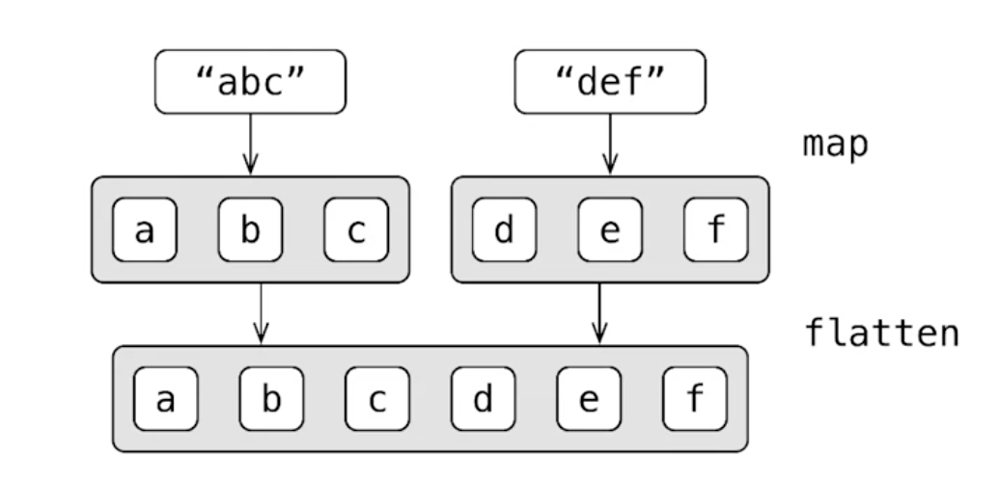

## Verständnisfragen

Die folgenden Fragen vertiefen das Verständnis über die Anwendung der oben erklärten Funktionen. Wir verwenden folgende Basisklasse:
```kotlin
data class Hero(
    val name: String,
    val age: Int,
    val gender: Gender?
)
enum class Gender { MALE, FEMALE }

val heroes = listOf)
    Hero("The Captain", 60, MALE),
    Hero("Frenchy", 42, MALE),
    Hero("The Kid", 9, null),
    Hero("lady Lauren", 29, FEMALE),
    Hero("First Mate", 29, FEMALE),
    Hero("Sir Stephen", 37, MALE))
```

1. Welche Ausgabe erhalten wir durch diesen Ausdruck: `heroes.last().name`?
    > "Sir Stephen"
1. `heroes.firstOrNull { it.age == 30 }?.name`?
    > null
1. `heroes.map { it.age }.distinct().size`?
    > [60, 42, 9, 29, 37]
1. `heroes.filter { it.age < 30 }.size`?
    > 3
1. `val (youngest, oldest) = heroes.partition { it.age < 30 } oldest.size`?
    > Zwei Listen (eine mit Alter<30 und ein mit Alter>=30)
1. `heroes.maxBy { it.age }?.name`?
    >  "The Captain"
1. `heroes.all { it.age < 50 }`
    > false
1. `heroes.any { it.gender == FEMALE }`
    > true
1.  ```kotlin
val mapByAge: Map<Int, List<Hero>> =
    heroes.groupBy { it.age }
val (age, group) = mapByAge.maxBy { (_, group) ->
    group.size
}!!
println(age)
```
    1. Als ersten erstellen wir eine Map-Datenstruktur, mit dem Alter als Key und einer Liste mit den entsprechenden Heros als Value.
    1. Danach rufen wir darauf die Funktion `maxBy` auf, die uns das größte Element liefert (in unserem Fall bezogen auf das Property `.group`)

    > Also erhalten wir als Rückgabewert: 2 (bzw. 29 für das Alter)

1. ```kotlin
val mapByName: Map<String, Hero> =
    heroes.associateBy { it.name }
mapByName["Frenchy"]?.age
```
    In diesem Fall gruppieren wir die Elemente mit ihrem Namen mithilfe der `associateBy` Funktion. Wir erhalten eine Map-Datenstruktur mit dem Key _name_ und dem Value _Hero-Objekt_.
    > 42

1. ```kotlin
val mapByName = heroes.associateBy { it.name }
val unknownHero = Hero("Unknown", 0, null)
mapByName.getOrElse("unknown") { unknownHero }.age
```
    > Die Funktion `getOrElse(..)` liefert den entsprechenden Wert zu dem Property. Ist das Property nicht vorhanden, so verarbeitet die Funktion den Lambda-Ausdruck.  
    Der Rückgabewert ist in diesem Fall daher: 0

## Function Types in Kotlin
In Kotlin können wir Lambda-Ausdrücke direkt in Variablen speichern. Diese Variable ist dann vom Type `function type`:
```kotlin
val sum = { x: Int, y: Int -> x + y }
// is the same as:
val sum: (Int, Int) -> Int = { x, y -> x + y }
```
In obigem Beispiel haben wir also einen Lambda Ausdruck, der zwei `Int`-Werte als Input akzeptiert und einen `Int` als Output zurückliefert.

Dieses Beispiel akzeptiert einen `Int`-Wert und liefert einen `Boolean`-Wert zurück:
```kotlin
val isEven: (Int) -> Boolean = { i: Int -> i % 2 == 0 }
```
Bei der Speicherung von Lambda-Ausdrücken in Variablen müssen wir zwischen dem Speichern eines Lambda-Ausdrucks und dem Speichern des Ergebnisses eines Lambda-Ausdrucks unterscheiden!
```kotlin
val result: Boolean = isEven(42) // true
```
Eine Variable, in der wir einen Lambda-Ausdruck gespeichert haben, können wir an jeder Stelle im Quellcode verwenden, an der wir auch einen Lambda-Ausdruck direkt verwenden können.
```kotlin
val list = listOf(1, 2, 3, 4)
list.any(isEven) // true
list.filter(isEven) // [2, 4]
```
Wenn wir runde Klammern direkt hinter einen Lambda-Ausdruck einfügen, können wir diesen auch direkt aufrufen:
```kotlin
{ println("hey!")}()
// works the same way like
run { println("hey!") }
```

### Nullability und Function Types
Auch bei Functions-Types können wir uns überlegen, wie Kotlin die Nullability von Typen handhabt. Welche der folgenden Ausdrücke ist nicht kompilierbar?

1. `val f1: () -> Int? = null`
1. `val f2: () -> Int? = { null }`
1. `val f3: (() -> Int)? = null`
1. `val f4: (() -> Int)? = { null }`

Worin liegt der Unterschied zwischen `() -> Int?` und `(() -> Int)?` ?

Im ersten Beispiel ist der Rückgabetyp `nullable`. Im zweiten Beispiel ist der Function Type `nullable`.

Was bedeutet `{ null }`? Dies ist ein Lambdaausdruck, der `null` zurückliefert.

Dieser Ausdruck `val f3: (() -> Int)? = null` kann entweder einen Lambda-Ausdruck, der einen `Int`-Wert zurückliefert oder `null` speichern.

Wie sieht nun also die Auflösung der Frage aus?
> Im ersten Beispiel versuchen wir `null` einer Variable zuzuweisen, deren Typ `not-nullable` ist. Dies kann nicht kompiliert werden.
> Im zweiten Beispiel speichern wir einen Lambda-Ausruck in der Variablen, der immer `null` zurückliefert. Dieser Auseruck kann kompiliert werden.
> Das dritte Beispiel kompiliert problemlos, da hier die Varaible mit einem `nullable`-Function Type initialisiert wird. Diesem können wir problemlos `null` zuweisen.
> Der vierte Ausdruck wiederum kann nicht kompiliert werden, da der Lambda-Ausdruck einen `Int`-Wert zurückliefern muss.


Generell können wir `nullable`-Function Types nicht direkt aufrufen. Wir haben jedoch diese beiden Möglichkeiten:
1. Wir können explizit auf `null` prüfen und mittels smart-cast die Variable aufrufen:
```kotlin
if (f != null) {
    f()
}
```
1. Wir verwenden die Methode `invoke()`:
```kotlin
f?.invoke()
```

## Referenzen auf Klassen-Member in Kotlin
In Koltin können wir keine Funktionen in Variablen speichern, so wie das in voll-funktionalen Sprachen der Fall ist. Wir können jedoch Referenzen auf Funktionen in Variablen speichern:
```kotlin
fun isEven(i: Int): Boolean = i % 2 == 0

val predicate ?= ::isEven
```
Die Funktionsreferenz wird genauso wie in Java angelegt. Der Klassenname (kann entfallen wenn direkt in der Klasse angelegt) und danach die Bezeichnung der Funktion, getrennt von zwei Doppelpunkten `::`. Dies ist jedoch nur ein anderer Weg, einen Lambda-Ausdruck aufzurufen. Wir könnten statt der Funktionsreferenz auf direkt einen Lambda-Ausdruck in der Variablen speichern:
```kotlin
val predicate = { i: Int -> isEven(i) }
```
Ein Vorteil der Verwendung der Funktionsreferenz ist, dass wir alle Parameter der Funktion verstecken können. Vergleiche die beiden identen Code-Beispiele:
```kotlin
val action = { person: Person, message: String -> sendEmail(person, message) }

val action = ::sendEmail
```
Die erforderlichen Parameter werden direkt vom Compiler abgeleitet. Wir können somit die Funktionreferenzen dazu nutzen, komplexe Lambda-Ausdrücke in einzelne Funktionsaufrufe zu unterteilen:
```kotlin
fun isEven(i: Int): Boolean = i % 2 == 0

val list = listOf(1, 2, 3, 4)
list.any(::isEven)      // true
list.filter(::isEven)   // [2, 4]
```

### `Bound` vs. `Non-Bound` Referenzen
In folgendem Beipsiel verwenden wir eine klassische `non-bound`-Referenz (`Person::isOlder`), die die zugehörige Klasse referenziert. Wir müssen daher jedesmal bei Aufruf dieser Funktionsreferenz explizit ein Objekt vom Typ `Person` im Zuge des Aufrufs mitübergeben.
```kotlin
 class Person(val name: String, val age: Int) {
    fun isOlder(ageLimit: Int) = age > ageLimit
}

val agePredicate = Person::isOlder

val alice = Person("Alice", 29)
agePredicate(alice, 21)     // true
```
Betrachten wir nun die interne Umsetzung: Aus unserer Funktionsreferenz wird ein Lambda-Auseruck generiert, der zwei Parameter akzeptiert (`person` und `ageLimit`):
```kotlin
val agePredicate = (Person, Int) -> Boolean = {
    person, ageLimit -> person.isOlder(ageLimit) }
```
Diese Funktionsreferenz ist nicht an eine bestimmte Referenz gebunden und wird daher als `non-bound` bezeichnet. Eine gebundenen (oder `bound`) Referenz hingegen ist an eine bestimmte Instanz der Klasse gebunden:
```kotlin
 class Person(val name: String, val age: Int) {
    fun isOlder(ageLimit: Int) = age > ageLimit
}

val alice = Person("Alice", 29)
val agePredicate = alice::isOlder

agePredicate(alice, 21)     // true
```
In obigem Beispiel haben wir im Lambda-Ausdruck kein Objekt vom Typ `Person` mehr, da dieses Objekt direkt mit der Funktionsreferenz gesetzt wurde.
```kotlin
val agePredicate = (Int) -> Boolean = {
    ageLimit -> alice.isOlder(ageLimit)
}
```
Member-Funktionsreferenzen können mittels `this` direkt an die jeweilige Instanz gebunden werden:
```kotlin
class Person(val name: String, val age: Int) {
    fun isOlder(ageLimit: Int) = age > ageLimit

    fun getAgePredicate() = this::isOlder
    // this can also be ommited:
    // fun getAgePredicate() = ::isOlder
}
```
