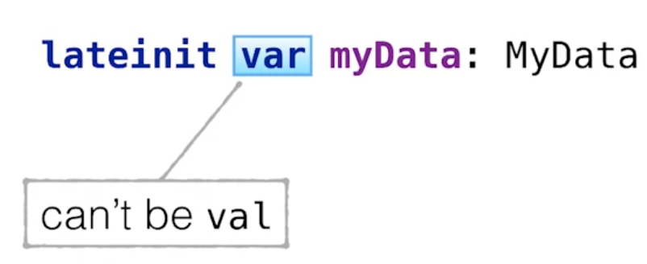

# Properties in Kotlin
In Kotlin werden Properties, die in Java über das Java-Beans Konzept realisiert werden, als eigenes Sprach-Features realisiert.

Betrachten wir zunächst eine Java-Klasse:
```Java
public class JavaClass {
    private int foo = 0;
    public int getFoo() {
        return foo;
    }
    public void setFoo(int foo) {
        this.foo = foo;
    }
}
```
In Java gibt es keine direkten Properties. Definieren wir jedoch zu einem Feld die entsprechenden `get` und `set` Methoden, so können wir dieses Feld als Property betrachten.

In Kotlin können wir Properties direkt innerhalb einer Klasse anlegen:
```Kotlin
class KotlinClass {
    var foo = 0
}
```
> Aufgrund der Kompatitibilität zwischen Kotlin und Java werden die Properties in Kotlin intern jedoch genauso wie in Java mithilfe von Feldern und entsprechenden `get` bzw. `set`-Methoden umgesetzt.
>
> property = field + accessor(s)
> val = field + getter
> var = filed + getter + setter

Allerdings verwenden wir in Kotlin die Properties direkt und nicht die getter-/setter-Methoden.

```Kotlin
class Contact (
    val name: String,
    var address: String
)

println(contact.address)
contact.adress = "...."
```
> Intern werden jedoch die entsprechenden getter-/setter-Methoden verwendet.

Verwenden wir diese Kotlin Klasse jedoch in Java, so müssen wir mittels der entsprechenden Methoden auf die Properties zugreifen.

Auf diese Weise können wir eine einfache und schlanke Syntax in Kotlin verwenden, während der generierte Bytecode voll kompatibel zu Java bleibt.

## Zugriff auf Felder in Kotlin
In Kotlin arbeiten wir nicht mit den Feldern einer Klasse, sondern direkt mit den Properties. Wir können jedoch innerhalb einer Accessor-Methode auch auf die Felder zugreifen.

```Kotlin
class StateLogger {
    var state = false
        set(value) {
            println("state has changed:  + $field --> $value")
            field = value
        }
}

StateLogger().state = true
```
> Output: state has changed: false -> true

Innerhalb der getter- und setter-Methode können wir mithilfe des Schlüsselworts `field` auf die entsprechenden Felder zugreifen.

Wenn wir zwar Accessor-Methoden implementieren, aber nicht auf das Feld zugreifen, wird auch kein _backup-property_ vom Compiler erstellt.

```kotlin
enum class State { ON, OFF}

class StateLogger {
    private var boolState = false

    var state: State
        get() = if (boolState) ON else OFF
        set(value: State) {
            boolState = value == ON
        }
}
```
In obigem Codebeispiel greifen wir innerhalb der Accessor-Methode nicht auf das interne Feld zu. Für das Property `state` erstellt der Compiler kein eigenes Feld, wir nur an das Property `boolState` delegieren.


## Properties ohne Felder
In Kotlin können wir die Felder weglassen, sofern wir keine Zwischenspeicherung der konkreten Werte benötigen. In diesem Fall definieren wir einfach die erforderliche(n) Methode(n).

```kotlin
class Rectangle(val height: Int, val width: Int) {
    val isSquare: Boolean
        get() {
            return height = width
        }
}
```

## Sichtbarkeit von Accessor-Methoden
Wir können die Sichtbarkeit von Accessor-Methoden auf Properties in Kotlin einschränken.

```kotlin
class LengthCounter {
    var counter: Int = 0
        private set

    fun addWord(word: String) {
        counter += word.length
    }
}
```

In diesem Beispiel definieren wir `set` als `private`. Dadurch können wir zwar innerhalb der Klasse schreibend auf das Propery zugreifen - jedoch nicht von außen.

## Properties in Interfaces
Auch in Interfaces können wir Properties definieren. Warum auch nicht - intern wird es einfach als getter-Methode implementiert.

In den Klassen, die das Interface implementieren, müssen wir dann das Property entsprechend überschreiben.

```kotlin
interface User {
    val nickname: String
}

class FacebookUser(val accountId: Int) : User {
    override val nickname = getFacebookName(accountId)
}

class SubscribingUser(val email: String) : User {
    override val nickname: String
        get() = email.substringBefore('@')
}
```

Sämtlliche Properties aus Interfaces können jedoch nicht in _smart-casts_ verwendet werden. Die Properties in Interfaces sind nicht `final`, sondern können in den implementierenden Klassen beschrieben werden.

```kotlin
interface Session {
    val user: User
}

fun analyzeUserSession(session: Session) {
    if (session.user is FacebookUser) {
        println(session.user.accountId)
    }
}
```
Hier liefert der Compiler einen Fehler: `session.user.accountId`, da kein _smart-cast_ verwendet werden kann. Das Property `session.user` hat eine offene Zugriffsmethode. Diese könnte bei jedem Zugriff einen anderen Wert zurückliefern, weshalb ein _smart-cast_ in diesem Fall nicht sicher ist.

Wir können dieses Code-Snippet jedoch so umbauen, dass wir mithilfe einer lokalen Variable den _smart-cast_ aus Kotlin nutzen können:

```kotlin
interface Session {
    val user: User
}

fun analyzeUserSession(session: Session) {
    val user = session.user
    if (user is FacebookUser) {
        println(user.accountId)
    }
}
```
> Auch mit `mutable` properties ist kein Einsatz von smart-casts möglich, da diese in einem parllelen Thread geändert werden könnten.

## Extension Properties
In Kotlin können wir auch `Extension Properties` erstellen. Dazu definieren wir einfach ein Property und definieren zuerst den `receiver`-Typ des Properties.

```kotlin
val String.lastIndex: Int
    get() = this.length - 1

val String.indices: IntRange
    get() = 0..lastIndex
```
Erweiterungs Properties sind um Grund gleich wie Erweiterungsfunktionen. Sie unterscheiden sich nur in der anderen Syntax.

### Mutable Extension Properties
Wir können auch `mutable`-Erweiterung-Properties in Kotlin erstellen, welches wir im weiteren Verlauf wie ein gewöhnliches Property verwenden können.

```kotlin
var StringBuilder.lastChar: Char
    get() = get(length -1)
    set(value: Char) {
        this.setCharAt(length - 1, value)
    }

val sb = StringBuilder("Kotlin?")
sb.lastChar = '!'
println(sb)
```
> Output: Kotlin!

## Lazy bzw. Late Properties
Bei _lazy_ Properties werden deren Werte erst beim ersten Zugriff auf das Property berechnet. Es ist daher also _lazy_ in dem Sinn, dass das Property keinerlei Interaktion auslöst, solange der Wert nicht erforderlich ist. In Kotlin fügen wir einfach `by lazy` an die Definition des Property an, um ein Property mit der _lazy_ Eigenschaft zu erzeugen.
```kotlin
val lazyValue: String by lazy {
    println("computed")
    "Hello"
}
```

Das Schlüsselwort `lazy` ist eine Funktion, die einen Lambda-Ausdruck als Argument verlangt. Wenn wir auf dieses Property zugreifen, wird der Wert beim ersten Zugriff berechnet und gespeichert. Bei jedem späteren Zugriff erfolgt nur die Rückgabe des gespeicherten Wertes.

```kotlin
fun main(args: Array<String>) {
    println(lazyValue)
    println(lazyValue)
}
```
Output:
> computed!
> Hello
> Hello

Eine weitere Möglichkeit stellt **Late Initialization** dar. Diese Variante ist besonders hilfreich bei der Initialisierung von Android Activities, dem Durchführen von Unittests oder dem Einsatz von dependency injection Frameworks.

```kotlin
class KotlinActivity: Activity() {
    var myData: MyData? = null

    override fun onCreate(savedInstanceState: Bundle?) {
        super.onCreate(savedInstanceState)

        myData = intent.getParcelableExtra("MY_DATA")
    }
}
```
In obigem Beispiel aus Android wollen wir das Property nicht im Konstruktor, sondern in einer eigenen Methode initialisieren. Natürlich können wir das Property in diesem Fall nicht als `not-nullable` definieren, da wir keinen initialen Wert haben. Wir können als Initialwertnur `null` wählen. Dies bedeutet jedoch, dass wir bei jedem Zugriff auf das Property mit der Thematik von `null`-Werten konfrontiert sind: `myData?.foo`.

Da wir jedoch wissen, dass dieses Property nicht mehr `null` sein kann, nachdem es ordnungsgemäß initialisiert wurde, können wir in diesem Beispiel _late initialization_ verwenden:

```kotlin
class KotlinActivity: Activity() {
    lateinit var myData: MyData
    ...
```

Nun können wir das Property als `not-nullable`-Typ verwenden: `myData.foo`.

**Was passiert jedoch, wenn das Property noch nicht ordnungsgemäß initialisiert wurde?**

Es wird zwar eine `Null-Pointer`-Exception geworfen, doch mit einer Erklärung, dass das Property noch nicht initialisiert wurde.

**Welche Rahmenbedingungen müssen wir beim Einsatz von _late-Initialization_ berücksichtigen?**

Wir können Properies mit `lateinit` nicht gleichzeitig als `val` (Konstante) deklarieren, da ein solches Property im Java-Byte-Code nicht als `final` definiert werden kann. Schließlich wird es nicht im Konstruktor, sondern erst später zur Laufzeit initialisiert.



Ein _late-init_ Property kann auch keinen primitiven Datentyp beinhalten.

Mit _late-init_ Properties können wir prüfen, ob die Properties bereits initialisiert wurden, oder nicht:

```Kotlin
class MyClass {
    lateinit var lateinitVar: String

    fun initilizationLogic() {
        println(this::lateinitVar.isInitialized) // false
        lateinitVar = "value"
        println(this::lateinitVar.isInitialized) // true
    }
}
```
