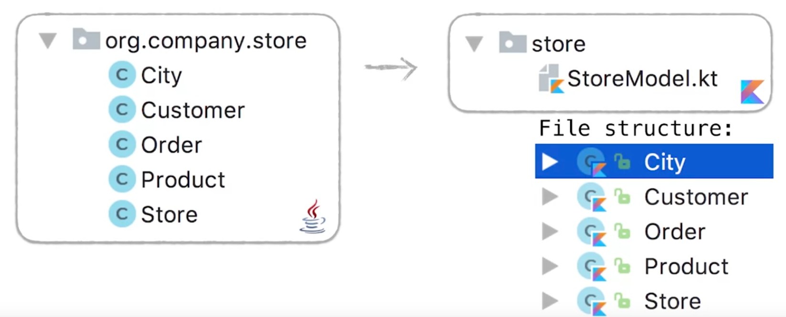
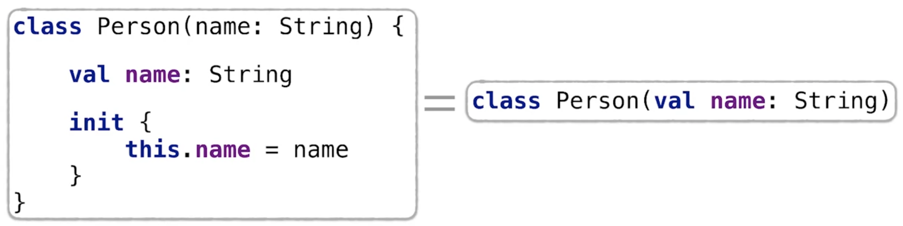
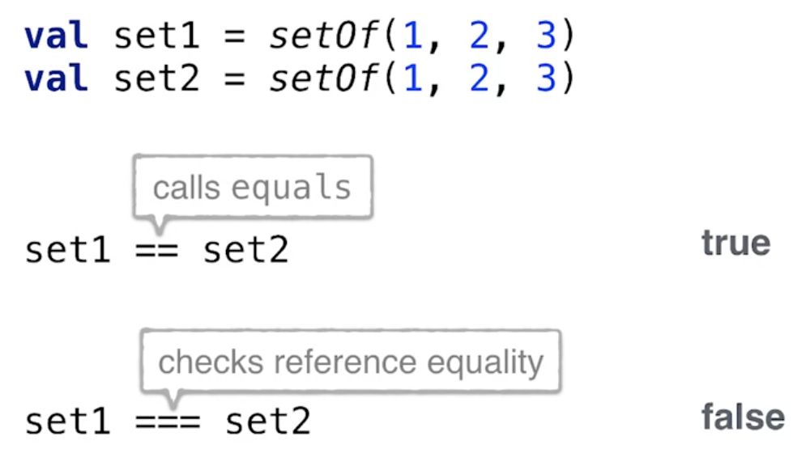

# Objektorientierung in Kotlin
Im Allgemeinen werden in Kotlin diesbezüglich keine vollständig neuen Konzepte eingeführt. Dennoch bringt Kotlin einigen Erweiterungen, die das Arbeiten angenehmer machen.

Im Vergleich zu Java verfügt Kotlin auch hinsichtlich der Objektorientierung über eine etwas andere Syntax. Da unser Ziel eine Einführung in Kotlin für Java-Entwickler ist, werden wir nicht auf Konzepte der objektorientierten Programmierung im Detail eingehen, sondern nur die Unterschiede zwischen Kotlin und Java herausarbeiten.

In Kotlin ist jede Deklaration `public` und `final` als Standard.

**Varianten:**
* `open`: Wir definieren die Klasse als veränderbar
* `internal`: Da es in Kotlin die von Java gewohnte Sichtbarkeit `package private` nicht gibt. Diese Deklarationen sind dann innerhalb des gleichen Moduls sichtbar.

Ein **Modul** in Kotlin ist eine Set aus verschiedenen Kotlin-Dateien, die gemeinsam kompiliert werden:
* ein IntelliJ IDEA Modul
* ein Maven Projekt
* ein Gradle Projekt

**Übersicht über die Modifizierer in Kotlin:**
* `final`: Die Deklaration _kann nicht_ überschrieben werden.
* `open`: Gegenteil von `final` - Die Deklaration _kann_ überschrieben werden.
* `abstract`: Die Deklaration _muss_ überschrieben werden.
* `override`: Überschreibt einen Member in der Superklasse bzw. ein Interface.

**Übersicht über die Sichtbarkeitsmodifizierer:**

 Modifizierer | Klassen-Member | Top-Level Deklaration
 ---- | ---- | ----
 `public` <td colspan=2>überall sichtbar
 `internal` <td colspan=2>  sichtbar im gleichen Modul
 `protected` | sichtbar in Subklassen | -- 
 `private` | sichtbar innerhalb der Klasse | sichtbar innerhalb der Datei

Wie sieht dies intern aus, wenn der Kompiler zu Bytecode übersetzt? Vergleichen wir dazu die Kotlin Sichtbarkeiten mit denen aus Java.

Kotlin | Java
-- | --
`public` | `public`
`protected` | `protected`
`private` | `private` / `package private`
`internal` | `public` in Verb. mit Änderungen in der Bezeichnung

Bei `internal` wird ein zufälliger interner, langer Name für die Klasse generiert, der nicht rein zufällig vom Programmierer an anderer Stelle verwendet werden kann.

**Kotlin:**
```kotlin
class MyClass {
    internal fun foo() {}
}
```

**Java:**
```Java
public final class MyClass {
    public final void foo$prodcution_sources_for_module_examples_main()
}
```

## Package-Struktur
In Java besteht die Empfehlung, jede Klasse in eine eigene Datei zu packen. Dies ist in Kotlin nicht erforderlich. Insbesondere bei reinen Datenklassen ist es komfortable, diese in einer gemeinsamen Datei zusammenzufassen.



In Kotlin muss der Name vom Package nicht mit der tatsächlichen Dateistruktur übereinstimmen - wir können einen beliebigen Namen für das Package wählen. Im Kotlin-Styleguide wird aber empfohlen, genauso wie in Java den eigenen Namen als Top-Level-Bezeichnung für das Package zu wählen.

## Konstruktoren in Kotlin
Mithilfe von Konstruktoren können wir Objekte initialisieren:

```Kotlin
class A
val a = A()
```

In Kotlin verwenden wir im Gegensatz zu Java kein Schlüsselwort `new`. Der Konstruktor wird in Kotlin wie einge gewöhnliche Funktion aufgerufen.

Auch wenn wir keinen Konstruktor innerhalb der Klasse definieren, können wir Objekte erzeugen, da automatisch - wie in Java - ein parameterloser Konstruktor generiert wird.

In Kotlin müssen wir den Code für den Konstruktor nicht explizit schreiben. Dieser wird aus der Klassendefinition abgeleitet. Die Initialbelegung der Member erfolgt in dem `init`-Abschnitt.

```kotlin
class Person(val name: String, val age: Int) {

    val name: String

    init {
        this.name = name
    }
}
```

Setzten wir vor einen Wert das Schlüsselwort `val` oder `var` wird automatisch ein Property in der Klasse erstellt. Fehlt dieses Schlüsselwort, so steht die Variable nur innerhalb des Konstruktors zur Verfügung.



Wenn wir die Sichtbarkeit des Konstrutors verändern wollen, so können wir das explizite Schlüsselwort `construtor` verwenden:

```Kotlin
class InternalComponent
internal constructor(name: String) {

}
```

### Zusätzliche Konstruktoren in einer Klasse
Innerhalb einer Klasse können beliebig viele zusätzliche Konstruktoren erstellt werden. Jeder dieser zusätzlichen Konstruktoren muss jedoch wiederum einen bereits bestehenden Konstruktor aufrufen.


Die bereits existierenden Konstruktoren einer Klasse können mit dem Schlüsselwort `this` angesprochen werden.

## Syntax zur Vererbung
Vereerbung wird in Kotlin mithilfe des Doppelpunkts (`:`) ausgedrückt. Müssen dabei Parameterwerte an den Konstruktor der Elternklasse übergeben werden, so werden diese innerhalb von runden Klammern eingefügt.

```kotlin
open class Parent(val name: String)
class Child(name: String) : Parent(name)
```

Mithilfe des Schlüsselworts `super` kann auf den Konstruktor der Elternklasse zugegriffen werden.

```kotlin
open class Parent(val name: String)
class Child : Parent {
    constructor(name: String, param: Int) : super(name)
}
```

## Modifizierer zu Klassen
In Kotlin können Klassen durch verschiedene Modifizierer anderes Verhalten aufzeigen.

### Enumerations mit `enum`
Das Schlüsselwort `enum` generiert eine Aufzählungsklasse mit festen Werten. Im Unterschied zu Java stellt `enum` keine eigene Instanz dar, sondern ist nur ein Modifizierer für Klassen.

```Kotlin
enum class Color {
    BLUE, RED, ORANGE
}

fun getDescription(color: Color) =
    when (color) {
        Color.BLUE -> "cold"
        Color.ORANGE -> "mild"
        Color.RED -> "hot"
    }
```

Auf enums kann über den vollständigen Namen zugegriffen werden. Möchte ich die Aufzählung ohne den gesamten Bezeichner verwenden, so muss das enum importiert werden:
```kotlin
import packageName.Color.*
```
Da ein enum eine gewöhnliche Klasse ist, können wir in Kotlin in Enums auf Member-Funktionen und Properties definieren.

```kotlin
enum class Color(
    varl r: Int, val g: Int, val b: Int
) {
    BLUE(0, 0, 255), ORANGE(255, 165, 0), RED(255, 0 , 0);

    fun rgb() = (r * 256 + g) * 256 + b
}
```
_In diesem Fall benötigen wir in Kotlin ein Semikolon `;`, um die Liste der Enum-Konstanten von den Klassenmembern zu trennen!_

Nachdem wir die Properties in einer enum Klasse definiert haben, können wir direkt auf diese zugreifen:

```kotlin
println(BLUE.r) // 0
println(BLUE.rgb()) // 255
```

### Datenklassen
Datenklassen in Kotlin können durch verschiedene Modifier im Verhalten angepasst werden.

```Kotlin
data class Contact(val name: String, val address: String)

contact.copy(address = "new Adress")
```

Mittels `copy()` kann eine Instanz der Datenklasse kopiert werden. In diesem Fall weisen wir eine neue Adresse zu. Die restlichen Werte der Member bleiben gleich.

Beim Objektvergleich zwischen Instanzen von Datenklassen unterscheiden wir in Kotlin zwischen `==` und `===`.



### Klassen als `sealed` deklarieren
In Kotlin können wir Klassen mittel des Schlüsselworts `sealed` deklarieren. Betrachten wir folgendes Beispiel. Wir haben ein Interface `Expr`, das einen Ausdruck darstellt. Davon leitet wir die Klassen `Num` und `Sum` ab. Mit der Funktion `eval` validieren wir die Ausdrücke.

```kotlin
interface Expr
class Nm(val value: Int) : Expr
class Sum(val left: Expr, val right: Expr) : Expr

fun eval(e: Expr): Int { ... }

// 1+ (2 + 3)
eval(Sum(Num(1), Sum(Num(2), Num(3)))) // 6
```

Wie implementieren wir diese Funktion `eval`? Wir könnten zB. eine `when` Expression verwenden. Innerhalb dieser `when`-Expression prüfen wir, ob der Audruck eine Zahl oder eine Summe darstellt und liefern den entsprechenden Wert zurück.

```kotlin
fun eval(e: Expr): Int = when (e) {
    is Num -> e.value
    is Sum -> eval(e.left) + eval(e.right)
}
```

Dieser Code lässt sich jedoch nicht kompilieren. Wir erhalten folgende Fehlermeldung:
> Compiler error: 'when' expression must be exhaustive, add necessary 'else' branch

Die Fehlermeldung ist auch hinsichtlich der Fehlerursache sehr aussagekräftig. Wir können nicht ausschließen, dass es nicht eine oder mehrere weitere Klassen gibt, die von `Expr` ableiten. Wir müssten also einen weiteren `else`-Zweig hinzufügen.

```kotlin
fun eval(e: Expr): Int = when (e) {
    is Num -> e.value
    is Sum -> eval(e.left) + eval(e.right)
    else -> throw IllegalArgumentException("Unknown expression")
}
```

Als Alternative können auch die Klasse `Expr` mit dem `sealed`-Modifzierer versehen und so ausschließen, dass weitere Klasse davon abgeleitet werden.

```kotlin
sealed class Expr
class Nm(val value: Int) : Expr()
class Sum(val left: Expr, val right: Expr) : Expr()
```
_Wir müssen nun jedoch sicherstellen, dass alle Kind-Klassen in der gleichen Datei wie die Elternklasse liegen._

_Beachte: In diesem Fall haben wir `Expr` als Klasse und nicht als Interface implementiert, was mit der zugrunde liegenden Implementierung zusammenhängt._
