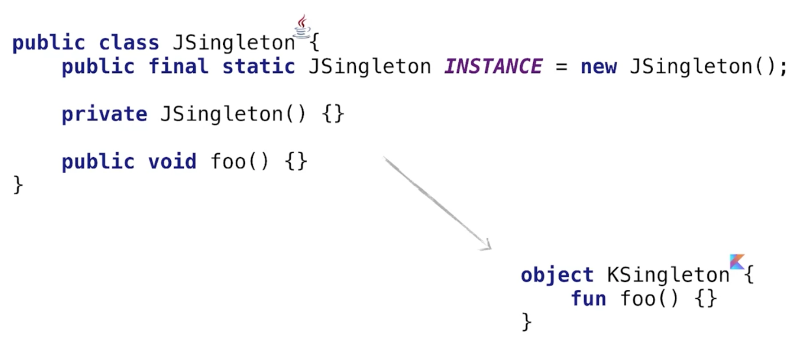
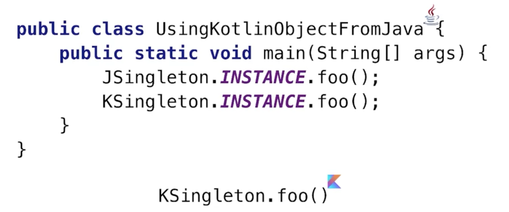

# Object Declaration vs. Object Expression
In Kotlin stellt `object` ein Singleton dar. Ein Singleton ist per Definition eine Klasse, die nur eine Instanz aufweist.

Um ein Singleton in Java zu implementieren, kann man einen privaten Konstruktor verwenden und ein Feld, das das Singleton beinhaltet definieren.



In Kotlin wird genau dieser Code generiert, um das Singleton-Pattern zu realisieren. Der Zugriff auf Members des Singletons erfolgt in Java über die in der Klasse gespeicherte Instanz, während wir in Kotlin direkt auf das Property zugreifen können.



## Object Expression
Object Expressions ersetzen die Annonymen Klassen in Java.

```kotlin
window.addMouseListener(
    object : MouseAdapter() {
        override fun mouseClicked(e: MouseEvent) {
            ....
        }

        override fun mouseEntered(e: MouseEvent) {
            ....
        }
    })
```
Wannimmer das Interface, das wir benötigen nur eine Methode aufweist, können wir anstatt der Object Expressions auch einfach Lambda-Ausdrücke verwenden.

## Companion Objects
In Kotlin können wir Objekte innerhalb von Objekten deklarieren. Dies wird als `companion object` bezeichnet:
```kotlin
class A {
    companion object {
        fun foo() = 1
    }
}

fun main(args: Array<String>) {
    A.foo()
}
```
Die Methoden des inneren  Objekts können dann über den Klassennamen aufgerufen werden. Da es in Kotlin keine statischen Methoden wie in Java gibt, können wir ähnliches Verhalten durch `companion` Objects realisieren.

Die `companion` Objects in Kotlin können Interfaces implementieren, was statische Klassen in Java nicht können.

Mit `companion` Objects können wir auch die Klassenerweiterungen aus Kotlin nutzen. Um bei der Erweiterung auf das `companion` Object zugreifen zu können, verwenden wir das Schlüsselwort `Companion`. Nach der Deklaration können wir die Erweiterungen wie eine Klassenerweiterung verwenden.

```kotlin
class Person(val FirstName: String, val lastName: String) {
    companion object { .... }    
}

fun Person.Companion.fromJSON(json: String): Person {
    ...
}

val p = Person.fromJSON(json)
```
