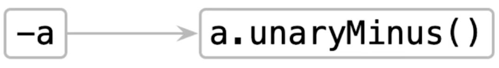

# Überladung von Operatoren in Kotlin
Um Operatoren in Kotlin zu überladen, schreiben wir einfach eine eigene Klasse und markieren diese mit dem Schlüsselwort `operator`. Dies ist sowohl für primitive Typen, wie auch für eigene Klassen möglich.

## Arithmetische Operatoren

```kotlin
operator fun Point.plus(other: Point): Point {
    return Point(x + other.x, y + other.y)
}
```

Nun können wir den `+` Operator ganz einfach für Objekte vom Typ `Point` verwenden: `Point(1, 2) + Point(2, 3)`.

Folgende arithmetische Operatoren können wir in Kotlin mittels Schlüsselwort überladen. Zusätzlich können wir noch mittels `Xassign` einen direkten Zuweisungsoperator überschreiben.

Ausdruck | Funktionsname | Zuweisungsfunktion
--- | --- | ---
`a + b` | plus | plusAssign
`a - b` | minus | minusAssign
`a * b` | times | timesAssign
`a / b` | div | divAssign
`a % b` | mod | modAsssign

Wir können diese Operatoren auch für die Verwendung mit verschiedenen Typen überladen. Die Typen der beiden Operanden müssen nicht gleich sein. Beispielsweise können wir Objekten vom Typ `Point` auch mit `Int`-Werten multiplizieren.

```Kotlin
operator fun Point.times(scale: Int): Point {
    return Point(x * scale, y * scale)
}
```

Nun können wir `Point`-Objekte mit `Int`-Werten multiplizieren: `Point(1, 2) * 3`.

## Unäre Operatoren
In Kotlin gibt es auch eine Liste an unären Operatoren, die wir überladen können.



Überladen wir beispielsweise den unären Minus-Operator:

```kotlin
operator fun Point.unaryMinus() = Point(-x, -y)
```

Nun können wir die Werte der Punktkoordinaten umkehren: `-Point(3, 4)`.

**Vollständige Liste aller unären Operatoren.**

Ausdruck | Funktionsname
--- | ---
`+a` | unaryPlus
`-a` | unaryMinus
`!a` | not
`++a`, `a++` | inc
`--a`, `a--` | dec

## Anwendung auf Listen
Bei `not-mutable` Listen gilt folgende Konvention:
> Mithilfe des `+`-Operators wird eine neue Liste gebildet und zurückgeliefert.

```kotlin
val list = listOf(1, 2, 3)
val newList = list + 2
```

Bie `mutable`-Listen gilt folgende Konvention:
> Wir können mittels `+=` die ursprüngliche Liste um den neuen Wert ergänzen. Im Hintergrund wird die entsprechende Funktion `plusAssign` aufgerufen.

```kotlin
val mutableList = mutableListOf(1, 2, 3)
mutableList += 4
```

Betrachten wir folgendes Beispiel um dies besser zu verstehen:

```kotlin
val list1 = listOf(1, 2, 3)
var list2 = list1
list2 += 4
println(list1)
println(list2)
```

Was wird von diesem Code ausgegeben?

> [1, 2, 3]
> [1, 2, 3. 4]

_Die Variable `list1` ist eine `not-mutable`-Liste. Daher verändert der `+=`-Operator NICHT die ursprüngliche List, sondern liefert eine neue Liste zurück._

_Die Variable `list2` ist eine Referenz auf `list1` - allerdings als `mutable` deklariert. Aus diesem Grund wird durch den `+=`-Operator im Hintergrund die Funktion `plusAssign` aufgerufen und die Liste verändert._

In diesem Fall wäre es besser (und eher im Sinn von Kotlin), `listOf` durch `mutableListOf` und `var` durch `val` zu ersetzen:

```kotlin
val list1 = mutableListOf(1, 2, 3)
val list2 = list1
list2 += 4
println(list1)
println(list2)
```

> [1, 2, 3, 4]
> [1, 2, 3. 4]

Nun wird auch die Variable `list1` verändert und wir erhalten den (wahrscheinlich) erwarteten Ouptut.

## Vergleichsoperatoren
In Kotlin können wir verschiedene Vergleichsoperatoren zwischen Variablen verwenden. Im Hintergrund werden auch diese Operatoren durch entsprechende Operator-Methoden implmentiert und können daher auf die gleiche Weise überladen werden, wie arithmetische oder unäre Operatoren.

**Liste der Vergleichsoperatoren:**

Symbol | Operator-Methode
--- | ---
`a > b` | `a.compareTo(b) > 0`
`a < b` | `a.compareTo(b) < 0`
`a >= b` | `a.compareTo(b) >= 0`
`a <= b` | `a.compareTo(b) <= 0`

Sämtliche Vergleichsoperatoren verwenden intern also die Methode `.compareTo()`. Sofern unsere Klasse das Interface `Comparable` implementiert, können wir diese Operatoren automatisch mit Objekten unserer Klasse verwenden.

## Gleichheitsoperator
Der Vergleich mittels `==` ist ebenfalls intern mittels Methode implementiert. In diesem Fall die Methode `equals()`: Der Ausdruck `a == b` entspricht intern dem entsprechenden Methodenaufruf: `a.equals(b)`.

In Kotlin kann der Vergleichsoperator auch korrekt mit `null`-Werten umgehen:

```kotlin
a == b              // a.equals(b)
null == "abc"       // false
null == null        // true
```

_Somit entfällt die erforderliche Prüfung auf `null` bevor wir Variablen mit dem Vergleichsoperator vergleichen können._

## Indexbasierter Zugriff auf Elemente von Collections
Auf Collection Datentypen (z.B. Listen) können wir mittels Index direkt auf einzelne Elemente zugreifen.

```kotlin
map[key]
mutableMap[key] = newValue
```

Diese Funktion ist intern mittels der Methoden `get` und `set` implementiert.

Indexbasiert | Funktionsbasiert
--- | ---
`x[a, b]` | `x.get(a, b)`
`x[a, b] = c` | `x.set(a, b, c)`

Auch diesen indexbasierten Zugriff können wir daher für unsere eigenen Klassen durch Überladung zugänglich machen.

```kotlin
class Board { ... }

operator fun Board.get(x: Int, y: Int): Char { ... }
operator fun Board.set(x: Int, y: Int, value: Char) { ... }

board[1, 2] = 'x'
board[1, 2]         // 'x'
```

## Der `in`-Operator
Immer wenn wir den `in`-Operator in Kotlin verwenden, wird im Hintergrund die Funktion `.contains` ausgeführt.

in-Operator | Funktion
-- | --
`a in c` | `c.contains(a)`

## Der `iterator`-Operator
In Kotlin können wir direkt über Collection-Datentypen oder Strings iterieren. Diese Funktionalität wird durch Implementierung des `iterator`-Operators erreicht.

```kotlin
operator fun CharSequence.iterator(): CharIterator

for (c in "abc") { ... }
```

Da dieser `CharIterator` als Erweiterungsfunktion der Klasse `String` in Kotlin implementiert ist, können wir in Kotlin auch direkt über Strings iterieren, obwohl im Hintergrund die String-Klasse aus Java verwendet wird, die dies nicht zulässt.
