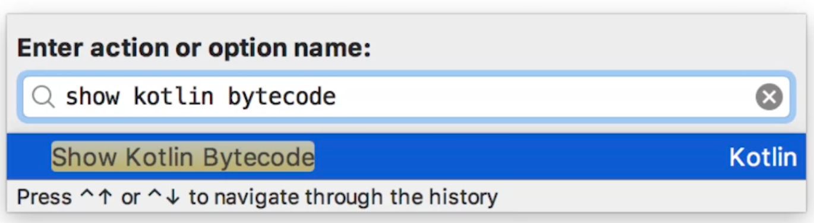
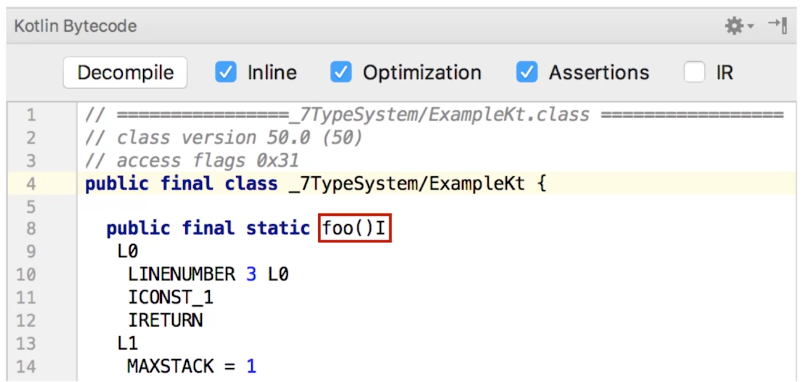
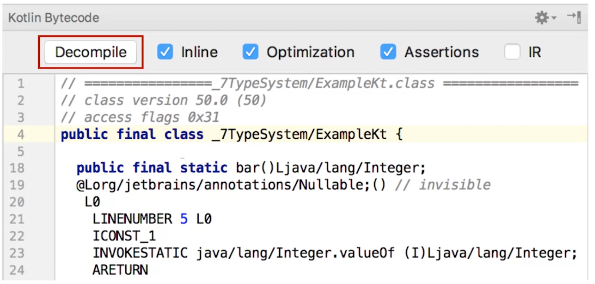
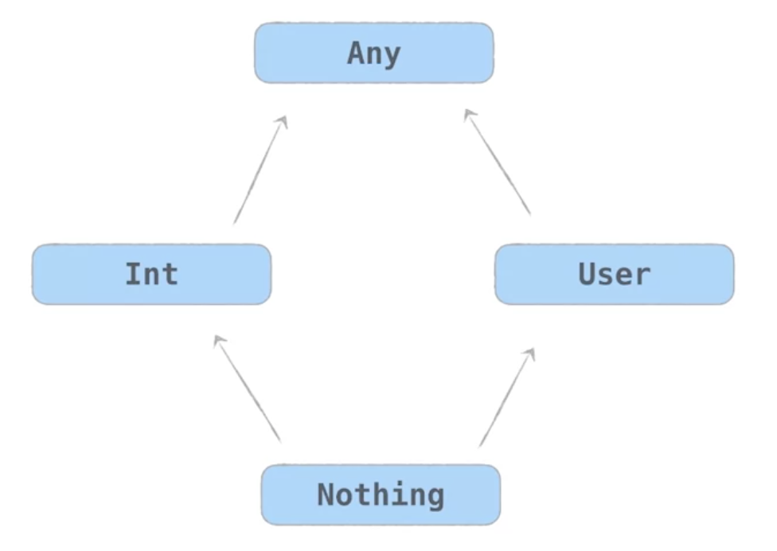

# Das Typsystem von Kotlin
Abschließend wollen wir noch ein paar _Spezialitäten_ hinsichtlich der Unterschiede im Typensystem zwischen Java und Kotlin besprechen.

## Primitive vs. Referenzdatentypen
In Kotlin wird nicht explizit zwischen primitiven und Referenzdatentypen unterschieden. Betrachten wir das Beispiel `Int`: Hier können wir unterscheiden, ob wir den Integer-Datentyp als `Int` oder `nullable Int` deklarieren wollen:

```Kotlin
fun foo(): Int = 1
fun bar(): Int? = 1
```

_Was passiert jedoch in Hintergrund bei der Generierung des Bytecode?_

Dazu können wir in der IDE IntelliJ die Funktion `show kotlin bytecode` nutzen.



Im Bytecode können wir nun den Rückgabetyp der beiden oben erstellten Funktionen betrachten:





Durch einen Klick auf `Decompile` gelangen wir zu dem Java Code, der dem Kotlin Code entspricht.

```java
public static final int foo() {
    return 1;
}

@Nullable
public static final Integer bar() {
    return Integer.valueOf(1);
}
```

Wir sehen also, dass in Java der `nullable Int` mittels `Integer`-Wrapper Klasse und der Annotation `@Nullable` implementiert wurde.

Der Standard-`Int` Typ in Kotlin entspricht einem primitiven `int`-Typ in Java.

Die anderen primitiven Datentypen aus Java, wie `double`, `boolean`, `real` oder `float` werden intern genauso behandelt wie der `int`-Typ.

## Der `String`-Datentyp in Kotlin
Der `String` Datentyp in Kotlin entspricht weitestgehend dem `String` Datentyp aus Java - versteckt jedoch die teilweise irre führenden Methoden aus Java (wie z.B. `replaceAll`).

```java
"one.two.".replaceAll(".", "*")  // ********
```

Anstatt nur die beiden `.`-Zeichen zu ersetzen, erhalten wir in Java einen String aus `*` zurück, da in Java `"."` in diesem Fall als `Regular Expression` und nicht als `String` interpretiert wird.

In Kotlin gibt es für diesen Zweck zwei verschiedene Funktionen:

```kotlin
"one.two.".replace(".", "*")           // one*two*
"one.two.".replace(".".toRegex(), "*") // ********
```

Im Standardfall interpretiert die Funktion `replace` den ersten Parameter einfach als String und ersetzt jedes Vorkommen mit dem zweiten Parameter. Möchten wir jedoch explizit einen regulären Ausdruck zum Ersetzen des Strings verwenden, so konvertieren wir den ersten Parameter explizit mittels `toRegex()` in einen regulären Ausdruck.

## Der Typ `Any` in Kotlin
In Kotlin gibt es mit `Any` einen allgemeinen Typ, der mit `java.lang.Object` zu vergleichen ist. Im Unterschied zu Java gilt `Any` jedoch als Supertyp für alle anderen Typen. Der Typ `java.lang.object` ist jedoch nur der Supertyp für alle Referenzdatentypen aus Java.

## Der `Nothing`-Typ in Kotlin
In Kotlin ist der Typ `Any` Supertyp für alle anderen Typen. Doch Kotlin hat auch einen untersten Typ: `Nothing`.



Immer wenn wir in Java `void` verwenden würden, verwenden wir in Kotlin `Unit`. Das bedeutet einfach, dass kein sinnvoller Wert zurückgegeben werden kann.

Meist wird `Unit` jedoch einfach weggelassen - wir können es aber auch explizit schreiben:

```kotlin
fun f() { ... }
// is the same as
fun f(): Unit { ... }
```

Im Bytecode wird `Unit` dann immer durch `void` ersetzt. `Unit` wird in Kotlin immer als Rückgabetyp von Funktionen verwendet, die keinen Rückgabewert haben.

Wenn wir in Kotlin z.B. an verschiedenen Stellen individuelle Exceptions werfen wollen, so können wir das Werfen der Exceptions in eine eigene Funktion kapseln. Diese Funktion hat dann `Nothing` als Rückgabetyp. In diesem Fall signalisiert `Nothing`, dass der Funktionsaufruf nur durch Werfen einer Exception vollendet werden kann. Der Kotlin-Compiler kann diese Information dann für Typ-Ableitungen und das Auffinden von _Dead Code_ nutzen.
